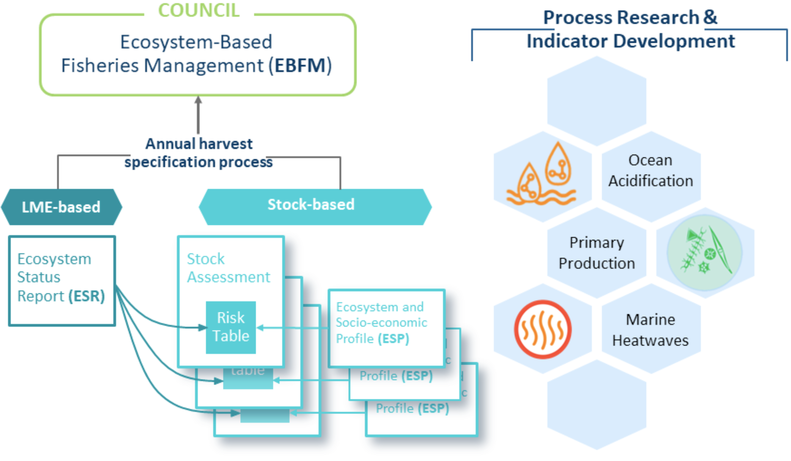
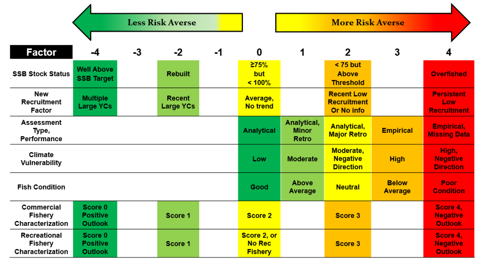
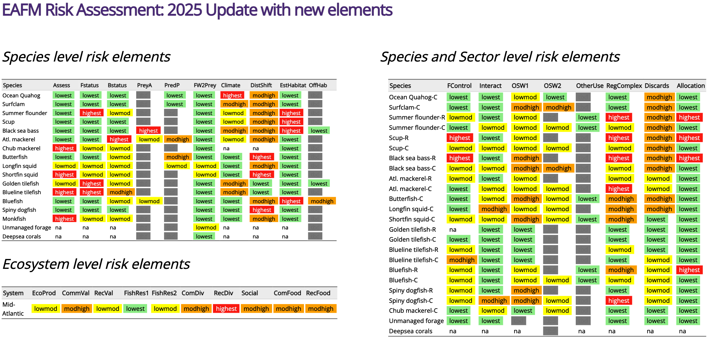
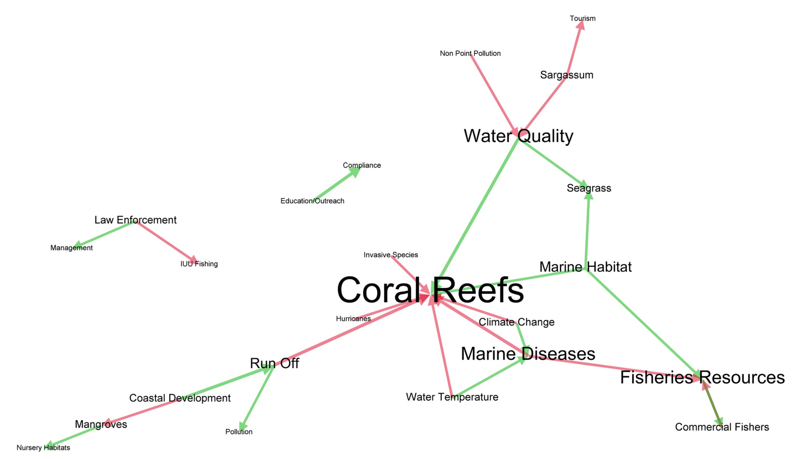
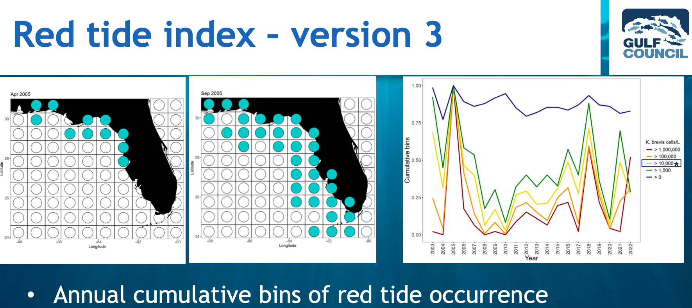
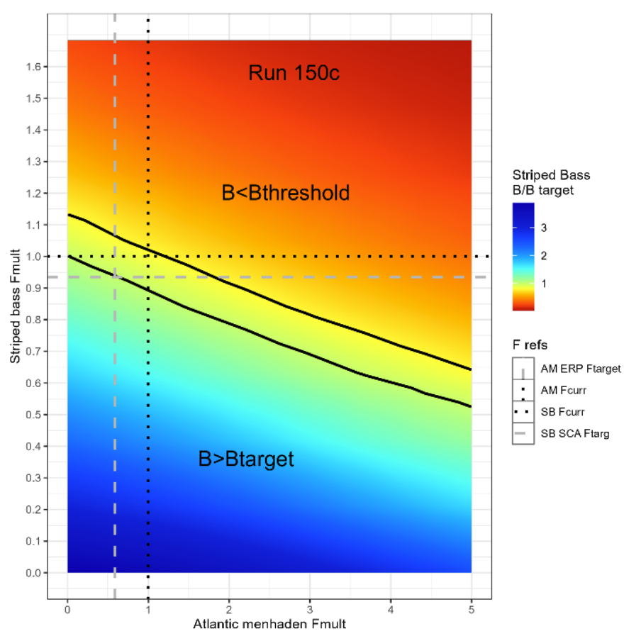

```{r setup, include=FALSE}
knitr::opts_chunk$set(echo = FALSE,
                      message = FALSE,
                      warning = FALSE,
                      fig.align = 'center')

library(tidyverse)
library(flextable) #hopefully makes actual tables in word
set_flextable_defaults(font.size = 10, padding = 5,
                       fonts_ignore=TRUE) #for latex

```

# Executive Summary

## Purpose and Context
This comprehensive review examines how ecosystem information is currently used across all eight U.S. Fishery Management Councils to support the South Atlantic Fishery Management Council (SAFMC) in enhancing its ecosystem-based fisheries management approaches. The work addresses a key priority of the East Coast Coordination Group: identifying ecosystem information that can improve management responsiveness and resilience under changing ocean conditions.

## Key Findings

### Current State of Ecosystem Reporting
All eight Councils have ecosystem data products, though with varying levels of development and update frequency:

- **Annual Reporting**: North Pacific (3 regional reports), Pacific, New England, and Mid-Atlantic Councils receive annual Ecosystem Status Reports (ESRs)
- **Intermittent Reporting**: Gulf, South Atlantic, Western Pacific, and Caribbean have less frequent updates
- **Indicator Diversity**: Reports range from 26-101 indicators spanning physical environment, biological productivity, species status, and human dimensions

### Three Distinct Management Approaches

**1. FMP/Indicator-Based (NPFMC, PFMC, MAFMC, NEFMC)**
- Species-based Fishery Management Plans with ecosystem overlays
- Annual ecosystem indicators inform catch specification decisions
- Risk tables and uncertainty frameworks integrate ecosystem considerations
- Non-regulatory Fishery Ecosystem Plans (FEPs) provide actionable pathways

**2. FEP/Geography-Based (WPFMC, CFMC)**
- Island or place-based ecosystem plans serve as operational management documents
- Co-developed with stakeholders reflecting distinct regional conditions
- Emphasis on human community connections and data-limited fisheries
- Ecosystem considerations embedded in management structure

**3. Developing Approaches (SAFMC, GFMC)**
- Species-based FMPs with expanding ecosystem integration
- SAFMC uniquely links Essential Fish Habitat (EFH) with ecosystem efforts
- Gulf developing Fishery Ecosystem Issues (FEIs) as action-oriented framework
- Both regions have recent ecosystem reports and climate vulnerability assessments

### Climate Vulnerability Analysis Coverage
Most regions have completed Climate Vulnerability Analyses (CVAs) for fish and invertebrates, with some also addressing:
- Fishing communities (Northeast, Southeast, Pacific regions)
- Critical habitats (Northeast U.S.)
- Marine mammals (Atlantic Coast)
- Highly Migratory Species (Atlantic Coast)

However, CVA information is underutilized—only the Mid-Atlantic currently incorporates CVA results systematically into risk assessment and catch advice processes.

## Common Management Concerns

**Forage Fish Ecology**: Multiple Councils have implemented protections for unmanaged forage species or developed harvest control rules accounting for ecosystem services (notably ASMFC's ecological reference points for Atlantic menhaden).

**Climate Change Impacts**: All regions are addressing rapid ecosystem changes, though even data-rich systems with long-term ecosystem reporting have experienced unexpected stock collapses, highlighting the need for climate-ready management approaches.

## Promising Practices

1. **Risk-Based Frameworks**: North Pacific, Pacific, New England, and Mid-Atlantic are developing or implementing indicator-based risk assessments to adjust catch advice

2. **Ecosystem and Socioeconomic Profiles (ESPs)**: Stock-specific ecosystem reports (pioneered by North Pacific, adopted by Northeast) link environmental drivers to individual stock productivity

3. **Stakeholder Co-Production**: Most FEPs emphasize collaborative development of ecosystem models and indicators with fishers, managers, and scientists

4. **Actionable Processes**: "Action modules" (North Pacific), "Initiatives" (Pacific), and "Fishery Ecosystem Issues" (Gulf) provide structured pathways from ecosystem plans to management action

## SAFMC Unique Strengths

- **Habitat-Ecosystem Integration**: Only Council explicitly linking EFH policies with ecosystem approaches through comprehensive policy statements
- **Citizen Science**: Proactive incorporation of participatory data collection
- **Recent Assessments**: Current fish CVA (2023) and fishing community CVA (2022) provide ready-to-use information

## Preliminary Recommendations for SAFMC

1. **Leverage Existing Products**: Align indicators from the 2021 South Atlantic ESR with objectives in EFH policy documents and CVA results to evaluate whether an integrated risk assessment framework could be developed

2. **Hybrid Approach**: Given mix of data-rich and data-limited stocks, consider combining approaches from multiple Councils rather than adopting a single model

3. **Develop Action Process**: Consider a process to develop explicit ecosystem initiatives or issues (similar to Pacific, North Pacific, Gulf) to move from planning to tangible management actions on priority topics

4. **Update Reporting Frequency**: Work toward more regular ecosystem reporting using streamlined automation processes developed for the Caribbean ESR

5. **Expand CVA Use**: Consider climate vulnerability information in management processes where characterizing uncertainty is important

## Resource Considerations

Councils with annual ecosystem reporting dedicate staff resources to production, supplemented by contributions from diverse regional scientists. Southeast Fisheries Science Center serves three Councils (Caribbean, Gulf, South Atlantic) with limited dedicated ecosystem staff, though recent process improvements may enable more frequent updates across all three regions.

---

**Full report contains**: Detailed product comparisons across all Councils, comprehensive indicator tables, structured interview results (in progress), and specific pathways for SAFMC implementation addressing both annual catch advice and other management decisions.

# Introduction

Federal Fishery Management Councils along the U.S. East Coast have been working towards improved management coordination and collaboration for the past several years under the [East Coast Scenario Planning Initiative](https://www.mafmc.org/climate-change-scenario-planning) and subsequent [East Coast Coordination Group](https://www.mafmc.org/east-coast-coordination-group). The purpose of the group is to improve management success in the face of changing ocean conditions and stock distributions that are outside historical bounds; in particular, across traditional management boundaries. A Potential Action Menu was developed for the Coordination Group to improve responsiveness and resilience in fishery management under changing conditions. A key Potential Action Menu item is identifying ecosystem information that can be used by Councils to evaluate changes in ecosystems and fishery resources, and ultimately to develop management that is robust to these changes. The South Atlantic Fishery Management Council (SAFMC) seeks to identify ecosystem data relevant to its region and managed resources, and to develop strategies to make the best use of ecosystem information in management. 

## Project Overview

Ecosystem information and data products are used in different ways across the U.S. Fishery Management Councils, depending on regional needs and information availability. To enhance opportunities for the SAFMC to use ecosystem information to support fishery management, an ecosystem information review is being conducted to develop recommendations for ways to incorporate ecosystem information into SAFMC fisheries management processes. First, a comprehensive literature review will be conducted and combined with structured interviews of key regional personnel to document ecosystem information sources, data products, and processes where ecosystem information is used for each U.S. Fishery Management Council, including SAFMC. This comprehensive review will place current SAFMC practice and products in the context of the experience of all other U.S. Councils, and set the stage to identify opportunities to use its existing ecosystem information resources, including an ecosystem status report, climate vulnerability analyses for fish and fishing communities, and citizen science program. 

Based on this review (provided in the current document), opportunities to use ecosystem information in SEFMC processes will be identified, and practical steps for implementation will be outlined.  All Councils set annual catch advice, and there are multiple other management decisions where ecosystem information may help reduce uncertainty and support improved management outcomes. The next steps in this project will address both annual catch advice and other SAFMC management actions. The project will evaluate whether products such as Ecosystem Socioeconomic Profiles would be useful and practical for SAFMC catch specification processes given data and staff resources, whether Climate Vulnerability Analysis might be useful for assessing uncertainty and risk in adjusting catch levels, and what other approaches to integrating ecosystem information into catch specification would be feasible. The project will also systematically review SAFMC actions for the past 3-5 years to identify current and potential pathways for the use of ecosystem information. This review will include inter-jurisdictional processes such as the East Coast Climate Scenario Planning and subsequent East Coast Coordination Group. Based on this review, management decisions will be classified by data needs and process timelines to develop a prioritized list of processes linked to ecosystem information and recommend practical pathways for implementation. Example management decisions may include spatial allocation of catch, seasonal openings and closures, or bycatch management, each requiring indicators at different scales. The project will evaluate whether risk based frameworks are appropriate for these decisions, and specify indicators necessary to support decisions. The project will also explore whether global and regional ocean physics datasets could provide useful indicators for SAFMC decisions, using methods developed for the Northeast U.S. shelf. Finally, the project will review current SAFMC cooperative research and citizen science programs and suggest where expansion of these programs would fill the highest priority ecosystem data gaps associated with key management decisions or validate information coming from other sources.

## Objectives

This report addresses the first Project objective:

1) Review the different types of ecosystem data and information including data products and
decision-support tools (e.g. Ecosystem Status Reports, Climate Vulnerability Assessments, risk
assessments) currently available to the regional management councils and evaluate how they are
used in council management processes.

Results reported here will be integrated with forthcoming findings for the next two project objectives addressing opportunities specific to the South Atlantic Fishery Management Council for integrating ecosystem information into its management processes and expanding Citizen Science programs to improve availability of high priority ecosystem information in the region.  

## Review Scope

Ecosystem information for the purposes of this report includes information spanning the physical, biological, and human environment. This follows the definition of Ecosystem Based Fishery Management (EBFM) in NOAA Ecosystem policy [@harvey_us_2025]: 

> a systematic approach to fisheries management in a geographically specified area that contributes to the resilience and sustainability of the ecosystem; recognizes the physical, biological, economic, and social interactions among the affected fishery-related components of the ecosystem, including humans; and seeks to optimize benefits among a diverse set of societal goals.

This report considers ecosystem information available and processes used in all 8 regional U.S. Fishery Management Councils: North Pacific (NPFMC), Pacific (PFMC), Western Pacific (WPFMC), New England (NEFMC), Mid-Atlantic (MAFMC), Caribbean (CFMC), Gulf (GFMC), and South Atlantic (SAFMC) (Fig. \@ref(fig:councilfig)). In addition, relevant examples from other U.S. organizations, such as the Atlantic States Marine Fisheries Commission (ASMFC) and NOAA National Marine Sanctuaries are included. Recognizing that these organizations do not operate under the same legislative mandates as Councils, these examples are intended to illustrate uses of ecosystem information that may still be applicable in a Council context. 

```{r councilfig, fig.cap = "U.S. Fishery Management Councils; source: https://www.fisherycouncils.org/",  out.width="80%"}

knitr::include_graphics(here::here("docs/images/RFMC+Map+2025.png"))

```


## Definitions and abbreviations

**Ecosystem Status Report (ESR)**: a document summarizing ecosystem information for a particular region, spanning physical, biological, economic, and social information. Indicators are presented and interpreted in the context of historical trends and current status relative to any known reference points. Trends and status of indicators can contribute to risk assessment at the ecosystem or stock level. Also known as State of the Ecosystem (SOE) or Ecosystem Considerations reports [@morrison_investigating_2022; @harvey_us_2025]. 

**Climate Vulnerability Analysis (CVA)**: an evaluation of vulnerability to projected climate conditions based on standard metrics of sensitivity and exposure appropriate to the species, habitat, or community being assessed [@bruno_soares_conceptual_2012; @morrison_methodology_2015]. In addition to detailed narratives of risks faced by each species, habitat, or community, CVA outputs include a ranking of risk across species, habitats, or communities within a region, facilitating risk assessment. CVA has been applied to marine fish and invertebrates, marine fish and invertebrate habitats, marine mammals, and fishing communities. 

**Fishery Management Plan (FMP)**: a legally required document outlining methods (management measures, regulations, monitoring, research) to achieve fishery management objectives as specified in the U.S. Magnuson-Stevens Fishery Conservation and Management Act. Councils determine which fisheries are included in an FMP, describe targeted species and fishing methods, identify essential habitat, and design methods to ensure sustainable optimum yield (maximum benefit to the Nation in terms of seafood production and recreational opportunities while accounting for the protection of marine ecosystems) while meeting other objectives such as bycatch reduction and other legal mandates for protected species. 

**Fishery Ecosystem Plan (FEP)**: a document outlining methods for ecosystem-based fishery management by providing an ecosystem description, overarching ecosystem policies and goals, and methods for coordinating across managed fisheries and addressing ecosystem interactions. When FEPs contain all components of an FMP, they can be used as FMPs. FEPs were originally outlined and recommended in a 1999 report to Congress [@ecosystem_principles_advisory_panel_ecosystem-based_1999], and operational methods for refining and using FEPs have been advanced more recently [@marshall_ecosystem-based_2018; @levin_building_2018].  


# Methods

## Comprehensive Literature Review

Literature included both peer reviewed scientific literature and Council and other organizational documents that may not appear in peer reviewed literature. Literature search was conducted using Google search and Google scholar, direct search of the NOAA Institutional Repository (IR), and a semi-automated Council webpage search for current and past ecosystem approaches. 

Literature search terms for each method included:

*  Google search and google scholar: "ecosystem indicators US fishery management councils"  
*  NOAA IR: "ecosystem status report" "climate vulnerability analysis" "fisheries ecosystem plan"  

Council web sites were also searched for any documents that included the terms "ecosystem approach", "ecosystem indicator", "ecosystem report", "ecosystem status", or "ecosystem based" using [this web-searching and scraping code](https://github.com/sgaichas/SAFMCindicators/blob/main/R/FindCouncilEcoDocs.R).  

Documents and information from the Council Coordinating Committee's recent meetings were retrived from their website: 

*  2022 Council Member Ongoing Development Workshop on New Approaches to EBFM/EAFM https://www.fisherycouncils.org/cmod-workshops/2022. 
*  2022 Seventh National Scientific Coordination Subcommittee Workshop on Adapting Fisheries Managment to a Changing Ecosystem https://www.fisherycouncils.org/ssc-workshops/scs-7  
*  2024 Eighth National Scientific Coordination Subcommittee Workshop on Applying ABC Control Rules in a Changing Environment https://www.fisherycouncils.org/ssc-workshops/scs-8 

Relevant Council documents were downloaded as pdfs and have been uploaded to SAFMC shared folders for ESRs, ESPs, FEPs, CVAs, and other Council Documents. All cited papers and Council documents were read and reviewed to generate the information in this report. Artificial intelligence capabilities were used to automate standardized ESR and FEP report summaries across documents as noted below. 

## Gather Council and Regional Contextual Data

Contextual information may help explain how Council ecosystem data products and processes evolved, and also highlight approaches that may be useful for SAFMC. Council processes are shaped by the regional context in terms of area managed, number of states involved, range of species managed, level of FEP development, and range of fisheries species and sector diversity, fisheries landing volume, and fishery value. 

The area managed by each Council in terms of square km and proportion of the U.S. EEZ was summarized in Table 2 of @bachman_use_2025. The number of U.S. states and territories are represented in each Council region was drawn from https://www.fisherycouncils.org/ and each Council's website and documents. The number of FMPs and FEPs for each Council was drawn from https://www.fisherycouncils.org/ and validated using individual Council websites and documents.

Current commercial and recreational landings for 2022-2024 were drawn from Fisheries Economics of the US 2022 [@national_marine_fisheries_service_fisheries_2024] and its associated [web data tool](https://www.fisheries.noaa.gov/foss/f?p=215:200::::::). The most recent year of commercial and recreational landings data available across all regions was 2023, but the most recent recreational value information was from 2022. Landings and value for each sector are reported as proportions of the total for the U.S. because the absolute numbers vary from year to year but rough proportions have been stable recently. 

Human populations in each Council region were drawn from @link_ecosystem-based_2021 and updated with US Census and UN data compiled on [Wikipedia](https://en.wikipedia.org/wiki/List_of_U.S._states_and_territories_by_population_density).

## Summarize and Compare Data Products

Draft ESR document summaries and R code to organize document section and indicator names into datasets were initially generated by Claude Sonnet 4.5 from each pdf file, then thoroughly reviewed and hand corrected where they inaccurately represented ESR content. Summaries were repeated using identical prompts on the same document for two ESRs from different regions to determine whether summaries were consistent. Differences between the replicate summaries were limited to formatting; section headings and indicators identified were consistent across replicates. Code to produce the summary datasets [`summtab.csv`](https://github.com/sgaichas/SAFMCindicators/blob/main/summtab.csv) and [`compesrdat.csv`](https://github.com/sgaichas/SAFMCindicators/blob/main/compesrdat.csv) that are used to produce these tables is contained in the document [`ESRsumms.Rmd`](https://github.com/sgaichas/SAFMCindicators/blob/main/docs/ESRsumms.Rmd). 

Note that while indicator counts given here should provide insight for comparisons across regional documents, they are approximate counts. There is interpretation required to count indicators: for example, are abundance and biomass from the same data source two indicators or one? Are time series for different species from the same source presented in one figure one single or multiple indicators? Are monthly vs. annual, local vs. regional sea surface temperature (SST) from the same source different indicators? When reviewing indicator summaries for each report, clearly different indicators were separated to the similar levels reported across all reports.

Council FEP pdf documents were summarized using the Claude API and [this code](https://github.com/sgaichas/SAFMCindicators/blob/main/R/pdfsumm.R). Summaries included an overview combined with a list of stated ecosystem policies, goals, and objectives in the document along. Summaries were compared with the full documents to ensure consistency, and any newer policy documents not included in the FEPs were reviewed individually. Policies and objectives were compared across Council FEPs with those originally recommended in the Ecosystem Advisory Panel's 1999 Report to Congress [@ecosystem_principles_advisory_panel_ecosystem-based_1999]. 

## Structured Interviews With Council Staff

The primary objective of structured interviews was to determine what the Council's think about their ecosystem information products and processes.

Council staff from each region were selected for interviews based on their role. Ecosystem, habitat, and/or climate leads were included if Councils identified staff in such roles, along with SSC liasons or other experts recommended by staff. Executive directors and or Deputies were also invited for interviews. 

Interviews were coordinated with the team leading the Fishery Management Process Review using logistics software developed by that team. Potential interviewees were contacted with an email briefly describing the project goals and an invitation to be interviewed. Those accepting the invitation filled out a google form confirming agreement to be interviewed and gathering basic contact information, years of experience, and initial thoughts on the interview questions listed below, then scheduled an interview at the time of their choice using the software that included the interviewer's schedule. 

Interviews could be 30-60 minutes depending on the interviewee's selected time slot. All interviews were conducted by Sarah Gaichas.

Interview Template:  
*  Review Data products and uses of record from lit review 
*  Are there corrections, clarifications, or updates to the information? What uses of ecosystem informaion are missing?  
*  What are successes with current information and processes? 
*  What are and challenges with current information and processes? 
*  What might be done differently to better meet each Council’s objectives?  

Interviews were scheduled during November-December of 2025 and January of 2026. Additional information was was submitted by correspondence. Fifteen people were interviewed and five more provided information by correspondence. 

*Council Staff participating in interviews or by correspondence:*

**NPFMC Contacts:** Katie Latanich, Climate Program Manager; Diana Stram, SSC and Specifications lead; Diana Evans, Executive Director. 

**PFMC Contacts:**  Gilly Lyons, Ecosystems and climate initiatives lead; Kelly Ames, Deputy Director. 

**WPFMC Contacts**: unable to respond during the time frame of this work. 
<!--Contacts included Mark Fitchett Pelagic fisheries, Ecosystem scientist, Joshua DeMellow, Island fisheries coordinator, Kitty Simonds Exec Dir.-->

**NEFMC Contacts**: Rachel Feeney, SSC lead; Michelle Bachman, Habitat lead; Andy Applegate, EAFM lead; Cate O'Keefe, Executive Director. 

**MAFMC Contacts**: Brandon Muffley, Ecosystems and SSC lead withEcosystem and Ocean Planning Committee support; Jessica Coakley Habitat and Ocean Planning Committee lead.  

**CFMC Contacts**: Liajay Rivera García, FMP and EBFM lead; Graciela García-Moliner, FMP and Habitat lead; Martha Prada, IRA coordinator; Chelsea Harms-Tuhoy, IRA CVA contractor. 

**GFMC Contacts**: Verena Wang, Ecosystems lead.

**SAFMC Contacts**: Kathleen Howington, Habitat & Ecosystem Scientist; John Hadley, Fishery Management Plan Coordinator & Fishery Economist; Myra Brouwer, Deputy Director for Management; John Carmichael, Executive Director. 

Interviews were recorded using zoom for note-taking purposes. Notes from separate interviews and correspondence for each Council were synthesized into the reflections at the conclusion of each Council section. Then, results across Councils were compared and contrasted. 

# Results

## Council Context and Overview

The Regional U.S. Fishery Management Councils are highly diverse in the amount of area managed, the number of states and territories involved, the number of FMPs and FEPs in place, and commercial and recreational landings and value (Table \@ref(tab:councilcomp)). 

```{r councilcomp, ft.arraystretch = 1}
# from Bachman et al 2025 table 2
EEZareas <- readr::read_table(here::here("docs/data/Bachman2025Tab2.txt"))

EEZclean <- EEZareas |>
  dplyr::filter(!Region %in% c("PercentofU.S.EEZ")) |>
  dplyr::mutate(dplyr::across(EEZArea:SeasonalFisheryManagement, ~as.numeric(stringr::str_remove(.x, ","))))

# downloaded from Fisheries Economics of the US website https://www.fisheries.noaa.gov/foss/f?p=215:200::::::
Comlandareas <- readr::read_csv(here::here("docs/data/FOSS_landings_commercial2022-24.csv"))
Comlandareasterr <- readr::read_csv(here::here("docs/data/FOSS_landings_territories2022-23.csv"))
Reclandareas <- readr::read_csv(here::here("docs/data/FOSS_landings_rec2022-24.csv"))

comlandterrtot <- Comlandareasterr |>
  dplyr::mutate(Region = dplyr::case_when(Territory %in% c("AMERICAN SAMOA", "GUAM", "NORTHERN MARIANA IS.") ~ "Western Pacific",
                                          Territory %in% c("PUERTO RICO", "U.S. VIRGIN IS.") ~ "Caribbean")
                ) |>
  dplyr::group_by(Year, Region) |>
  dplyr::summarise(dplyr::across(Pounds:Dollars, ~sum(.x, na.rm = TRUE))) |>
  dplyr::select(Year, Region, ComPounds = Pounds, ComDollars = Dollars, ComTons = `Metric Tons`)

# downloaded from Caribbean IEA github: https://github.com/Gulf-IEA/Caribbean-ESR-2/blob/main/indicator_objects/total_landings.RData
# dataset created here https://github.com/Gulf-IEA/Caribbean-ESR-2/blob/main/indicator_processing/fishery_dependent/INDICATOR_total_landings.R
# includes lobster, conch, and all other species landings 2000-2023 for Puerto Rico and USVI
# data name is ind
load("~/Documents/Work/SAFMCindicators/SAFMCindicators/docs/data/carib_total_landings.RData")
caribdat <- ind$indicators 
lab2 <- paste(ind$labels[1,], ind$labels[3,])
names(caribdat) <- lab2

caribdat$totlbs  <-  rowSums(caribdat, na.rm = TRUE)

caribland <- caribdat |>
  tibble::rownames_to_column(var = "Year") |>
  dplyr::mutate(Year = as.numeric(Year),
                ComPounds = totlbs*1000) |>
  dplyr::select(Year, ComPounds) |>
  dplyr::mutate(tottons = ComPounds/2205)

caribland23 <- caribland |> 
  dplyr::filter(Year == 2023) |> 
  dplyr::mutate(Region = "Caribbean") |>
  dplyr::select(Year, Region, ComPounds, ComTons = tottons)

comlandterrtot23 <- comlandterrtot |> dplyr::filter(Year == 2023)

comlandclean23 <- Comlandareas |>
  dplyr::filter(Year == 2023) |>
  dplyr::select(Year, Region = `Region Name`, ComPounds = Pounds, ComDollars = Dollars, ComTons = `Metric Tons`) |>
  dplyr::bind_rows(comlandterrtot23) |>
  dplyr::bind_rows(caribland23) |>
  dplyr::mutate(Region = dplyr::case_when(Region == "Hawaii" ~ "Western Pacific",
                                          TRUE ~ Region)) |>
  dplyr::group_by(Year, Region) |>
  dplyr::summarise(dplyr::across(ComPounds:ComTons, ~sum(.x, na.rm = TRUE)))
  

# caribbean total rec catch from 2019 as a proxy from ESR: 
# from https://github.com/Gulf-IEA/Caribbean-ESR-2/blob/main/indicator_objects/objects_as_csvs/total_rec_catch.csv

caribreclbs19 <- 	(1.11045313148897 +	0.209245775288) * 10^6
caribrecland <- data.frame(Year = 2019,
                           Region = "Caribbean",
                           RecPounds = caribreclbs19,
                           RecTons = caribreclbs19/2205)

#value not downloadable as numbers from https://www.fisheries.noaa.gov/foss/f?p=215:44:4285637220149:::::
# these values are from FEUS 2024 Fig 8 for 2022, the last year in the report and on the web
recvalue22 <- data.frame(Region = c("Alaska",
                                    "Gulf",
                                    "Hawaii",
                                    "Middle Atlantic",
                                    "New England",
                                    "Pacific Coast",
                                    "South Atlantic",
                                    "Caribbean"),
                         RecDollars22 = c(686000000,
                                     5100000000,
                                     435000000,
                                     2300000000,
                                     584000000,
                                     807000000,
                                     3500000000,
                                     NA))  

reclandclean23 <- Reclandareas |>
  dplyr::filter(Year == 2023) |>
  dplyr::select(Year, Region = `Region Name`, RecPounds = Pounds, Dollars, RecTons = `Metric Tons`) |>
  dplyr::bind_rows(caribrecland) |>
  dplyr::left_join(recvalue22) |>
  dplyr::select(Year, Region, RecPounds, RecDollars22, RecTons)

landlook <- data.frame(Region = c(reclandclean23$Region, 
                                  "Western Pacific"),
                       CouncilName = c("North Pacific",
                                       "Gulf",
                                       "Western Pacific",
                                       "Mid-Atlantic",
                                       "New England",
                                       "Pacific",
                                       "South Atlantic",
                                       "Caribbean",
                                       "Western Pacific"))   

landvalstats <-  landlook |>
  dplyr::left_join(comlandclean23 |> dplyr::select(-Year)) |>
  dplyr::left_join(reclandclean23 |> dplyr::select(-Year)) |>
  dplyr::group_by(CouncilName) |>
  dplyr::summarise(dplyr::across(ComPounds:RecTons, ~sum(.x, na.rm = TRUE))) |>
  dplyr::mutate(PercComRev = (ComDollars/sum(ComDollars))*100,
                PercComTons = (ComTons/sum(ComTons))*100,
                PercRecExpend = (RecDollars22/sum(RecDollars22))*100,
                PercRecTons = (RecTons/sum(RecTons))*100)

# the 0 values in here are missing
landvalstats[landvalstats == 0] <- NA
  
                       
regionnames <- data.frame(Region = EEZclean$Region,
                          CouncilName = c("New England",
                                         "Mid-Atlantic",
                                         "South Atlantic",
                                         "Gulf",
                                         "Caribbean",
                                         "Pacific",
                                         "North Pacific",
                                         "Western Pacific",
                                         NA),
                          Nstates = c(5, 7, 4, 5, 2, 3, 1, 4, NA),
                          NFMPs = c(9, 7, 8, 7, 3, 4, 6, 0, NA),
                          NFEPs = c(0, 1, 1, 1, 0, 1, 2, 5, NA))

proparea <- EEZclean |>
  dplyr::select(Region, EEZArea) |>
  dplyr::filter(!Region %in% c("Totalarea")) |>
  dplyr::mutate(Proparea = EEZArea/sum(EEZArea),
                Percarea = Proparea*100) |>
  dplyr::left_join(regionnames) |>
  dplyr::left_join(landvalstats)

write.csv(proparea, here::here("proparea.csv"))

proparea |>
  dplyr::select(CouncilName, EEZArea, Percarea, Nstates, NFMPs, NFEPs, 
                PercComTons, PercRecTons, PercComRev, PercRecExpend) |>
  flextable::flextable() |>
  flextable::colformat_double(
      j = c("Percarea", "PercComTons", "PercRecTons",
            "PercComRev", "PercRecExpend"), # Specify the columns to format
      big.mark = "",             # Set big.mark to an empty string to remove commas
      digits = 2,                  # Specify the number of decimal places
      na_str = "-"      # missing value
    ) |>
  flextable::set_header_labels(
      CouncilName = "Council",
      EEZArea = "EEZ Area (sq km)",
      Percarea = "Percent of U.S. EEZ", 
      Nstates = "Number of States or Territories",
      NFMPs = "Number of FMPs",
      NFEPs = "Number of FEPs",
      PercComTons = "Percent of 2023 U.S. Commercial Landings",
      PercRecTons = "Percent of 2023 U.S. Recreational Landings",
      PercComRev = "Percent of 2023 U.S. Commercial Revenue",
      PercRecExpend = "Percent of 2022 U.S. Recreational Expenditures"
    ) |>
  #flextable::set_table_properties(layout = "autofit", width = 1)
  flextable::set_caption("Comparison of Council management context attributes.") |>
  flextable::width(width = c(1, rep(0.6, 2), rep(0.5, 3), rep(0.6, 4)))


```

```{r peepop}

#table from https://en.wikipedia.org/wiki/List_of_U.S._states_and_territories_by_population_density

USpop <- readr::read_table(here::here("docs/data/USpop2023.txt")) 

USpopCouncils <- USpop |>
  dplyr::mutate(Council = dplyr::case_when(State %in% c("DistrictofColumbia", 
                                                        "NewJersey",
                                                        "Maryland",
                                                        "Delaware",
                                                        "NewYork",
                                                        "Pennsylvania",
                                                        "Virginia") ~ "MAFMC",
                                           State %in% c("RhodeIsland",
                                                        "Massachusetts",
                                                        "Connecticut",
                                                        "NewHampshire",
                                                        "Maine") ~"NEFMC",
                                           State %in% c("PuertoRico",
                                                        "U.S.VirginIslands") ~ "CFMC",
                                           State %in% c("Guam",
                                                        "AmericanSamoa",
                                                        "NorthernMarianaIslands",
                                                        "Hawaii") ~ "WPFMC",
                                           State %in% c("Florida",
                                                        "NorthCarolina",
                                                        "Georgia",
                                                        "SouthCarolina") ~ "SAFMC",
                                           State %in% c("California",
                                                        "Washington",
                                                        "Oregon") ~ "PFMC",
                                           State %in% c("Texas",
                                                        "Florida",
                                                        "Louisiana",
                                                        "Alabama",
                                                        "Mississippi") ~ "GFMC",
                                           State %in% c("Alaska") ~ "NPFMC",
                                           TRUE ~ NA)) |>
  dplyr::filter(!is.na(Council)) |>
  dplyr::group_by(Council) |>
  dplyr::summarise(TotPop = sum(PopN),
                   TotPopDensSqKm = TotPop/sum(AreaSqKm)) |>
  dplyr::arrange(desc(TotPop))
```

All of the Councils have at least one ESR or similar ecosystem data product. However, not all reports are updated annually.

This table gives an overview of which Councils receive which reports, the reporting region, the most recent year of the report, report length, number of sections, approximate number of indicators (see note above), and the first and last section headers in each report (Table \@ref(tab:ESRdat)). This give some insight into structural differences between the reports. Additional tables listing sections and numbers of indicators for each report, and listing indicator names for each report, are available [online here](https://sgaichas.github.io/SAFMCindicators/ESRcomparisons.html). 

```{r ESRdat, ft.arraystretch = 1}

compesrdat <- readr::read_csv(here::here("compesrdat.csv"))

summtab <- readr::read_csv(here::here("summtab.csv"))

summtab$Frequency <- dplyr::case_when(summtab$Council == "CFMC" ~ "First",
                                      summtab$Council %in% c("GFMC", "SAFMC", "WPFMC") ~ "Intermittent",
                                      TRUE ~ "Annual")

summtab <- summtab |> dplyr::relocate(Frequency, .after = Year)

sectionindcounts <- compesrdat |>
  dplyr::group_by(Region, Year, Section) |>
  dplyr::summarise(Nind = n())

indcounts <- compesrdat |>
  dplyr::group_by(Region) |>
  dplyr::summarise(Nind = n())

sectioncounts <- compesrdat |>
  dplyr::select(Region, Year, Section) |>
  dplyr::distinct() |>
  dplyr::group_by(Region, Year) |>
  dplyr::summarise(Nsect = n())

order <- compesrdat |>
  dplyr::group_by(Region) |>
  dplyr::select(Section) |>
  dplyr::distinct() |>
  dplyr::mutate(order = 1:length(Section))

esrs <- merge(sectionindcounts, order) |>
  dplyr::select(Region, Year, Section, Order= order, Nind) |>
  dplyr::arrange(Region, Order)
  
esrsls <- split(esrs, f = esrs$Region)

esrsdetls <- split(compesrdat, f = compesrdat$Region)

flextable::flextable(summtab) |>
  flextable::colformat_num(
    j = c("Year"), # Specify the columns to format
    big.mark = "",             # Set big.mark to an empty string to remove commas
    digits = 0                  # Specify the number of decimal places
  ) |>
  flextable::set_header_labels(
      Npages = "Total pages",
      Nsect = "Number of Sections",
      Nind = "Number of Indicators",
      First = "First Section",
      Last = "Last Section"
  ) |>
  #flextable::set_table_properties(layout = "autofit", width = 1)
  flextable::set_caption("Comparison of most recent Ecosystem Status Reports (ESRs) across Council regions.") |>
  flextable::width(width = c(0.6, 1, rep(0.5, 5), 1.2, 1.2))

```

Most Council regions, aside from the Caribbean, have a completed Climate Vulnerability Analysis (CVA) for fish and invertebrates in the region. Some Council regions have fishing community CVAs, habitat CVAs, and marine mammal CVAs. In addition, an Atlantic Highly Migratory Species (HMS) CVA was completed in August 2025. Numbers in the table are the year each CVA was published (Table \@ref(tab:CVAs)).

```{r CVAs, ft.arraystretch = 1}

CVAs <- proparea |>
  dplyr::select(CouncilName) |>
  dplyr::mutate(FishInvertCVA = dplyr::case_when(CouncilName %in% c("Mid-Atlantic", 
                                                                 "New England") ~ 2016,
                                                 CouncilName %in% c("North Pacific") ~ 2019,
                                                 CouncilName %in% c("Western Pacific") ~ 2022,
                                                 CouncilName %in% c("Pacific", 
                                                                 "South Atlantic",
                                                                 "Gulf") ~ 2023,
                                              TRUE ~ NA),
                HabitatCVA = dplyr::case_when(CouncilName %in% c("Mid-Atlantic", 
                                                                 "New England") ~ 2022,
                                              TRUE ~ NA),
                CommunityCVA = dplyr::case_when(CouncilName %in% c("Mid-Atlantic", 
                                                                 "New England") ~ 2016,
                                                CouncilName %in% c("South Atlantic", 
                                                                 "Gulf",
                                                                 "Pacific") ~ 2022,
                                              TRUE ~ NA),
                HMSCVA = dplyr::case_when(CouncilName %in% c("Mid-Atlantic", 
                                                                 "New England",
                                                                "South Atlantic",
                                                             "Gulf",
                                                             "Caribbean") ~ 2025,
                                              TRUE ~ NA),
                MammalCVA = dplyr::case_when(CouncilName %in% c("Mid-Atlantic", 
                                                                 "New England",
                                                                "South Atlantic",
                                                                "Gulf",
                                                                "Caribbean") ~ 2023,
                                              TRUE ~ NA) 
                )

flextable::flextable(CVAs) |>
  flextable::colformat_num(
    #j = c("Year"), # Specify the columns to format
    big.mark = "",             # Set big.mark to an empty string to remove commas
    na_str = "-",      # missing value
    digits = 0                  # Specify the number of decimal places
  ) |>
  flextable::set_caption("Comparison of Climate Vulnerability Analyses (CVAs) available to each Council, with publication year.") |>
  flextable::width(width = c(rep(1,6)))

```

Council FEPs (and some FMPs) contain some similar content in terms of ecosystem policies and goals, with regionally specific goals for habitats unique to a given region such as coral reefs. However, Councils have different mechanisms across FEPs or FMPs to operationalize the use of ecosystem information. First FEPs are compared to the contents outlined in the original 1999 report to Congress [@ecosystem_principles_advisory_panel_ecosystem-based_1999], (Table \@ref(tab:FEPs)). More longstanding FEPs contain many components, while the newer in-progress Gulf FEP has very few as it is being designed according to newer principles [@levin_building_2018] to be as actionable as possible. The Pacific, North Pacific Bering Sea, and Mid-Atlantic FEP documents also contain "Initiatives", "Action Modules" and an EAFM loop process, respectively, to each give each Council a process turn the ecosystem plan into tangible action on a topic. 

```{r FEPs, ft.arraystretch = 1}

FEPactions <- data.frame(Council = c("New England*",
                                     "Mid-Atlantic",
                                     "South Atlantic",
                                     "Gulf",
                                     "Caribbean",
                                     "Pacific",
                                     "North Pacific",
                                     "Western Pacific"),
                         EcoDescription = c(1,1,1,NA,1,1,1,1),
                         FoodWebConsMod = c(1,1,1,NA,1,1,1,NA),
                         FoodWebEFH = c(NA,1,1,NA,1,1,1,1),
                         TotRemovals = c(1,NA,NA,NA,NA,NA,1,NA),
                         Uncertainty = c(NA,NA,NA,NA,NA,NA,NA,NA),
                         EcoHealth = c(NA,NA,NA,NA,NA,NA,NA,1),
                         Monitoring = c(1,1,1,NA,1,1,1,1),
                         OutsideImpacts = c(NA,1,1,NA,1,1,1,1))

flextable::flextable(FEPactions) |>
  flextable::set_header_labels(
      EcoDescription = "Ecosystem Description",
      FoodWebConsMod = "Food Web Conceptual Model",
      FoodWebEFH = "Food Web Essential Fish Habitat",
      EcoHealth = "Ecosystem Health Objectives",
      TotRemovals = "Total Removals Objectives",
      OutsideImpacts = "Other Ocean Uses Considered"
  ) |>
  flextable::colformat_num(
    #j = c("Year"), # Specify the columns to format
    big.mark = "",             # Set big.mark to an empty string to remove commas
    na_str = "-",      # missing value
    digits = 0                  # Specify the number of decimal places
  ) |>
  flextable::set_caption("Comparison of Council FEPs with FEP components suggested by EPAP 1999. 1 = Included.") |>
  flextable::width(width = c(1, rep(0.75,8)))

```

```{r FEPobjectives, ft.arraystretch = 1, eval=FALSE}

FEPobj <- data.frame(Council = c("New England*",
                                     "Mid-Atlantic",
                                     "South Atlantic",
                                     "Gulf",
                                     "Caribbean",
                                     "Pacific",
                                     "North Pacific",
                                     "Western Pacific"))

#finish this later 
                     
```

## Review of Products and Processes by Council

In each section below, the Council context, management structure, and use of ecosystem data products is detailed for each region based on the literature review and interviews with Council staff and other regional experts. 

*Questions to be clarified during interviews are included in italics.* 

### NPFMC

The North Pacific Council region includes multiple large marine ecosystems, a single U.S. state (Alaska) and federal waters representing nearly 30% of the US EEZ by area [@link_ecosystem-based_2021; @bachman_use_2025]. Commercial fisheries dominate landings, with over 60% of 2023 total US landings by weight coming from the North Pacific, representing over 30% of total US commercial revenue [@national_marine_fisheries_service_fisheries_2024]. A large proportion of regional fisheries landings are from a single species, Alaska pollock. The North Pacific region has the lowest human population and population density of all the Council regions [@link_ecosystem-based_2021]. Stock and ecosystem areas are spatially aligned, and stock and ecosystem assessments are temporally aligned for the groundfish and crab FMPs. 

The North Pacific Council manages fisheries using 6 Fishery Management Plans (FMPs): one is area-based (Arctic), and five FMPs are species-based: Crab (5 species), Salmon (5 species), Scallop (1 target species), and two regional multispeces groundfish FMPs: Bering Sea Aleutian Islands (BSAI) and Gulf of Alaska (GOA). The Groundfish and Scallop FMPs specify target and ecosystem component species. There are 2 ecosystem component species included in the Scallop FMP in addition to the targeted Weathervane scallops. The BSAI Groundfish FMP covers 19 target species/groups and 27 ecosystem component groups, while the GOA Groundfish FMP covers 21 target species/groups and 35 ecosystem component species/groups.  FMP based single species groundfish and crab management has evolved to include ecosystem indicators in the catch specification process, as described below. 

The North Pacific Council groundfish FMP specify total groundfish optimimum yield (OY) caps in both the BSAI and the GOA as part of the management measures designed to prevent overfishing. The groundfish OY caps were set in the 1980s based on 85% of the maximum total annual groundfish catch from 1968-1977 in the BSAI, and 92% of the mean MSY from 1983-1987 in the GOA. In the BSAI, the total allowable catch summed across single species assessments has often exceeded the total groundfish catch cap of 2 million metric tons, requiring adjustments to allowable catch for multiple species (primarily, flatfish total allowable catches are reduced) [@witherell_ecosystem-based_2000]. The GOA total groundfish catch cap of 800,000 metric tons has never been exceeded by sum of single species groundfish allowable catches [@rovellini_evaluating_2025]. 

The North Pacific Region has three Ecosystem Status Reports (ESRs), one for each ecoregion: Eastern Bering Sea [@siddon_ecosystem_2024], Gulf of Alaska [@ferriss_ecosystem_2024], and Aleutian Islands [@ortiz_ecosystem_2024]. Reports include graphical and text report cards for each region, ecosystem assessment sections, and detailed indicator sections, with multiple appendices. Tables \@ref(tab:BeringInds), \@ref(tab:AleutInds), and \@ref(tab:GOAInds) list indicators presented in the most recent reports. ESRs have been produced since 1995, are also presented as contextual information, and have been used to adjust TAC advice in the past [@zador_ecosystem_2016]. AFSC staff produce the reports as part of their regular duties (dedicated resources), while contributors range from NOAA staff to academic researchers in the region who have varying availability or resources to update indicators. 

```{r BeringInds, ft.arraystretch = 1}

ESRname <- "Eastern Bering Sea"

flextable::flextable((esrsdetls[[ESRname]]))|>
  flextable::colformat_num(
    j = c("Year"), # Specify the columns to format
    big.mark = "",             # Set big.mark to an empty string to remove commas
    digits = 0                  # Specify the number of decimal places
  ) |>
  flextable::set_caption(paste0("Indicators presented in the ", ESRname, " ESR, in order of appearance.")) |>
  flextable::width(width = c(1.5,0.5,2,3))

```

```{r AleutInds, ft.arraystretch = 1}

ESRname <- "Aleutian Islands"

flextable::flextable((esrsdetls[[ESRname]]))|>
  flextable::colformat_num(
    j = c("Year"), # Specify the columns to format
    big.mark = "",             # Set big.mark to an empty string to remove commas
    digits = 0                  # Specify the number of decimal places
  ) |>
  flextable::set_caption(paste0("Indicators presented in the ", ESRname, " ESR, in order of appearance.")) |>
  flextable::width(width = c(1.5,0.5,2,3))

```

```{r GOAInds, ft.arraystretch = 1}

ESRname <- "Gulf of Alaska"

flextable::flextable((esrsdetls[[ESRname]]))|>
  flextable::colformat_num(
    j = c("Year"), # Specify the columns to format
    big.mark = "",             # Set big.mark to an empty string to remove commas
    digits = 0                  # Specify the number of decimal places
  ) |>
  flextable::set_caption(paste0("Indicators presented in the ", ESRname, " ESR, in order of appearance.")) |>
  flextable::width(width = c(1.5,0.5,2,3))

```

In the North Pacific region, Ecosystem and Socio-economic Profiles (ESPs), an ecosystem status report tailored to an individual stock, were invented [@shotwell_introducing_2023] and are produced for select stocks: Alaska sablefish [@shotwell_ecosystem_2024-2], Eastern Bering Sea Pacific cod [@shotwell_ecosystem_2024-1], Eastern Bering Sea snow crab [@fedewa_appendix_2024], Bristol Bay red king crab [@fedewa_appendix_2024-1], Bering Sea and Aleutian Islands tanner crab [@fedewa_ecosystem_2024], Aleutian Islands Atka mackerel [@sullivan_proposed_2025], Gulf of Alaska pollock [@shotwell_appendix_2024], Gulf of Alaska Pacific cod [@shotwell_ecosystem_2024], and Gulf of Alaska arrowtooth flounder [@shotwell_appendix_2025]. 

In addition to these ecosystem and stock specific indicator reports, the Council receives reports on unmanaged forage fish [@vollenweider_2024_2024], grenadiers [@siwicke_assessment_2024], and a multispecies model incorporating climate drivers for Eastern Bering Sea pollock, cod, and arrowtooth flounder [@holsman_2024_2024]. A separate annual economic status report [@abelman_stock_2024] is also presented. All are available online https://www.npfmc.org/library/safe-reports/. 

ESRs are produced annually, and many ESPs are updated annually, with both presented alongside updated stock assessments in the Council's annual specifications process. Both ESRs and ESPs feed into annual catch specification through risk tables presented in stock assessments [@dorn_risk_2020]. Both data products draw on process research conducted in the region to develop indicators (Fig. \@ref(fig:npfmcuse)). 

<!---->
<!--!-->

```{r npfmcuse, fig.cap="North Pacific ecosystem data in management processes, reprinted from Siddon, E. 2025 Fig. 1", out.width="75%" }
knitr::include_graphics(here::here("docs/images/Honeycomb Graphic.png"))
```

To date, risk tables incorporating ecosystem indicators have been presented in up to 18 stock assessments annually. Since risk tables were introduced in 2018, 14 stocks have had reductions in ABC from the maximum permissible due to risk information (including stock assessment, population dynamics, and fishery concerns as well as ecosystem concerns). In 2024, reductions to three stock ABCs were based on stock assessment, population dynamics, and fishery considerations. No reductions were taken in response to ecosystem considerations. 
 
FEPs have been developed for the Aleutian Islands (2007, inactive) and the Bering Sea (2019, active). The Bering Sea FEP intends to use ESRs for monitoring progress against ecosystem objectives, and has "action modules" focusing on climate readiness, incorporation of local and traditional knowledge, evaluating current management alongside EBFM best practice, developing conceptual models, and alignment of Council priorities with research funding. 

The first two FEP action modules have been initiated, and a final report is available from the Climate Change Task Force, as well as a ranking of climate readiness completed by the Climate Change Task force. Climate readiness was ranked 2-3 out of a possible scale of 5 This report noted the importance of ESRs in providing links between observed trends and long term climate change (Fig. \@ref(fig:climateready)).

<!---->

```{r climateready, fig.cap="NPFMC Climate readiness evaluation 2022, from FEP action module", out.width="50%"}
knitr::include_graphics(here::here("docs/images/NPFMC_ClimateReadiness2022.png"))
```

A Climate Vulnerability Analysis for 36 Bering Sea fish and invertebrate species has been published [@spencer_trait-based_2019], however its direct use in management processes is unclear. Climate vulnerability analysis has yet not been completed for Gulf of Alaska, Aleutian Islands, or Arctic species. The Climate Ready Synthesis recommended inclusion of climate vulnerability information in status reports/risk assessments. 

Climate and ecosystem impacts have become even more urgent to NPFMC due to climate driven fishery collapses in recent years (Gulf of Alaska cod [@barbeaux_marine_2020], Bering Sea snow crab [@szuwalski_collapse_2023]). There are three main emphases of current Council work regarding the use of ecosystem information, reflecting priorities from the FEP modules:  
*  Integrating local and traditional knowledge 
*  Building climate resilience 
*  Accounting for risk and uncertainty in harvest specifications 

A climate scenario planning workshop took place in June 2024. This workshop was structured differently from those in other regions, with scenarios were developed by scientific staff based on IPCC pathways adjusted for Alaska, rather than with stakeholder workshops developing narrative contrasting scenarios. The focus was on all Alaska regions rather than just Bering Sea, developing short stories of stock dynamics under the different climate scenarios.

In December 2024 the Council established a Climate Resilience Workplan based on recommendations of the Climate Change Task Force. The workplan identifies near-term opportunities for incorporating existing and emergent climate science, creating an onramp for future work into the Council process.

The SSC held a [workshop in June 2025](https://meetings.npfmc.org/Meeting/Details/3093) to address a Council October 2024 motion "Consider to what extent, and whether, to revise groundfish and crab harvest control rules (HCRs) to be more climate-resilient." To build upon these efforts, in 2026 with the advice from its Groundfish and Crab Plan Teams as well as recommendations from the SSC, the Council will begin to select a range of climate resilient HCRs for consideration and a framework for when to implement them in order to bring climate awareness and flexibility for groundfish and crab stocks in the North Pacific.

NPFMC Staff identified both successes and challenges with the use of ecosystem information in their region. Successes were attributed to rich scientific and resources combined with predictably structured Council processes where participants from scientific, management, and fishing backgrounds can learn from each other. Challenges related to the complexity of ecosystem and management issues and effectively communicating complexity, as well as capacity limitations.

The data and resource rich environment has supported both the successful long term annual production of ecosystem reports and the institutional knowledge base among both scientists and professional industry participants. The current ecosystem products and management processes are well established, with participants knowing what to expect and when to expect it.  In depth discussions of the ESR are common at Council meetings. In addition, the structure of NPFMC meetings (alignment of SSC, the single AP, and Council all in the same week) allows new participants to see many aspects of process and data before having to make decisions. 

Recent initiatives have been successful by further engaging a range of participants to make progress on targeted ecosystem issues. The Climate Change Task Force was successful in getting Council, scientific, and public participants at the table to do the critical work of translating both the available science and the management process for each other. This group was able to connect what information is ready when, and where to insert that information in the management process to be most useful. This allowed them to identify clear short term actionable information use and activities. As part of the climate scenario workshop with a range of participants, climate fishery disasters were critically evaluated for potential signals to determine what might be done to be better prepared? There was some evidence that fishery performance might have been leading indicator of the GOA cod collapse, and that signals in crab surveys might have warned of the crab collapse.

The general complexity of ecosystem issues was identified as a significant challenge. While there are well-developed modeling suites capable of addressing climate and ecosystem interactions in the region, these can be difficult for the Council and the public to understand and value. Formulating management-relevant questions that can be answered with the models is difficult without technical knowledge of both the management process and the scientific tools, requiring a dedicated process like the Climate Change Task Force to bring the right skillsets together. The climate HCR work in progress is helping the Council understand the applications of complex ecosystem models, but this work is currently in the more technical Plan Team and SSC processes. Results may be challenging to translate for managers and the general public. 

Additional challenges are related to capacity limitations even in this resource rich environment. The Council's FEP driven Climate Change Task Force identified a need for additional resources to implement recommendations for improving climate readiness. Some tasks such as developing CVAs for the Council's other ecoregions besides the Bering Sea, or considering an FEP for the GOA are limited by capacity. Finally, there are general challenges with getting new information into an existing process or new people introduced to a process that can limit the uptake of ecosystem information. 

Some potential innovations suggested for incorporating ecosystem information included how to make the best use of observations from fishers on the water, ways to use ecosystem information in addition to adding precaution by reducing allowable catches, and metrics of success that describe improved ecosystem function. Thinking more broadly about ecosystem objectives and defining what a "better" ecosystem looks like could provide future opportunities in this region.

### PFMC

The Pacific Council region includes one large marine ecosystem, the California Current, spanning three states (Washington, Oregon, and California) and federal waters representing almost 7% of the US EEZ [@link_ecosystem-based_2021; @bachman_use_2025]. The region is dominated by commercial fisheries prosecuting diverse Pacific rockfish stocks, groundfish, and pelagics, representing 10% of 2023 US landings by weight and 12.5% of commercial revenue [@national_marine_fisheries_service_fisheries_2024]. The Pacific region has the second highest human population of all the Council regions (after the Mid-Atlantic) [@link_ecosystem-based_2021], and ranks sixth in population density.

The Pacific Council manages under 4 multispecies FMPs: Salmon (3 species), Groundfish (86 species), Coastal pelagic species (8 species groups), and Highly migratory species (11 species). An additional 8 species groups are shared ecosystem component species across all FMPs. 

The Pacific Council FEP was developed in 2013 and revised in 2022. The 2022 FEP is informational and not prescriptive, retaining Council discretion to act on ecosystem information. It specifies goals and objectives as well as "ecosystem initiatives" that focus on priority actions (described below). The FEP includes an outline of ecosystem science uses in the Council process. FEP Initiative 1 prohibited directed fishing on currently unexploited, unmanaged forage fish in the region and was completed in 2015. FEP Initiative 2 reviewed the ESR 2015-2016 to better inform the Council of both ecosystem indicators and processes and the potential use of this information in management [@tommasi_case_2021]. Initiative 2 reviewed the California Current ESR that was introduced to the Council in 2014, and made recommendations for modifications and frequency of updates to better inform Council processes.

As now prescribed in its 2022 FEP, The Pacific Council receives a single ESR produced annually for the California Current ecoregion [@leising_2024-2025_2025-1], consisting of a graphical summary and ~40 page main report with many detailed appendices for indicators and methods (Table \@ref(tab:CalCurInds)). Additional appendices are included for both short term and long term ecological and climate forecasts. Forecast uncertainty and evaluation of previous forecasts are included. Both the NOAA Northwest and Southwest Fisheries Science Centers have dedicated staff supporting ESR production and participating in the California Current Integrated Ecosystem Assessment (CCIEA) team. The CCIEA team actively participates in both science and management processes. 

```{r CalCurInds, ft.arraystretch = 1}

ESRname <- "California Current"

flextable::flextable((esrsdetls[[ESRname]]))|>
  flextable::colformat_num(
    j = c("Year"), # Specify the columns to format
    big.mark = "",             # Set big.mark to an empty string to remove commas
    digits = 0                  # Specify the number of decimal places
  ) |>
  flextable::set_caption(paste0("Indicators presented in the ", ESRname, " ESR, in order of appearance.")) |>
  flextable::width(width = c(1.5,0.5,2,3))

```

In addition to the annual ESR, ESP like products [@tolimieri_oceanographic_2018; @haltuch_oceanographic_2020] exist for at least 2 species, and several assessments make use of ecosystem information in the model development and estimation process. For example, the sablefish assessment [@wetzel_status_2025] includes a recruitment index that incorporates indicators of cross-shelf transport in pelagic and benthic habitats during juvenile life stages, based on the conceptual life history model developed in [@tolimieri_oceanographic_2018] and indicators derived from the Global Ocean Reanalysis (GLORYS, @jean-michel_copernicus_2021, DOI (product): https://doi.org/10.48670/moi-00021). 

FEP Initiative 3, completed in 2019, was the Climate and Communities initiative to evaluate potential impacts of climate change and identify ways to improve flexibility and responsiveness of management. As part of this initiative, climate scenario planning was completed. While the scenario planning and other outputs of Initiative 3 were considered valuable, it was difficult to envision how to operationalize the outputs within Council processes. 

The Pacific region has multiple climate vulnerability analyses that have were completed concurrent with or following FEP Initiative 3. A CVA for 64 managed fish stocks, spanning the PFMC FMPs was completed in 2023 [@mcclure_vulnerability_2023]. The CVA information is proposed for use as a component in the process determining ABC uncertainty buffers (see below). In addition, a salmon CVA [@crozier_climate_2019] and a west coast fishing community CVA [@koehn_social-ecological_2022] are available.

FEP Initiative 4, [Ecosystem and Climate Information for Species, Fisheries, and FMPs](https://www.pcouncil.org/actions/ecosystem-and-climate-information-for-species-fisheries-and-fmps/), is currently active and is developing a risk-based framework for use in the Council's catch specification process. Initiative 4 developed conceptual models of catch specification processes under the Coastal Pelagics, Groundfish, and Salmon FMPs, highlighting the timing of each step in the process and specific points where ecosystem information could be brought in (Fig. \@ref(fig:wheeloftime)). The CCIEA team developed the science to support the use of assessment and ecosystem information in the SSC's ABC decision process. 

```{r wheeloftime, fig.cap="Groundfish harvest setting process highlighting the timing and potential on-ramps for ecosystem and climate information, reprinted from PFMC Ecosystem Working Group Report on FEP Initiative 4, Appendix 1, Figure 1.", out.width="100%"}

knitr::include_graphics(here::here("docs/images/PFMC_WheelOfTimeFEP4.png"))
```

Within FEP Initiative 4, the PFMC SSC is evaluating risk tables in progress for stock assessments and ABC decisions, where risk tables are reframed as uncertainty tables using IPCC "confidence" language on degree of agreement of indicators and robustness of evidence. This approach is patterned on the use of risk tables in NPFMC harvest specification, but is tailored to the p* process used in PFMC. The ecosystem team tested options and recommended one where ecosystem and climate risks would alter the sigma applied to characterize scientific uncertainty in the OFL  (sigma is equivalent to the MAFMC SSC OFL CV). PFMC sigmas are 0.5 for high certainty assessments, 1.0 for data moderate assessments, and 2.0 for data limited assessments, with additional increases from a baseline sigma as time passes since the most recent assessment. Ecosystem and climate risks could further inform sigma, increasing or decreasing it as these factors increase or decrease uncertainty. 

Operationally, a prototype process has ecosystem and stock scientists participate in a structured conversation to identify key uncertainties in the assessment and evaluate ecosystem drivers of the stock (that are not already included in the assessment) to fill out a table indicating whether ecosystem conditions are favorable, neutral, or unfavorable for the stock. This draws on previous literature and the indicators reported in the ESR. Information from the CVA for each stock is also included in this discussion. The structured discussion template is included in the [2024 report](https://www.pcouncil.org/documents/2024/08/h-1-a-cciea-team-report-1-cciea-risk-table-report-on-fep-initiative-4.pdf/). As of early 2026, prototype risk tables have been developed for sablefish [@wetzel_status_2025] and are in progress for three other groundfish species. 

Similar to the North Pacific region, PFMC staff suggested that a data and resource rich environment contributes to a clear success where the annual California Current ESR is integrated into the routine Council process. A dedicated integrated ecosystem assessment team across 2 NOAA NMFS Science Centers works to both produce the annual ESR and has been effective in engaging in Council processes to both improve the ESR and facilitate the use of ecosystem information. Staff also identified a long history of considering ecosystem issues as contributing to success. The PFMC's 2013 FEP was the first in the US that defined a process, the FEP Initiative, to focus on discrete topics of interest to the Council. This type of FEP structure laying out actionable processes has more recently been adopted in the North Pacific, Mid-Atlantic, and Gulf regions. In addition, the PFMC's first FEP Initiative resulted in regulatory change after evaluating data and ecosystem science related to forage species. Initiatives 2 and 3 were more procedural in nature, while the current initiative 4 focuses on developing more operational uses of ecosystem information in the catch specification process.

Key successes associated FEP Initiative 4 include the structured process for developing the risk table that has enhanced communication between ecosystem and assessment scientists. This process makes use of CVA results as well ESR results and information from research on individual stocks. In contrast to the North Pacific assessment risk tables, the PFMC process is designed to allow for both higher or lower ABC depending on conditions, rather than always representing a reduction from the maximum permissible ABC. Adding risk tables during the pilot process did not result in large differences in catch advice. PFMC is continuing to review the process, but could potentially add risk tables to assessment terms of reference for 2027-2029, which would represent a progression from FEP experiment to FMP operations. 

A challenge associated with the risk table process is that some Council participants that did not engage personally in the risk table process are not fully convinced that the additional effort is adding value for management. While future FEP initiatives might consider alternative HCRs or ecosystem based reference points, experience with the risk table process suggests that the Council may be at capacity at present for developing new ways to incorporate ecosystem information.


### WPFMC

The Western Pacific region includes multiple island archipelagos spanning at least two large marine ecosystems, one US state (Hawaii) and 3 territories (American Samoa, Guam, and Northern Mariana Islands), and federal waters representing nearly 50% of the US EEZ [@link_ecosystem-based_2021; @bachman_use_2025]. The Hawaii EEZ alone is slightly bigger than the US West Coast EEZ managed by the PFMC. The region has a high-value, low volume, primarily pelagic commercial fishery with a proportion of US commercial revenue comparable to that of the South Atlantic (~3%), and accounts for about 10% of US recreational landings, similar to the New England region [@national_marine_fisheries_service_fisheries_2024]. The Western Pacific region has the second lowest human population of all the Council regions, after the North Pacific [@link_ecosystem-based_2021], but ranks fifth in population density with a magnitude similar to the South Atlantic and New England regions.

The Western Pacific Council manages with 5 place-based Fishery Ecosystem Plans established in 2010: Hawaii, American Samoa, Mariana, Pacific remote islands, Pelagic. Each island archipelago FEP manages over 100 species across bottomfish, crustaceans, precious corals, and coral reef ecosystem categories. The Pelagic FEP manages 32 species and species groups in across tuna, billfish, sharks, and other pelagic species. The Council established the first US ecosystem based FMP for coral reefs in 2004, and initiated development of its FEPs in 2005 with a series of workshops introducing and developing EAFM, focusing on biophysical, social science, and policy aspects of EAFM [@martell_fishery_2020]. Fishery and protected species management issues as well as ecosystem information are considered in each FEP. The Council guiding principles include promoting an ecosystem approach. The Council has Regional Ecosystem Advisory Committees (REACs) made up of Council members and government officials, business, academic, and NGO representatives who are responsible for or interested in activities on land and outside fisheries that may affect fishery management; REACs represent Hawaii, American Samoa, and the Mariana Archipelago. 

Western Pacific SAFE reports for each FEP include three sections: fishery performance, ecosystem considerations, and data integration, and are available at https://www.wpcouncil.org/annual-reports/. Fishery performance includes catch and effort information. The ecosystem considerations include fisher observations, coral reef fish biomass and habitat condition indicators, life history parameters, socioeconomics, protected species, climate and ocean indicators, EFH, and marine planning sections (updated through 2024). The data integration section is intended to link environmental indicators with managed stocks. These sections are less developed in each SAFE. The Hawaii example is uku, but it appears it has not been updated since 2018 and includes data through 2012 [@wprfmc_annual_2025]. There is an ESP for Hawaii uku [@ayers_ecosystem_2022], but its use in the management process is unclear. The American Samoa [@wprfmc_annual_2025-1] and Marianas Archipelago data integration sections includes multivariate analysis updated through 2016 [@wprfmc_annual_2025-2]. Pelagic [@wprfmc_annual_2025-3] and Pacific Remote Island Area [@wprfmc_annual_2025-4] all include updated climate and ocean indicators. June 2025 Council discussions suggested that summaries of what has changed in SAFEs would be useful for the Council; "dashboard" presentations are being considered by the FEP teams. 

There is a p* process and a Social, Ecological, Economic, and Management (SEEM) process for specifying scientific and management uncertainty, respectively. The p* is done by the SSC while the SEEM process is a collaboration between fishers, scientists, and managers. Research priorities for the coming years seek to bound harvest levels based on stock and ecosystem productivity while considering climate change effects on productivity. 

An ESR for Hawaii with the same geographic scope as Hawaii FEP was produced in 2022 [@gove_2022_2022]; prior reports were for West Hawaii only. The 2022 report includes socioeconomic, fisheries, coral reef, climate, human impact, and coral reef climate vulnerability sections, and identifies cumulative impacts (Table \@ref(tab:HawaiiInds)). Aspects on nearshore fisheries were included at the request of the Council. Habitat recovery is noted to depend on both land based and fishery management. PIFSC is on the Hawaii REAC for the Council. Resources for ecosystem reporting are limited in PIFSC, but many scientists are listed as contributors to SAFEs. *Has the ecosystem considerations portion of each SAFE replaced the ESR?* 

```{r HawaiiInds, ft.arraystretch = 1}

ESRname <- "Hawaii"

flextable::flextable((esrsdetls[[ESRname]]))|>
  flextable::colformat_num(
    j = c("Year"), # Specify the columns to format
    big.mark = "",             # Set big.mark to an empty string to remove commas
    digits = 0                  # Specify the number of decimal places
  ) |>
  flextable::set_caption(paste0("Indicators presented in the ", ESRname, " ESR, in order of appearance.")) |>
  flextable::width(width = c(1.5,0.5,2,3))

```

CVA was conducted for 83 fish and invertebrate species across pelagic, deep slope, coastal, and coral reef habitats across full Pacific Islands region [@giddens_assessing_2022]. *Are there plans to included/reference CVA in FEP SAFE reports?*

Active spatial ecosystem indicators include [turtle watch](https://oceanwatch.pifsc.noaa.gov/turtlewatch.html) that is updated daily to indicate regions of potential turtle bycatch for pelagic fisheries based on temperature, and [ocean watch](https://oceanwatch.pifsc.noaa.gov/indicators.html) that summarizes ocean conditions in key fishing and coral areas. Ocean watch data includes coral reef bleaching hotspot and alert area data. *Does this translate into an indicator being used?*  

There is a Fisheries Ecosystem Analysis Tool ([FEAT](https://apps-pifsc.fisheries.noaa.gov/FEAT/#/)) online that summarizes fishery performance indicators 2002-2018 (landings, revenue, and participation by fleet and region), cost data through 2016, nearshore state and island fishery trends, spatial catch and effort in the Western Pacific, and reports on social science work. 

The State of Hawaii is using layers on [cumulative impacts](https://www.arcgis.com/home/item.html?id=ca750b9476fb429b809d1300628f3bb7), habitat efforts are also using the information. 


### NEFMC

The New England Council region includes a portion of one large marine ecosystem with two ecoregions, spanning five states (Maine, New Hampshire, Massachusetts, Rhode Island, and Connecticut) and federal waters representing less than 2% of the US EEZ [@link_ecosystem-based_2021; @bachman_use_2025]. The region has high value commercial fisheries accounting for less than 5% of 2023 US landings by weight but over 26% of US commercial revenue. These fisheries include the highly economically valuable Atlantic scallop fishery, and the Atlantic States Marine Fisheries Commission-managed American lobster fishery. The region has a long history of commercial fishing, including heavy historical exploitation by foreign fleets. The region also accounts for 10% of US recreational landings [@national_marine_fisheries_service_fisheries_2024]. The New England region has the fifth highest human population of all the Council regions, and ranks third in population density  [@link_ecosystem-based_2021] with a magnitude similar to the South Atlantic.

The New England Council manages under 9 FMPs. Three are mutispecies FMPs: Northeast multispecies ("groundfish", 13 species/22 stocks), Small mesh multispecies (3 species/5 stocks), and Skates (7 species); and six are single species FMPs: Atlantic Scallop, Atlantic Herring, Monkfish, Dogfish, Salmon, and Deep Sea Red Crab. The Dogfish and Monkfish FMPs are joint with the Mid-Atlantic Council. As early as 1985, the Northeast multispecies plan included some aspects of ecosystem-based fishery management, such as a description of the ecosystem and trophic interactions between managed species. The Atlantic Herring FMP features a harvest control rule that was designed to account for herring's role as forage in the ecosystem using a multi-species stakeholder-driven management strategy evaluation [@deroba_dream_2018; @feeney_integrating_2019]. The Atlantic Scallop FMP specifies regional rotational management areas based on a spatial model that considers productivity differences by area.

The Council has a Habitat Committee that interacts across all other FMP Committees. [Habitat policies](https://www.nefmc.org/library/nefmc-habitat-policies-for-offshore-energy-aquaculture-submarine-cables) in New England address the interactions of fisheries with broader ocean uses such as offshore wind development, oil and gas development, aquaculture, and submarine cables, extending into Ecosystem Based Management (EBM). A recent [Essential Fish Habitat (EFH) review](https://www.nefmc.org/library/essential-fish-habitat-efh-information) was conducted jointly with the Mid-Atlantic Council for all Northeast U.S. managed stocks. This comprehensive review included new information on [predator-prey relationships](https://www.mafmc.org/s/Component-7-Food-Habits-of-Council-Managed-Species.pdf) for managed species and resulted in an [online dashboard](https://fishmaps.shinyapps.io/prey/) summarizing the diet data for each managed species based on the Northeast Fisheries Science Center's long term food habits monitoring program. The recent extensive work on habitat assessment incorporated many datasets for species distribution modeling and represents a significant new ecosystem information resource for the region.

An [example FEP](https://d23h0vhsm26o6d.cloudfront.net/3_Draft-example-Fishery-Ecosystem-Plan-eFEP_190830_113712.pdf) was developed between 2012 and 2024 illustrating ecosystem based management on Georges Bank, including management with aggregate ecosystem and fish guild level total allowable catches (ceilings) and single species minimum biomass thresholds (floors) for 10 species on Georges Bank. The proposed EBFM was designed to address both ecological and fleet technical interactions and the need for increased fishery operational flexibility. However, this FEP was not formally adopted, and the Council has suspended development of this FEP approach in favor of the new indicator-based risk policy operating within established FMPs (described below).

The New England region gets a State of the Ecosystem (SOE) report each year that covers two ecoregions: the Gulf of Maine and Georges Bank [@caracappa_state_2025]. Coastwide Northeast U.S. indicators are also included. The New England SOE report includes a graphical summary section and three report sections: performance against fishery management objectives, risks to meeting fishery management objectives, and ecosystem highlights from the most recent year (Table \@ref(tab:NEInds). Fishery management objectives are drawn from U.S. legislation [@depiper_operationalizing_2017], and risks include climate-driven changes and other ocean uses (offshore wind development). 

```{r NEInds, ft.arraystretch = 1}

ESRname <- "New England"

flextable::flextable((esrsdetls[[ESRname]]))|>
  flextable::colformat_num(
    j = c("Year"), # Specify the columns to format
    big.mark = "",             # Set big.mark to an empty string to remove commas
    digits = 0                  # Specify the number of decimal places
  ) |>
  flextable::set_caption(paste0("Indicators presented in the ", ESRname, " ESR, in order of appearance.")) |>
  flextable::width(width = c(1.5,0.5,2,3))

```

Ecosystem profiles and ESPs have been produced for 3 species during research track assessments: American plaice [@behan_ecosystem_2022-1; @behan_environmental_2022], Atlantic cod [@behan_profile_2023; @behan_environmental_2023; @tyrell_development_2023], and Atlantic herring [@molina_atlantic_2025]. All Northeast US ESPs to date are listed here: https://www.fisheries.noaa.gov/new-england-mid-atlantic/ecosystems/ecosystem-and-socioeconomic-profile-development-and-reports. Ecosystem factors were also considered in the 2025 Atlantic Scallop research track assessment, highlighting that developing a full ESP is not required to consider these factors within an assessment. 

To date ecosystem indicators have been integrated into 2 research track stock assessments for Southern New England Mid Atlantic (Gulf Stream Index controls expected recruitment) and Georges Bank (deviation from BH recruitment controlled by bottom temperature) yellowtail flounder. Decisions to include indicators were based on literature review and statistical indicator testing similar to an ESP process. 

A climate vulnerability analysis for 82 Northeast U.S. fish and invertebrate species has been published [@hare_vulnerability_2016], and provides input to the new risk policy currently in development by the Council (see below). Both community climate vulnerability [@colburn_indicators_2016] and habitat climate vulnerability [@farr_assessment_2021] have also been assessed in the Northeast U.S. Climate vulnerability for 108 marine mammal stocks [@lettrich_vulnerability_2023] and 58 highly migratory fish stocks [@loughran_climate_2025] have been assessed for the entire Atlantic Coast. There is currently a plan to update the fish CVA, but this project is resource-dependent. 

The Council is developing a [risk policy](https://d23h0vhsm26o6d.cloudfront.net/Risk-Policy-Statement-and-Concept-Overview-for-posting-v1-final.pdf) that will use some indicators from the SOE, the fish CVA, and possibly ESPs. The policy evaluates risk due to stock status and assessment uncertainty, climate and ecosystem drivers, and economic and community considerations (Fig. \ref(fig:NEriskpolicy)). Indicators are being selected for each category will be scored according to criteria established for the category, then scores across categories are to be weighted by the Council to achieve an overall risk score for each stock given the set of indicators. The risk score would then be used to adjust the buffer between OFL and ABC using the established control rule for the stock in question (NEFMC harvest control rules vary by FMP). The Council plans to start with its groundfish FMP to refine this indicator based risk approach. As of January 2026, risk policy matrices have been developed for [monkfish](https://d23h0vhsm26o6d.cloudfront.net/biii_2025-Monkfish-Risk-Policy-Matrix.pdf), [skates](https://d23h0vhsm26o6d.cloudfront.net/biii_2025-Skate-Risk-Matrix.pdf), [scallops](https://d23h0vhsm26o6d.cloudfront.net/1d.-Scallop-Risk-Policy-Matrix.pdf), and [groundfish](https://d23h0vhsm26o6d.cloudfront.net/5_251014_Risk-Policy-Matrix_Groundfish-Stocks-Combined.pdf), including Acadian redfish, white hake, Georges Bank winter flounder, Gulf of Maine winter flounder, Southern New England winter flounder, Cape Cod/Gulf of Maine yellowtail flounder, and Southern New England Mid Atlantic yellowtail flounder. In addition, an automated Fishery Performance Report has been proposed for the [small-mesh multispecies fishery](https://d23h0vhsm26o6d.cloudfront.net/2_Final-annual-monitoring-and-fishery-performance-report.pdf) to integrate information needed for implementing the risk policy. The Council plans to review an updated risk policy concept document in summer 2026 that incorporates feedback from various Council groups as well as simulation testing of the decision framework.

<!---->

```{r NEriskpolicy, fig.cap="NEFMC Risk Policy indicator scoring example.", out.width="80%"}
knitr::include_graphics(here::here("docs/images/NEFMC_RiskPolicy2025.png"))
```

The Council has several [current projects](https://d23h0vhsm26o6d.cloudfront.net/New-England-Council-IRA-Approved-Project-Descriptions.pdf) coordinated by its Climate and Ecosystem Steering Committee addressing operational use of ecosystem information in management, designation of ecosystem component species, coordination with other management entities, and evaluation of climate-robust groundfish harvest control rules. In addition, a strategic planning process is underway which is mapping where different types of information can feed into the Council process. 

NEFMC staff identified multiple successes with the use of ecosystem information in current management. All pointed to the rich data resources and the evolution of ecosystem reporting in the region, especially the iterative development of the annual SOE reports to better meet Council needs, as contributing to the success that the Council is now considering including this information more operationally into management through its risk policy. Northeast SOE reports have been produced annually since 2017. Prior to that, longer ESRs were produced in 2002, 2009, 2012, and 2015. The NEFSC dedicates staff time to developing annual ecosystem reports and intermittent ESPs for the full Northeast Region, including both the New England and Mid-Atlantic Council regions. Council staff also pointed to the recent updates in standardized research track stock assessments terms of reference to formally address ecosystem factors affecting each stock (ToR 1), and the associated ecosystem profiles and ESPs as successful steps in considering ecosystem impacts within the standard single stock management process. The Council's risk policy was repeatedly highlighted as a success both due to its development of an operational process for including a wide range of ecosystem information, and because the development process has allowed the Council to think about using ecosystem information in general. 

Current challenges identified with the use of ecosystem information in NEFMC processes include the overall difficulty balancing single stock mandates and traditional approaches with more holistic ecosystem approaches, especially in the current context of decreasing resources for scientific support. While there is consideration of place-based productivity for several stocks within FMPs, cross-FMP consideration of place-based productivity remains difficult. Both habitat efforts and delivery of ecosystem and assessment information to the SSC and Council staff were described as "siloed" in the current processes. Despite a recent extensive habitat assessment incorporating new data sources and integrated habitat modeling, there is limited use of this information formally in decision processes outside EFH updates, and it is mainly disjoint from the SOE. Habitat quality and quantity are implied in several aspects of the developing risk policy (stock status and recruitment), but are not included explicitly. Other sources of ecosystem information are also considered difficult to use by the SSC or Council due to incomplete integration between scientific teams working on the SOE, stock assessments, and (to a lesser extent) social and economic analyses. For example, the SOE and stock assessments are designed for different ecological and spatial scales. In the absence of the dedicated product bridging that scale (stock level ecosystem profiles or ESPs), connecting the SOE and assessment information directly within a management decision is difficult. There was concern that the valuable but resource intensive ESPs may not be feasible in the current funding environment, and that development of a range of assessment methods applicable to both data rich and data poor stocks that could incorporate ecosystem information may not happen either. Finally, the difficulty of including ecosystem information within stock assessments even in a resource rich environment was noted. The assessment process, including review, may currently place more emphasis on model performance diagnostics than integrating ecosystem information. 

NEFMC staff made several suggestions to improve the use of ecosystem information in the management process. As noted in other regions, the complexity and technical nature of some ecosystem information and analyses was seen as challenging for NEFMC to absorb and use. Some current ecosystem products contain "too much information generated for the message managers need to act on." A way forward might be for the Council's SSC and or Plan Development Teams (PDTs) to process, review, and distill the technical information. The Council could then receive key aspects of the information that clearly apply to their decisions. Similarly, improved collaboration across ecosystem, stock assessment, and social scientists contributing information to the Council could provide more integrated input directly into PDT, SSC, and Council processes. There is considerable promise in the current NEFMC projects to evaluate where, when, and how to bring in ecosystem information, and the Council's new distributed approach for evaluating diverse ways to use ecosystem information (the Ecosystem Steering Committee's interaction with the projects and the Risk Policy working group) is proving a more successful model than having as single committee working on one approach. Considering increase resource limitations, staff also highlighted the need for simpler, more flexible approaches to integrate ecosystem information for stocks assessed with simple models or data updates. Working through a high profile example integrating ecosystem information into management could lead to wider use of information. For example, ocean forecasts developed for the Atlantic might inform scallop management in different areas if water temperatures are forecast to become stressful. Finally, it was noted that regional considerations are important for successful implementation of ecosystem approaches.


### MAFMC

The Mid-Atlantic Council region includes a portion of one large marine ecosystem, spanning seven states (New York, New Jersey, Pennsylvania, Delaware, Maryland, Virginia, and a portion of North Carolina) and federal waters representing less than 2% of the US EEZ [@link_ecosystem-based_2021; @bachman_use_2025]. The region has a mix of commercial and recreational fisheries accounting for over 6% of 2023 US landings by weight and over 8% of commercial revenue, and nearly 25% of US recreational landings and over 17% of recreational expenditures [@national_marine_fisheries_service_fisheries_2024]. A large proportion of commercial landings in the Mid-Atlantic region are Atlantic menhaden, which is managed by the Atlantic States Marine Fisheries Commission. The Mid-Atlantic region has the highest human population of all the Council regions [@link_ecosystem-based_2021], and ranks second in population density after the US Caribbean.

The Mid-Atlantic Council manages under 7 FMPs; 4 multispecies (Summer flounder scup and black sea bass; Mackerel squid and butterfish, Surfclam and ocean quahog, and Tilefish) and 3 single species (Bluefish, Spiny Dogfish, Monkfish). Dogfish and Monkfish FMPs are joint with the New England Council.

The Council has policy statements related to both [fishing impacts](https://www.mafmc.org/s/Fishing-Impacts-Policy-16-08-12-Final.pdf) and [non-fishing impact](https://www.mafmc.org/s/NonFishing-HabPolicies-Combined_2022-02-02.pdf), extending into Ecosystem Based Management (EBM). A recent [Essential Fish Habitat (EFH) review](https://www.mafmc.org/habitat) was conducted jointly with the New England Council for all Northeast U.S. managed stocks. This comprehensive review included new information on [predator-prey relationships](https://www.mafmc.org/s/Component-7-Food-Habits-of-Council-Managed-Species.pdf) for managed species and resulted in an [online dashboard](https://fishmaps.shinyapps.io/prey/) summarizing the diet data for each managed species based on the Northeast Fisheries Science Center's long term food habits monitoring program. The recent extensive work on habitat assessment incorporated many datasets for species distribution modeling and represents a significant new ecosystem information resource for the region. The EFH review is supporting an [Omnibus Amendment](https://www.mafmc.org/actions/omnibus-efh-amendment) across all MAFMC FMPs. 

The Council's [Ecosystem Approach to Fisheries Management (EAFM) Policy Guidance Document](https://www.mafmc.org/s/EAFM-Doc-Revised-2019-02-08-palr.pdf) functions similarly to an FEP in outlining Council policy in a non-regulatory document. It highlights EAFM policy guidance in several strategic areas including [forage fish](https://www.mafmc.org/forage), [habitat](https://www.mafmc.org/habitat), [climate change](https://www.mafmc.org/climate-change), and ecosystem interactions, with social and economic issues considered through all strategic areas. Based on the EAFM policy strategic areas, the Council has implemented operational management including an [unmanaged forage amendment](https://www.mafmc.org/actions/unmanaged-forage), updated EFH designations as noted above, and climate change research, [scenario planning](https://www.mafmc.org/climate-change-scenario-planning), and [multi-Council coordination](https://www.mafmc.org/east-coast-coordination-group). 

The policy guidance for addressing ecosystem interactions outlines a decision process beginning with risk assessment for prioritizing key interactions, conceptual modeling for identifying links between risks, information gaps, and questions the Council can address, and management strategy evaluation to quantitatively analyze tradeoffs and management options regarding the high priority ecosystem interactions [@gaichas_framework_2016]. The EAFM risk assessment has been used to identify priority fisheries for further analysis with [conceptual modeling](https://nefsc.github.io/READ-SSB-DePiper_Summer_Flounder_Conceptual_Models/sfconsmod_riskfactors_subplots.html) [@depiper_learning_2021] that helped identify [questions](https://nefsc.github.io/READ-SSB-DePiper_Summer_Flounder_Conceptual_Models/sfconsmod_final_2col.html) to be addressed with stakeholder-driven management strategy evaluation [@muffley_there_2021]. The risk assessment was expanded in 2024 to include additional risk elements, indicators, and risk criteria (see Fig. \@ref(fig:MAEAFMrisk) below).

The Mid-Atlantic region gets a State of the Ecosystem (SOE) report each year that covers one ecoregion: the Mid-Atlantic Bight [@gaichas_state_2025]. Coastwide Northeast U.S. indicators are also included. The Mid-Atlantic SOE report includes a graphical summary section and three report sections: performance against fishery management objectives, risks to meeting fishery management objectives, and ecosystem highlights from the most recent year (Table \@ref(tab:MAInds)). Fishery management objectives are drawn from U.S. legislation [@depiper_operationalizing_2017], and risks include climate-driven changes and other ocean uses (offshore wind development). 

```{r MAInds, ft.arraystretch = 1}

ESRname <- "Mid-Atlantic"

flextable::flextable((esrsdetls[[ESRname]]))|>
  flextable::colformat_num(
    j = c("Year"), # Specify the columns to format
    big.mark = "",             # Set big.mark to an empty string to remove commas
    digits = 0                  # Specify the number of decimal places
  ) |>
  flextable::set_caption(paste0("Indicators presented in the ", ESRname, " ESR, in order of appearance.")) |>
  flextable::width(width = c(1.5,0.5,2,3))

```

Ecosystem socio-economic profiles have been produced for 5 stocks during research track assessments:  black sea bass [@tabandera_black_2024], bluefish [@tyrell_bluefish_2022], golden tilefish [@salois_golden_2024], longfin inshore squid (in progress as of October 2025), and shortfin squid [@salois_oceanographic_2022]. All Northeast US ESPs to date are listed here: https://www.fisheries.noaa.gov/new-england-mid-atlantic/ecosystems/ecosystem-and-socioeconomic-profile-development-and-reports

The Council develops annual Fishery Performance Reports using its FMP Advisory Panels that include market, social, economic, and ecosystem influences on fishery productivity from the perspectives of fishery participants. These reports accompany operational stock assessments and fishery data updates through the Council process from the SSC decisions on ABC through committees and Council decisions on ACLs. 

To date, ecosystem indicators have been integrated into the operational black sea bass assessment (winter bottom temperature, northern area influences expected recruitment) and into research track models for black sea bass and bluefish (forage fish index influences recreational index catchability). Decisions were based on ESPs.

A climate vulnerability analysis for 82 Northeast U.S. fish and invertebrate species has been published [@hare_vulnerability_2016], and is considered within the SSC's ABC deliberation process as part of ecosystem factors contributing to uncertainty in the OFL. Both community climate vulnerability [@colburn_indicators_2016] and habitat climate vulnerability [@farr_assessment_2021] have also been assessed in the Northeast U.S. Climate vulnerability for 108 marine mammal stocks [@lettrich_vulnerability_2023] and 58 highly migratory fish stocks [@loughran_climate_2025] have been assessed for the entire Atlantic Coast.

A habitat-species climate vulnerability [crosswalk](https://nrha.shinyapps.io/dataexplorer/#!/crosswalk) summarizing species vulnerability and life history stages dependent on climate vulnerable habitat is also being considered during SSC deliberations, but is not yet formally part of the OFL CV protocol. 

The Council uses indicators from the SOE, the fish and community CVAs, multiple ESPs, and from maps of other ocean activities in an annual ecosystem-level risk assessment (Fig. \@ref(fig:MAEAFMrisk))  [@gaichas_implementing_2018]. This risk assessment is part of the Council's Ecosystem Approach to Fisheries Management (EAFM) as laid out in their 2019 policy document. 

<!---->

```{r MAEAFMrisk, fig.cap="MAFMC 2025 Indicator-based EAFM Risk Assessment", out.width="100%"}
knitr::include_graphics(here::here("docs/images/MAFMCrisk2025.png"))
```

IRA projects may also expand operational use of indicators

As noted in the NEFMC section above, Northeast SOE reports have been produced annually since 2017. Prior to that, longer ESRs were produced in 2002, 2009, 2012, and 2015. The NEFSC dedicates staff time to developing annual ecosystem reports and intermittent ESPs for the full Northeast Region, including both the New England and Mid-Atlantic Council regions. There is currently a plan to update the fish CVA. 

Successes

Multispecies SDM based on lots of data integration work, brings many surveys together, incorporates environmental data and species interactions
Clams SDM uses clam survey and trawl survey data which catches surfclams but not used in assessment
Potential for using info in assessments or at least connecting assessment and habitat data, will contact Kristan Blackhart

EAFM approach was good, slower stepwise approach working better than NE FEP with more radical changes that has now been put aside

I think the level of comfort with the information being provided to the Council has increased over the last 10-15 years, but it still lacks more direct integration into actual decision-making or longer-term strategic planning. 

The EAFM guidance document has worked well as a non-regulatory document for which the Council can work to address priorities. The Council has addressed/taken management action in the areas of forage fish management, habitat and EFH work. The EAFM structured decision framework has also worked really well for the Council to develop and integrate climate and ecosystem information in different aspects of the management process. A particular area that has worked well and allowed the areas I just mentioned to be successful was the development of the Mid-Atlantic/New England SOE reports. This product not only produced a lot of the information and indicators we use, but presenting this information annually to the Council was critical for managers to see, begin to understand, and feel comfortable using this information in different areas of the management process.


Council has made a lot of advances in using ecosystem information
Current annual ecosystem reporting and risk assessment keeps the information in front of them, they have become comfortable with ecosystem information over time. A longer frequency such as 5 years would be problematic with Council members turning over on 3 year cycles
Similar to stock assessments delivered at high frequency: council is familiar with the product, can respond to it
Working through a process like EAFM with Council and stakeholders built trust & buy in
Initial worry about risk assessment, not knowing how it would be used
Seeing their feedback integrated has been helpful for buy in
Incremental and iterative approaches work
Challenge is how to keep advancing, integrate more ecosystem info into the system


Challenges
Habitat, lots of advances but is SILOED, how to better integrate?


Still struggle to get information into decision making
Cooperative management may be one reason: different entities still in single species mindset with focused goals for constituents (e.g. fluke, bsb, scup)
Recreational fisheries may need more infrastructure to facilitate uptake
Info on the “back end” after assessments or as additional info in decisions complicates the process, members have to answer to constituents so social and economic factors take precedence over ecological or habitat 


Information saturation combined with resource and capacity limitations
Fishery info docs have a lot of data not updated every year
Annual tweaks without a chance to look at the big picture
Could we step back, evaluate things on a 3 year cycle more comprehensively?
Align more with Council member 3 year term (max 3 consecutive)

Still some skepticism that using ecosystem information always results in lower more precautionary quotas or advice, need examples to counter
Ecosystem information can be complex and weedy. Need to boil it down to keep it on the priority list among the many demands on the Councils time
Finding the balance between giving enough information but still digestible amount
Always resource and staff time constraints to get everything done


Potential innovations/what to do differently
Combine habitat and assessment modeling approaches for decisions?
Chris Haak’s habitat framework with environment, multispecies 
Age structured stock assessment framework familiar with ref pts
Info in on front end–in into assessments then Council decisions don't change
Avoid chasing noise–set it and forget it
Tease out ecological and management effects, what is our management doing?
More stability is very desirable in the process
Data infrastructure needs to work for stability: less busywork, less reports that don't change actions (data updates), no constant tinkering
A 3 year cycle would focus on management track assessments with more info in them, don't do data updates
Bundles of indicators could be reviewed on a 3 years cycle to focus more on an issue
Year 1 commercial fishery performance
Year 2 environment and climate indicators
Year 3 rec fisheries or other issues
Or do species every 3 years and review all indicators each year?
Would require coordination with Center and NEFMC and ASMFC
Set quotas in rounder numbers to acknowledge uncertainty/imprecision in estimates. Simplify for all involved
Fewer regular decisions in an annual cycle make space for more evaluation of ecosystem decisions 
Atlantic habitat group: Involve other entities generating and using ecosystem information
Habitat groups separated, integrate people and data
EPA and USGS work with NOAA habitat restoration, opens doors
In this region, able to integrate multiple surveys well beyond regional bounds to address habitat for managed species–eg chub mackerel into nearshore Gulf of Mexico
Requires relationship building
Need to do across as well as within regions
Data access across entities will be required as traditional data sources thin out or change

Consider focusing on a small set of issues rather than trying to address every Council comment on an ecosystem product or process
Start with the issue rather than the indicators
What are core questions, decisions? Then go to indicators based on that
Add big picture or potential advice to products, not just summaries. What can be done?
Risk assessment, are we seeing more high risk over time, in what categories? 
SOE, which trends are most concerning?
Which of the high risk/concerning things does the Council have control over?
Include CEFI or other forecasts when available, not just backwards looking
Build flexible processes that can take information as it becomes available
Current RT assessments are where this can happen but they are going away
MT assessments need more flexibility to bring in new information or methods


SAFMC advice
Don't let the perfect be the enemy of the good, don't try to do everything the first round
Consider more than just catch decisions for using ecosystem information, don't limit
SAFMC Citizen science program a national example, takes time and continued investment to build, similar to Mid’s experience with EAFM


### CFMC

The Caribbean Council region includes a portion of one large marine ecosystem, spanning two US territories (Puerto Rico and the U.S. Virgin Islands) and federal waters representing less than 2% of the US EEZ [@link_ecosystem-based_2021; @bachman_use_2025]. Caribbean fisheries are characterized by high species diversity, critical dependence on vulnerable nearshore and coral reef habitats, many artisanal commercial fishers with a variety of gears landing in many ports, and a recreational fishery with similar characteristics and yield; these conditions make typical single species data collection, assessment, and management approaches difficult [@appeldoorn_transforming_2008]. The Caribbean region has the highest population density of all the Council regions, but the third lowest human population [@link_ecosystem-based_2021].

The Caribbean Council manages under three Island-Based FMPs for for Puerto Rico, St. Croix, and St. Thomas/St. John. The FMPs identify objectives and measures for all of the major fisheries, habitat, and ecosystem issues in each region. Up until 2022, the Caribbean Council managed under region-wide FMPs for spiny lobster, queen conch, reef fish, and corals (with a prohibition on coral take). The Island-Based FMPs were initiated in 2012 to address management issues unique to each island and to lay the groundwork for place-based EBFM; these Island-Based FMPs have been used for management since October 2022. The Island Based FMPs all refer to EBFM as the overarching management principle, and include goals and objectives related both to fishery stock management and sustainable ecosystem services.

An FEP is under development by the Council's EBFM Technical Advisory Panel (TAP) using ecosystem conceptual models developed for each island by District Advisory Panels and diverse stakeholder groups [@seara_development_2024] as a starting point to identify "where we are now" in the FEP loop [@levin_building_2018]. The conceptual models identify the most important ecological and social components, relationships, and drivers of each island fishery ecosystem, as informed by expert knowledge from fishers, managers, and scientists serving on the SSC (Fig. \@ref(fig:caribConsMod)). 

<!---->

```{r caribConsMod, fig.cap="Ecosystem relationships common across stakeolder conceptual models; reprinted from Seara et al 2024", out.width="80%"} 
knitr::include_graphics(here::here("docs/images/CaribConsensusModel.png"))
```


The Caribbean region has the newest ESR [@southeast_integrated_ecosystem_assessment_program_caribbean_2025], the first produced for this region. The Caribbean ESR is organized according to the goals and objectives identified in each Island Based FMP, and uses indicators inspired by the conceptual models developed for each island. The first section of the report evaluates progress towards FMP objectives in the categories of food production, socioeconomic health, equity, engagement/participation, bycatch reduction, governance, and ecosystem protection. The second section evaluates risks to meeting those objectives (Table \@ref(tab:CaribInds)). 

```{r CaribInds, ft.arraystretch = 1}

ESRname <- "Caribbean"

flextable::flextable((esrsdetls[[ESRname]]))|>
  flextable::colformat_num(
    j = c("Year"), # Specify the columns to format
    big.mark = "",             # Set big.mark to an empty string to remove commas
    digits = 0                  # Specify the number of decimal places
  ) |>
  flextable::set_caption(paste0("Indicators presented in the ", ESRname, " ESR, in order of appearance.")) |>
  flextable::width(width = c(1.5,0.5,2,3))

```

A project is in progress to develop fishery species CVA for this region (see below). Marine mammal (108 stocks) and highly migratory species (58 stocks) climate vulnerability has been assessed for the entire Atlantic Coast including the Caribbean [@lettrich_vulnerability_2023; @loughran_climate_2025]. 

Current Council projects include "Developing a US Caribbean Hub to Operationalize EBFM in the US Caribbean" to advance indicator-based risk assessment, "Evaluating Priority Species Vulnerability to Changing Environmental Conditions" to initiate a CVA for the region, and "Understanding Impacts of Extreme Events on the Fishery Ecosystem and the Fishers’ Communities in the U.S. Caribbean" to strengthen outreach and education. 

The Caribbean Council is one of three regional Councils served by SEFSC, the other two are the Gulf and South Atlantic. While SEFSC dedicates some staff resources to ecosystem reporting, resources to date have been inadequate to produce annual ecosystem reports across all three regions. However, streamlined processes and automation were developed for the current ESR that may permit more frequent updates. 


### GFMC

The Gulf Council region includes a portion of one large marine ecosystem, spanning five states (Texas, Louisiana, Alabama, Mississippi, and the west coast of Florida) and federal waters representing over 5% of the US EEZ [@link_ecosystem-based_2021; @bachman_use_2025]. The region has a mix of commercial and recreational fisheries accounting for nearly 15% of both 2023 US landings by weight and commercial revenue. The Gulf has the highest recreational landings and expenditures of any US region, at nearly 27% of US recreational landings and over 38% of recreational expenditures [@national_marine_fisheries_service_fisheries_2024]. Gulf menhaden, which is managed by the Gulf States Marine Fisheries Commission, contributes the majority of commercial landings in the region. The Gulf region has the fourth highest human population of all the Council regions [@link_ecosystem-based_2021], but ranks second to last in population density.

The Gulf Council manages under 7 FMPs; 4 multispecies (Coastal migratory pelagics, Reef fish, Shrimp, Coral) and 3 single species (Red drum, Spiny lobster, Stone crab), with and additional FMP for Aquaculture.  The original Coral FMP was joint with South Atlantic Council. 

A draft Gulf FEP was completed in 2022. This FEP also evaluated cooperative research and citizen science programs. Further FEP development is in progress with the Council's ecosystem technical team. The FEP extension follows the process outlined in the Pacific and North Pacific of identifying a Fishery Ecosystem Issue (FEI). An example FEI addressing red tide illustrates going through FEI loop [@levin_building_2018] identifying objectives, potential indicators, and uses of the indicators to support management. The FEI steps include scoping (the where are we now step) with stakeholders to outline the issue, data available, and potential for Council management, development and execution of a workplan (where are we going), implementation with recommended research, communication, and tradeoff analysis among management options, followed by management recommendation and evaluation of the recommended actions. 

For the red tide issue, extensive scoping work is already complete, and considerable data is available for red tides. The red grouper and gag grouper stock assessments include red tide mortality, and red tide uncertainty has been considered by the SSC for these stocks. An new red tide index is currently in development by Council staff. Three index options were presented in May 2025. The red tide index was strongly associated with river discharge, highlighting environmental drivers linked to episodic fish mortality. 

<!---->

```{r gulfredtide, fig.cap="Work in progress developing a red tide index under the Gulf Red Tide FEI", out.width="80%"}
knitr::include_graphics(here::here("docs/images/redtideindexGulf.png"))
```


Two ESRs have been produced for the Gulf, in 2013 and most recently in 2017 [@karnauskas_ecosystem_2017]. The Gulf ESR reports on climate, physical, habitat, lower and upper trophic level, ecosystem services, and human dimensions indicators, then analyzes combined trends across all of the section indicators to provide an overview of ecosystem conditions (Table \@ref(tab:GulfInds)). 

```{r GulfInds, ft.arraystretch = 1}

ESRname <- "Gulf"

flextable::flextable((esrsdetls[[ESRname]]))|>
  flextable::colformat_num(
    j = c("Year"), # Specify the columns to format
    big.mark = "",             # Set big.mark to an empty string to remove commas
    digits = 0                  # Specify the number of decimal places
  ) |>
  flextable::set_caption(paste0("Indicators presented in the ", ESRname, " ESR, in order of appearance.")) |>
  flextable::width(width = c(1.5,0.5,2,3))

```

A CVA for 75 Gulf fish and invertebrate species was recently completed [@quinlan_results_2023], Gulf fishing community climate vulnerability has been assessed [@seara_community_2022], and 108 marine mammal and 58 highly migratory fish stocks' climate vulnerability has been assessed for the entire Atlantic Coast, including the Gulf [@lettrich_vulnerability_2023; @loughran_climate_2025]. 

The Gulf Council is one of three regional Councils served by SEFSC, the other two are the Caribbean and South Atlantic. While SEFSC dedicates some staff resources to ecosystem reporting, resources to date have been inadequate to produce annual ecosystem reports across all three regions. However, streamlined processes and automation were developed for the Caribbean ESR that may permit more frequent updates across all regions.

Gulf Council managed fisheries are a mix of recreational and commercial. 


### SAFMC

The South Atlantic Council region includes a portion of one large marine ecosystem, spanning four states (North Carolina, South Carolina, Georgia, and the east coast of Florida) and federal waters representing over 4% of the US EEZ [@link_ecosystem-based_2021; @bachman_use_2025]. The region is dominated by recreational fisheries accounting for nearly 25% of 2023 US recreational landings and over 26% of recreational expenditures [@national_marine_fisheries_service_fisheries_2024]. The South Atlantic region has the third highest human population of all the Council regions [@link_ecosystem-based_2021], and ranks fourth in population density, with a similar magnitude to the density of New England and the Western Pacific Council regions.

The South Atlantic Council manages under 8 FMPs: 4 multispecies (Coastal migratory pelagics,  Dolphin Wahoo, Shrimp, Snapper Grouper), 2 single species (Golden crab, Spiny lobster) and 2 habitat-oriented FMPs (Coral and live bottom habitat, Sargassum). The original Coral FMP was joint with the Gulf. The FMPs for Coral and Sargassum limit or prohibit commercial exploitation and promote conservation of these living habitats. 

Habitat forms the basis of ecosystem based management approaches in the South Atlantic. The South Atlantic [FEP II](https://safmc.net/documents/fishery-ecosystem-plan-2-fep-ii/) contains both extensive description of the ecosystem (>50% of 400 pages) as well as essential fish habitat (EFH) policy statements that specifically outline indicators and research to support policies. Many of these policies address cross-sectoral considerations, extending into Ecosystem Based Management (EBM). Policies and key ecosystem information include those listed in the FEP and several newer statements from https://safmc.net/fishery-management-plans/habitat/:  

* South Atlantic Food Webs and Connectivity Policy – January 2025
    +  Connects EFH and food web considerations, identifies research needs 
    +  Includes fish food habits data identifying top 10 prey by FMP
    +  Includes food web model for the South Atlantic region (Fig. \@ref(fig:SAfoodweb))  
* Climate Variability and Fisheries – December 2016
    +  Connects changing ocean conditions with fish distribution shifts and changing timing, identifies research needs 
    +  Notes these shifts present challenges for management and new fishery opportunities  
    +  Requests annual summaries of climate indicators tracking ecological, social and economic trends 
    +  Requests climate vulnerability analysis and management strategy evaluation focused on climate robustness
* Marine Submerged Aquatic Vegetation (SAV) Habitat Policy – June 2014    
    +  Describes ecosystem services provided by SAV and recent declines in this EFH
    +  Outlines monitoring and research, planning, management, and education and enforcement to protect and restore SAV

The following policies identify species with EFH and HAPC potentially impacted by each activity, and identify specific threats, best management practices and research needs:
* Beach Dredging and Filling, Beach Renourishment and Large-Scale Coastal Engineering – September 2023 
* Energy Exploration, Development, Transportation and Hydropower Re-Licensing - November 2024   
* Alteration of Riverine, Estuarine and Nearshore Flows Policy – June 2014    
* Artificial Reef Habitat Policy Threats to EFH – September 2017    
* Marine and Estuarine Non-Native and Invasive Species Policy – June 2014    
* Interactions Between Essential Fish Habitats And Marine Aquaculture Policy – June 2014     

A Threats Addressed by Policies Matrix summarizing a range of ocean activities with the potential to affect EFH is included in the FEP and was updated in the [2023 Habitat Blueprint](https://safmc.net/documents/habitat-blueprint-2023/). The Blueprint updated the membership and clarified the functions of the Council's Habitat and Ecosystem Based Fishery Management Advisory Panel (HEAP), as well as identifying current information products and criteria for developing additional information products supporting habitat and ecosystem efforts.    

The Council develops [Fishery Performance Reports](https://safmc-shinyapps.shinyapps.io/FPRAll/) from its FMP Advisory Panels in association with updated stock assessments. These reports include information on landings/discard trends, management measure performance, environmental and socioeconomic influences on the fishery, and any other concerns. In 2022, The Council adjusted Fishery Performance Report discussion questions to gather information for use in allocation decisions using [Allocation Decision Trees](https://safmc.net/documents/safmc_allocationdecisiontoolblueprint_202312_final/). The adjustments specifically address species distribution shifts, fishing practices related to catch and release, and social or cultural importance. 

The Council has recently revised its [ABC control rule](https://safmc.net/documents/abccram_06052023_submittal-pdf/) for several FMPs to incorporate risks arising from biological, human, and environmental aspects of risk. These are used together to form a Stock Risk Rating that is combined with information on stock status to determine an appropriate probability of overfishing or P*. Fishery Performance Report information is considered alongside species natural mortality rate and age at maturity as well as information on ecosystem importance, climate change, and other environmental variables within the stock risk rating in the Council's updated 2023 ABC Control Rule for the Dolphin-Wahoo, Golden Crab, and Snapper-Grouper FMPs. 

    
<!---->

```{r SAfoodweb, fig.cap="SAFMC food web model highlighting managed species and their trophic links", out.width="75%"}
knitr::include_graphics(here::here("docs/images/SAFMC_FWmodel.png"))
```


Considerable work has been completed in the Southeast US region that forms an excellent starting point to evaluate South Atlantic resources relative to those available nationwide. The South Atlantic has an ESR [@craig_ecosystem_2021] including indicators spanning climate drivers, physical and chemical pressures, habitat states, lower and upper trophic level status, ecosystem services, and human dimensions (Table \@ref(tab:SAInds)). 

```{r SAInds, ft.arraystretch = 1}

ESRname <- "South Atlantic"

flextable::flextable((esrsdetls[[ESRname]]))|>
  flextable::colformat_num(
    j = c("Year"), # Specify the columns to format
    big.mark = "",             # Set big.mark to an empty string to remove commas
    digits = 0                  # Specify the number of decimal places
  ) |>
  flextable::set_caption(paste0("Indicators presented in the ", ESRname, " ESR, in order of appearance.")) |>
  flextable::width(width = c(1.5,0.5,2,3))

```

A CVA for 71 fish and invertebrate species [@burton_climate_2023; @craig_climate_2025] is complete, as well as analysis for South Atlantic and Gulf fishing communities [@seara_community_2022]. Marine mammal (108 stocks) and highly migratory fish (58 stocks) climate vulnerability has also been assessed for the entire Atlantic Coast [@lettrich_vulnerability_2023; @loughran_climate_2025]. These documents contain indicators that represent a starting point towards meeting the needs identified in the EFH policy documents above. In addition, the fish CVA might inform the climate portion of the P* process used to set ABC for stocks in the Dolphin-Wahoo, Golden Crab, and Snapper-Grouper FMPs. 

In addition to these data sources, the South Atlantic, well-developed processes to integrate stakeholder ecosystem knowledge [@mcpherson_participatory_2022], and the results of a joint workshop that identified data sources for ecosystem indicators throughout the U.S. East Coast [@saba_summary_2023]. 

The South Atlantic Council is one of three regional Councils served by SEFSC, the other two are the Caribbean and Gulf. While SEFSC dedicates some staff resources to ecosystem reporting, resources to date have been inadequate to produce annual ecosystem reports across all three regions. However, streamlined processes and automation were developed for the Caribbean ESR that may permit more frequent updates across all regions. 

South Atlantic fisheries are roughly evenly split between commercial and recreational. 


### Examples from other organizations

#### Atlantic States Marine Fisheries Commission

The Atlantic States Marine Fisheries Commission (ASMFC) coordinates management of fisheries shared by 15 states bordering the Atlantic Ocean. ASMFC manages a total of 27 stocks, some in partnership with the three Atlantic Councils or NOAA, and 14 species/groups under its own Interstate FMPs (ISFMPs): American Eel, American Lobster, Atlantic Croaker, Atlantic Menhaden, Atlantic Striped Bass, Atlantic Sturgeon, Black Drum, Northern Shrimp, Red Drum, Shad and River Herring, Spot, Spotted Sea Trout, Tautog, and Weakfish. 

ASMFC manages Atlantic menhaden using Ecological Reference Points (ERPs) that account for menhaden's role in the ecosystem [@anstead_path_2021; @howell_combining_2021]. The reference points are estimated from a multispecies food web model that includes menhaden and its key managed fish predator species [@chagaris_ecological_2020]. The food web model is calibrated based on current stock assessments for each managed fish species and fit to biomass and catch data used in each stock assessment. Therefore, the model assumptions about the productivity of each species match the information currently used to manage each species. Diet information from many sources is included in the model to estimate predator prey relationships. The ERP is estimated by evaluating a range of joint fishing mortalities of menhaden and its most responsive predator, striped bass, and finding the menhaden fishing mortality that maintains striped bass at its target biomass when striped bass are fished at their target fishing rate (Fig. \@ref(fig:ASMFCERP)). (The model runs exploring these fishing scenarios include all the other predators and prey and their interactions, where other species are assumed to be fished at their current rates.) Once this fishing rate is found using the ecosystem model, it is translated into the menhaden single species assessment to complete short term projections of the menhaden stock including uncertainty in stock parameters.  

<!---->

```{r ASMFCERP, fig.cap="Projected striped bass stock biomass under combined menhaden and striped bass fishing mortality scenarios.", out.width="50%"}
knitr::include_graphics(here::here("docs/images/ASMFC_Run150c.png"))
```


The process leading up to this approach included a history of multispecies modeling for menhaden and a stakeholder workshop to identify ecosystem management objectives [@anstead_path_2021], the development of multiple models over a range of complexity to evaluate predator prey relationships [@drew_balancing_2021], and close collaboration between the menhaden single species assessment team and the ERP modeling team [@chagaris_ecological_2020]. 

ASMFC has in-house stock assessment resources, and has established a dedicated workgroup to continue the ERP process [@anstead_path_2021]. The ERP modeling takes advantage of existing single species stock assessment review to streamline evaluation of model inputs, which requires coordination among assessments.  

#### National Marine Sanctuaries (*include?*)

Literature review found that there are ESR like products used for assessment and strategic planning in the National Marine Sanctuaries, as well as CVAs for several Sanctuaries. These could be summarized if of interest, although the management objectives are much more different from Councils.

# Discussion

## Synthesis across Councils

Based on this review, there are three general categories for current use of ecosystem products: FMP/indicator based, FEP/geographically based, and developing. 

The NPFMC, PFMC, MAFMC and NEFMC use species based FMPs to structure management decisions, although many species can be within a particular FMP. Annual ecosystem indicator reports are produced and presented to each Council. Three of the four Councils have non-regulatory FEPs that outline ecosystem level goals and objectives and specify processes (action modules, initiatives, etc.) for each Council to turn the ecosystem plan into tangible action on a topic. (NEFMC developed an FEP with similar attributes, but has not approved it and suspended further work.) Ecosystem indicators have been examined and sometimes used at the full ecosystem, ecoregion (subset of area within Council jurisdiction), species, and/or stock levels for decision making regarding annual catch limits. These regions are characterized by high value, data rich stocks with complex quantitative assessments, although data limited stocks and species complexes are also in each region. 

The WPFMC and CFMC each use island based FEP/FMPs to structure decisions for species within a defined ecoregion. This management structure was designed because each island region has distinct social, economic, and ecological conditions, and conducting species assessments across all islands was never practical. Ecosystem reporting has been intermittent (WPFMC) or only recently developed (CFMC) in these regions, yet EBFM is prioritized in the management of in both regions and is being co-developed with regional stakeholders. Human community economic, social, and cultural interactions with the ecosystem are central tenets of management. Both regions are characterized by fisheries capturing a lot of species, with many data limited fisheries and species. 

The SAFMC and GFMC are developing ecosystem processes. In each Council, species based FMPs structure decisions, although many species can be within an FMP. SAFMC is leading the other Councils in directly linking EFH and ecosystem efforts. SAFMC has a voluminous FEP and a recent ecosystem indicator report, though not annual. GFMC has a newer FEP and is currently developing Fishery Ecosystem Issues similar to the approach taken in NPFMC and PFMC, but using the conceptual framework that CFMC is applying to develop an FMP. 

### Common Concerns

The ecosystem role of forage fish has been addressed by many Councils. Generally, Councils have taken steps to prevent new fisheries from developing on currently unmanaged resources or developed harvest control rules accounting for supporting ecological services provided by forage fishing. The ASMFC has developed ecological reference points tying forage fish harvest to predator needs. Spatial management (buffer zones around endangered species colonies/rookeries) has also been implemented. 

Climate and ecosystem change is a concern across Councils. The East Coast Coordination Group is actively addressing this concern in the complex jurisdictional and management environment of the U.S. East Coast. While efforts to improve ecosystem and climate information are in progress across the Council regions, it is important to note that having a long history of ecosystem reporting and a data-rich stock assessment environment does not necessarily ensure that a management system is robust to ecosystem change. For example, NPFMC experienced rapid changes in key stocks (Gulf of Alaska cod [@barbeaux_marine_2020], Bering Sea snow crab [@szuwalski_collapse_2023]) that caused major impacts to fisheries. Climate readiness was ranked relatively low by the Climate Change Task Force established under the FEP. 

### Ways Forward

There is considerable potential to make more use of the regional CVAs available to most Councils, as well as the ESRs, even if they are intermittent. ESRs can establish a baseline and help Councils evaluate risk tolerance by examining a range of historical conditions and identifying both preferred ecosystem trends or states and trends or states to be avoided. Ecosystem indicator trends and status can then be used in risk assessment. Several Councils now use indicator states in stock or ecosystem level risk assessment. At present, only MAFMC is using information from fish and fishing community CVAs in its EAFM risk assessment process, as well as considering fish and habitat CVA during its SSC ABC process. However, there are plans to include CVA results in the currently developing New England Risk Policy. Because CVA results highlight species, habitats, or communities along a range of vulnerability from high to low, these analyses can be excellent starting points for prioritizing how to address the impacts of ecosystem change. 

The initiatives underway at many Councils are promising to improve both ecosystem data and its use, both within each Council region and across them. Councils have a long history of learning from each other in designing and implementing ecosystem level planning. For example, the Pacific Council reviewed the Aleutian Islands, South Atlantic, and Western Pacific FEPs prior to developing its FEP. The Mid-Atlantic in turn reviewed the Pacific and other FEPs in developing its EAFM Policy Guidance Document (functionally an FEP). The North Pacific's Bering Sea FEP includes the "ecosystem initiative" approach to operationalizing aspects of EBFM, patterned on the Pacific FEP, and the developing Gulf Council FEP similarly includes Fishery Ecosystem Issues or FEIs as the basis for addressing specific ecosystem issues or goals. The island-archipelago based FEPs in the Western Pacific that are currently used for operational fishery management preceeded the Caribbean's development of island-based FMPs, replacing their the species based FMPs and setting the groundwork for geographically based EBFM. 

Iterative co-production of ecosystem data products with managers and scientists has been demonstrated to improve understanding and use of ecosystem data in fishery management [@muffley_there_2021; @tommasi_case_2021]. Most current FEPs are designed to include co-production, including the WPFMC SEEM process, the NPFMC FEP action module on incorporating local and indigenous knowledge, the Caribbean's approach to island-based EBFM conceptual models, and many more. Established cooperative research [@jones_learning_2022] and citizen science programs can ideally be integrated with ecosystem approaches as they develop, and can produce both novel and actionable science [@salois_oceanographic_2022]. 


## Recommendations for SAFMC (Preliminary)

SAFMC is unique among Councils in explicitly linking EFH and ecosystem efforts, and in proactively bringing citizen science into its process. These advantages can be incorporated into approaches going forward. 

SAFMC shares a mix of reef-type or west coast rockfish complex-like data limited species with some high value data rich stocks, so a mix of approaches from other regional Councils may be warranted, rather than adopting a single Council's approach.

SAFMC has identified many ecosystem indicators and objectives in its EFH policy documents and also has a process to consider environmental information in ABC setting for multiple species; evaluation of indicators currently in the South Atlantic ESR and results of the fish and community CVAs are likely to reveal matched information as a basis for moving forward.

An explicit process for developing specific ecosystem initiatives, as applied through FEPs or similar policy documents in other regions (Gulf, Mid-Atlantic, Pacific, North Pacific) may allow SAFMC to explore practical ecosystem-based management for a particular fishery or issue. 

# References

