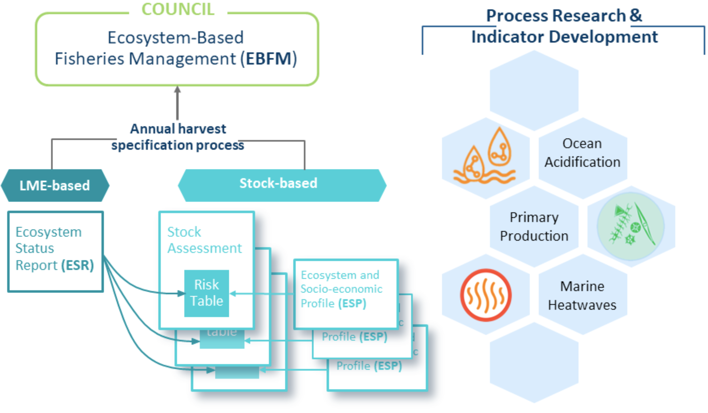
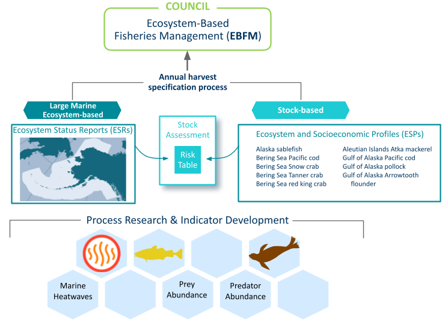
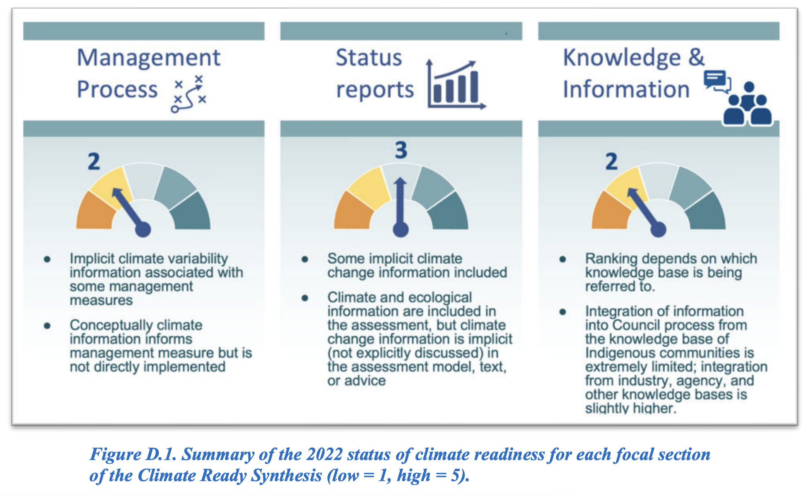
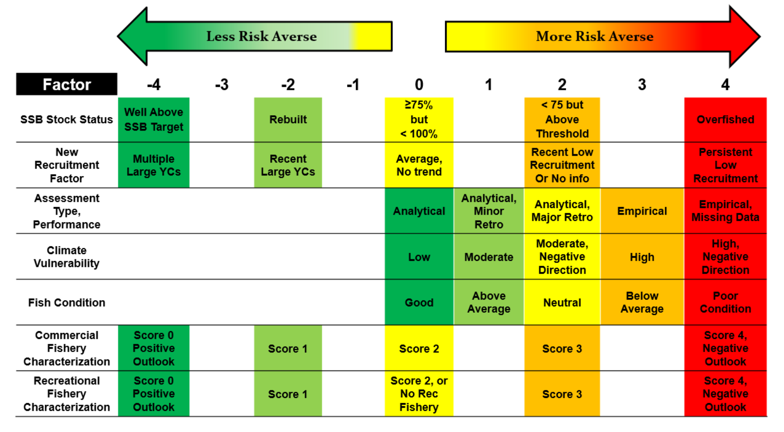
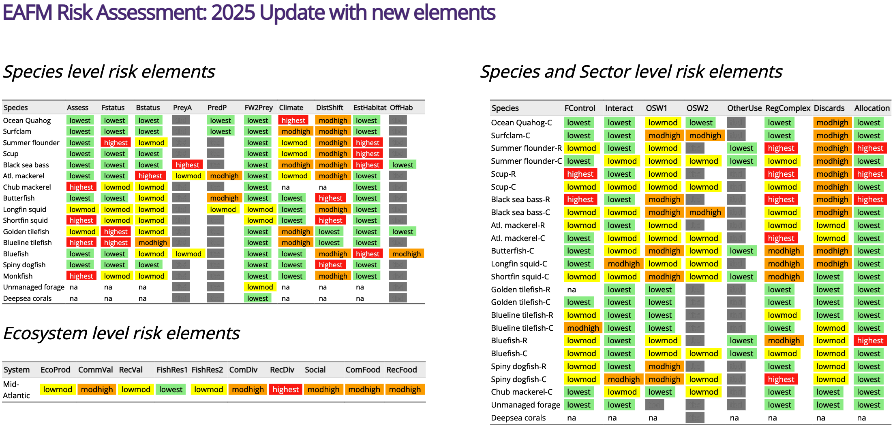
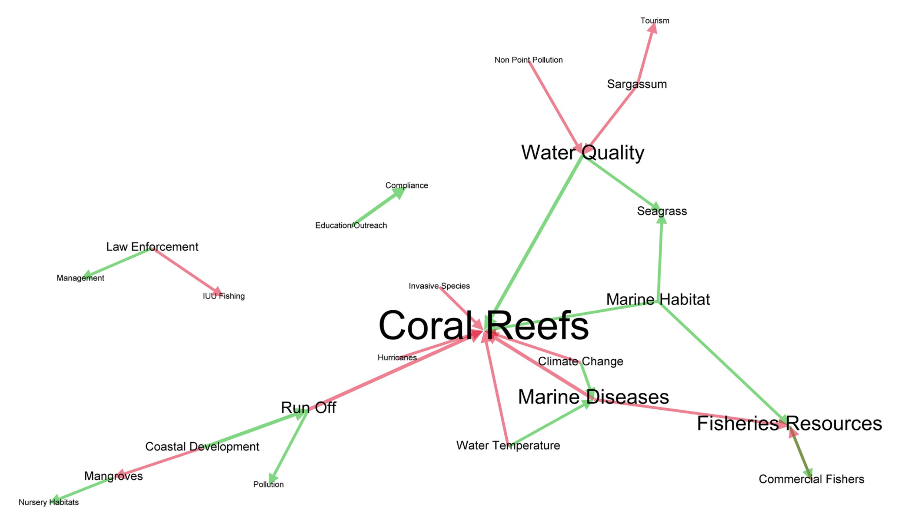

```{r setup, include=FALSE}
knitr::opts_chunk$set(echo = TRUE)
```

# Objectives

1) Review the different types of ecosystem data and information including data products and
decision-support tools (e.g. Ecosystem Status Reports, Climate Vulnerability Assessments, risk
assessments) currently available to the regional management councils and evaluate how they are
used in council management processes;

2) Identify opportunities and methods for incorporating identified ecosystem information into
SAFMC management processes, including inter-jurisdictional management decision-making
processes, and identify practical requirements for successful implementation (e.g. data quality,
frequency of information updates, regional council process consistency, implementation
timelines); and

3) Identify opportunities to continue to expand cooperative, constituent-engaged data collection
and research to improve the available ecosystem information in the South Atlantic region (e.g.,
study fleets, cooperative research, citizen science).


# Methods

## Conduct an ecosystem information review across Councils, including SAFMC

### Comprehensive literature review: peer reviewed literature and Council webpage search for current and past ecosystem approaches

Lit search terms:

*  Google search and google scholar: "ecosystem indicators US fishery management councils"  
*  NOAA IR: "ecosystem status report" "climate vulnerability analysis" "fisheries ecosystem plan"  

Web scraping Council sites for documents including the terms "ecosystem approach|ecosystem indicator|ecosystem report|ecosystem status|ecosystem based" using [this code](https://github.com/sgaichas/SAFMCindicators/blob/main/R/FindCouncilEcoDocs.R)

Documents and information from the Council Coordinating Committee's recent meetings: 

*  2022 Council Member Ongoing Development Workshop on New Approaches to EBFM/EAFM https://www.fisherycouncils.org/cmod-workshops/2022. 
*  2022 Seventh National Scientific Coordination Subcommittee Workshop on Adapting Fisheries Managment to a Changing Ecosystem https://www.fisherycouncils.org/ssc-workshops/scs-7  
*  2024 Eighth National Scientific Coordination Subcommittee Workshop on Applying ABC Control Rules in a Changing Environment https://www.fisherycouncils.org/ssc-workshops/scs-8 


### Gather contextual data about the Councils: 

How much area do they manage? Summarized in Table 2 from @bachman_use_2025

How many U.S. states and territories are represented in each? Drawn from https://www.fisherycouncils.org/

How many FMPs and FEPs? Drawn from https://www.fisherycouncils.org/ and individual Council reviews below.

```{r}
EEZareas <- readr::read_table(here::here("docs/Bachman2025Tab2.txt"))

EEZclean <- EEZareas |>
  dplyr::filter(!Region %in% c("PercentofU.S.EEZ")) |>
  dplyr::mutate(dplyr::across(EEZArea:SeasonalFisheryManagement, ~as.numeric(stringr::str_remove(.x, ","))))

regionnames <- data.frame(Region = EEZclean$Region,
                          CouncilName = c("New England",
                                         "Mid-Atlantic",
                                         "South Atlantic",
                                         "Gulf",
                                         "Caribbean",
                                         "Pacific",
                                         "North Pacific",
                                         "Western Pacific",
                                         NA),
                          Nstates = c(4, 7, 4, 5, 3, 3, 1, 11, NA),
                          NFMPs = c(9, 7, 8, 7, 3, 4, 6, 0, NA),
                          NFEPs = c(0, 1, 1, 1, 0, 1, 2, 5, NA))

proparea <- EEZclean |>
  dplyr::select(Region, EEZArea) |>
  dplyr::filter(!Region %in% c("Totalarea")) |>
  dplyr::mutate(Proparea = EEZArea/sum(EEZArea),
                Percarea = Proparea*100) |>
  dplyr::left_join(regionnames)

proparea |>
  dplyr::select(CouncilName, EEZArea, Percarea, Nstates, NFMPs, NFEPs) |>
  flextable::flextable() |>
  flextable::colformat_double(
      j = c("Percarea"), # Specify the columns to format
      big.mark = "",             # Set big.mark to an empty string to remove commas
      digits = 2                  # Specify the number of decimal places
    ) |>
  flextable::set_header_labels(
      CouncilName = "Council",
      EEZArea = "EEZ Area (sq km)",
      Percarea = "Percent of U.S. EEZ", 
      Nstates = "Number of States/Territories",
      NFMPs = "Number of FMPs",
      NFEPs = "Number of FEPs"
    ) |>
  flextable::set_table_properties(layout = "autofit", width = 1)


```


Structured interviews of key regional personnel to document ecosystem information sources, data products, and processes where ecosystem information is used for each U.S. Fishery Management Council, including SAFMC. 

This comprehensive review will place current SAFMC practice and products in the context of the experience of all other U.S. Councils, and set the stage to identify opportunities to use its existing ecosystem information resources, including an ecosystem status report, climate vulnerability analyses for fish and fishing communities, and citizen science program.

## Develop recommendations for ways to incorporate ecosystem information into SAFMC fisheries management processes

Annual catch specification--ESRs/ESPs into assessments, SSC processes for ABC buffers. Can ESPs work in SEDAR and SAFMC SSC processes?

To identify opportunities specific to SAFMC processes beyond catch decisions, I will review both SEDAR processes and Council actions for the past 3-5 years to evaluate current and potential pathways for the use of ecosystem information. This review will include inter-jurisdictional processes such as the East Coast Climate Scenario Planning and subsequent East Coast Climate Coordination Group. Noting that the Council is also currently requesting proposals to review its fisheries management process, I would coordinate with that project if practical given project timelines. Based on this review, I will classify management decisions by data needs and process timelines to develop a prioritized list of processes linked to ecosystem information and recommend practical pathways for implementation. Below are several examples that could be further refined for the South Atlantic context during the project.

# Results

## Ecosystem information review across Councils

ADD TABLES: ESR sections and indicator contents by Council, CVA species by Council, ESP species by Council, FEP structure by Council

PRELIMINARY THOUGHTS/HYPOTHESES TO TEST

Three general categories for current use of ecosystem products: FMP/indicator based, FEP/geographically based, and developing

WPFMC and CFMC: island based FEP/FMPs structure decisions for species within a defined ecoregion, done because each island has distinct social, economic, and ecological conditions and conducting species assessments across all islands was probably never practical. Ecosystem reporting has been intermittent (WPFMC) or only recently developed (CFMC). Characterized by a lot of species, many data limited

NPFMC, PFMC, MAFMC, NEFMC: species based FMPs structure decisions although many species can be within an FMP. Annual ecosystem indicator reports are produced and presented to each Council. Ecosystem indicators have been examined and sometimes used at the full ecosystem, ecoregion (subset of area within Council jurisdiction), species, and stock levels for decision making. Characterized by high value data rich stocks with complex quantitative assessments although data limited stocks and species complexes are also in the region

SAFMC, GFMC: developing. species based FMPs structure decisions although many species can be within an FMP. SAFMC has a voluminous FEP and a recent ecosystem indicator report, though not annual.  I need to look at GFMC that is the only one where I have no idea right now.

WHAT DO THE COUNCILS THINK ABOUT THEIR APPROACHES?

Interview Template:

Review Data products from lit review

Review Uses of record from lit review

Validate the above, then:

What other uses not recorded?

What are successes with current information and processes

What are and challenges with current information and processes

What might be done differently to better meet each Council’s objectives

### In depth each Council, pre interview

#### NPFMC

The North Pacific Council manages fisheries using Fishery Management Plans (FMPs): five FMPs are species-based (Groundfish-2 areas, Crab, Salmon, and Scallop) and one is area-based (Arctic). FMP based single species groundfish and crab management has evolved to include ecosystem indicators in the catch specification process, as described below. 

The North Pacific Region has three Ecosystem Status Reports (ESRs), one for each ecoregion: Eastern Bering Sea [@siddon_ecosystem_2024], Gulf of Alaska [@ferriss_ecosystem_2024], and Aleutian Islands [@ortiz_ecosystem_2024]. Reports include graphical and text report cards for each region, ecosystem assessment sections, and detailed indicator sections, with multiple appendices. In this region, Ecosystem and Socio-economic Profiles (ESPs), an ecosystem status report tailored to an individual stock, were invented [@shotwell_introducing_2023] and are produced for select stocks: Alaska sablefish [@shotwell_ecosystem_2024-2], Eastern Bering Sea Pacific cod [@shotwell_ecosystem_2024-1], Eastern Bering Sea snow crab [@fedewa_appendix_2024], Bristol Bay red king crab [@fedewa_appendix_2024-1], Bering Sea and Aleutian Islands tanner crab [@fedewa_ecosystem_2024], Aleutian Islands Atka mackerel [@sullivan_proposed_2025], Gulf of Alaska pollock [@shotwell_appendix_2024], Gulf of Alaska Pacific cod [@shotwell_ecosystem_2024], and Gulf of Alaska arrowtooth flounder [@shotwell_appendix_2025]. In addition to these ecosystem and stock specific indicator reports, the Council recieves reports on unmanaged forage fish [@vollenweider_2024_2024], grenadiers [@siwicke_assessment_2024], and a multispecies model incorporating climate drivers for Eastern Bering Sea pollock, cod, and arrowtooth flounder [@holsman_2024_2024]. A separate annual economic status report [@abelman_stock_2024] is also presented. All are available online https://www.npfmc.org/library/safe-reports/. 

ESRs are produced annually, and many ESPs are updated annually, with both presented alongside updated stock assessments in the Council's annual specifications process. Both ESRs and ESPs feed into annual catch specification through risk tables presented in stock assessments [@dorn_risk_2020]. Both data products draw on process research conducted in the region to develop indicators. 

To date, risk tables incorporating ecosystem indicators have been presented in up to 18 stock assessments annually. Since risk tables were introduced in 2018, 14 stocks have had reductions in ABC from the maximum permissible due to risk information (including stock assessment, population dynamics, and fishery concerns as well as ecosystem concerns). In 2024, reductions to three stock ABCs were based on stock assessment, population dynamics, and fishery considerations. No reductions were taken in response to ecosystem considerations. 

<!---->
 
 
FEPs have been developed for the Aleutian Islands (shelved) and the Bering Sea (active). The Bering Sea FEP intends to use ESRs for monitoring progress against ecosystem objectives, and has "action modules" focusing on climate readiness, incorporation of local and traditional knowledge, evaluating current management alongside EBFM best practice, developing conceptual models, and alignment of Council priorities with research funding. 

The BS FEP team appears to meet annually, the most recent meeting was January 2024. Are other action modules to be activated, or are they at capacity? 

The first two FEP action modules have been initiated, and a final report is available from the Climate Change Task Force, as well as a ranking of climate readiness completed by the Climate Change Task force. Climate readiness was ranked 2-3 out of a possible scale of 5 This report noted the importance of ESRs in providing links between observed trends and long term climate change.



A Climate Vulnerability Analysis for Bering Sea species has been published [@spencer_trait-based_2019], however its direct use in management processes is unclear... The Climate Ready Synthesis recommended inclusion of climate vulnerability information in status reports/risk assessments; perhaps this is being done?

A climate scenario planning workshop took place in June 2024. How has this been integrated?

The Climate Change Task Force recommended several next steps and the Council took action in Dec 2024 to address the steps. The SSC held a [workshop in June 2025](https://meetings.npfmc.org/Meeting/Details/3093) to address a Council October 2024 motion "Consider to what extent, and whether, to revise groundfish and crab harvest control rules (HCRs) to be more climate-resilient." This is a step towards bringing alternative harvest management measures with more climate awareness and flexibility to the Council. 

It appears the NPFMC IRA projects were to address some of these steps and the Council may also be initiating a programmatic EIS to encompass climate-ready/resilient management goals and objectives. This would likely expand beyond ABC/TAC specification to other management measures such as spatial management (noted in the Climate Ready Synthesis). 

ESRs have been produced since 1995, are also presented as contextual information, and have been used to adjust TAC advice in the past [@zador_ecosystem_2016]. AFSC staff produce the reports as part of their regular duties (dedicated resources), while contributors range from NOAA staff to academic researchers in the region who have varying availability or resources to update indicators. The Council's FEP driven Climate Change Task Force identified a need for additional resources to implement recommendations for improving climate readiness.

The North Pacific Council region includes multiple large marine ecosystems, a single U.S. state (Alaska) and federal waters. Stock and ecosystem areas are spatially aligned, and stock and ecosystem assessments are temporally aligned for the groundfish and crab FMPs. Commercial fisheries dominate landings.

**Contacts:** Diana Evans deputy and ecosystems, Diana Stram co led CCTF, Katie Latanich climate program mgr, David Witherell Exec dir


#### PFMC

The Pacific Council manages under 4 multispecies FMPs: Salmon, Groundfish, Coastal pelagic species, Highly migratory species. 

The Pacific Council FEP was developed in 2013 and revised in 2022. The 2022 FEP is informational and not prescriptive, retaining Council discretion to act on ecosystem information. It specifies goals and objectives as well as "ecosystem initiatives" that focus on priority actions (described below). The FEP includes an outline of ecosystem science uses in the Council process. 

FEP Initiative 1 prohibited directed fishing on currently unexploited, unmanaged forage fish in the region and was completed in 2015. FEP Initiative 2 reviewed the ESR 2015-2016 to better inform the Council of both ecosystem indicators and processes and the potential use of this information in management [@tommasi_case_2021]. FEP Initiative 3, completed in 2019, was the Climate and Communities initiative to evaluate potential impacts of climate change and identify ways to improve flexibility and responsiveness of management. As part of this initiative, climate scenario planning was completed. How is this being used?

As prescribed in its FMP, The Pacific Council receives a single ESR produced annually for the California Current ecoregion [@leising_2024-2025_2025-1], consisting of a graphical summary and ~40 page main report with many detailed appendices for indicators and methods. Additional appendices are included for both short term and long term ecological and climate forecasts. Forecast uncertainty and evaluation of previous forecasts are included. 

ESP like products [@tolimieri_oceanographic_2018; @haltuch_oceanographic_2020] exist for at least 2 species.

Which assessments include ecosystem indicators directly?

CVA exists [@mcclure_vulnerability_2023] and is proposed for use as a component in the process determining ABC uncertainty buffers (see below).

The SSC is evaluating risk tables in progress for stock assessments and ABC decisions (see below), but they are reframed as uncertainty tables using IPCC "confidence" language on degree of agreement of indicators and robustness of evidence). FEP Initiative 4, [Ecosystem and Climate Information for Species, Fisheries, and FMPs](https://www.pcouncil.org/actions/ecosystem-and-climate-information-for-species-fisheries-and-fmps/), is currently active and is developing an ecosystem and climate risk assessment framework for use in the catch specification process. This is patterned on the use of risk tables in NPFMC harvest specification, but is tailored to the p* process used in PFMC. The ecosystem team tested options and recommended one where ecosystem and climate risks would alter the sigma applied to characterize scientific uncertainty in the OFL  (sigma is equivalent to the MAFMC SSC OFL CV). PFMC sigmas are 0.5 for high certainty assessments, 1 for data moderate assessments, and 2 for data limited assessments, with additional increases in sigma as time passes since the most recent assessment. Ecosystem and climate risks could further inform sigma, increasing or decreasing it as these factors increase or decrease uncertainty. 

In lieu of an ESP type product, the proposal would be for ecosystem and stock scientists to have a structured conversation to identify key uncertainties in the assessment and evaluate ecosystem drivers of the stock not included in the assessment to fill out a table indicating whether ecosystem conditions are favorable, neutral, or unfavorable for the stock. This draws on previous literature and the indicators reported in the ESR. Information from the CVA for each stock is included in this discussion. The structured discussion template is included in the [2024 report](https://www.pcouncil.org/documents/2024/08/h-1-a-cciea-team-report-1-cciea-risk-table-report-on-fep-initiative-4.pdf/).

Use in other management processes?

Both the Northwest and Southwest fisheries science centers have dedicated staff supporting ESR production. The CCIEA team developed the recommendation for use of assessment and ecosystem information in the SSC's ABC decision process. 

The Pacific Council region includes one large marine ecosystem spanning three states and federal waters. Mostly commercial fisheries?

**Contacts**:  Gilly Lyons Ecosystems and climate initiatives, Marlena Bellman SSC lead,  Kerry Griffin habitat, Kelly Ames deputy, Merrick Burden Exec dir

#### WPFMC

The Western Pacific Council manages with 5 place-based Fishery Ecosystem Plans established in 2010: Hawaii, American Samoa, Mariana, Pacific remote islands, Pelagic. The Council established the first US ecosystem based FMP for coral reefs in 2004, and initiated development of its FEPs in 2005 with a series of workshops introducing and developing EAFM, focusing on biophysical, social science, and policy aspects of EAFM [@martell_fishery_2020]. Fishery and protected species management issues as well as ecosystem information are considered in each FEP. The Council guiding principles include promoting an ecosystem approach. The Council has Regional Ecosystem Advisory Committees (REACs) made up of Council members and government officials, business, academic, and NGO representatives who are responsible for or interested in activities on land and outside fisheries that may affect fishery management; REACs represent Hawaii, American Samoa, and the Mariana Archipelago.  

Western Pacific SAFE reports for each FEP include three sections: fishery performance, ecosystem considerations, and data integration, and are available at https://www.wpcouncil.org/annual-reports/. Fishery performance includes catch and effort information. The ecosystem considerations include fisher observations, coral reef fish biomass and habitat condition indicators, life history parameters, socioeconomics, protected species, climate and ocean indicators, EFH, and marine planning sections (updated through 2024). The data integration section is intended to link environmental indicators with managed stocks. These sections are less developed in each SAFE. The Hawaii example is uku, but it appears it has not been updated since 2018 and includes data through 2012 [@wprfmc_annual_2025]. There is an ESP for Hawaii uku [@ayers_ecosystem_2022]. The American Samoa [@wprfmc_annual_2025-1] and Marianas Archipelago data integration sections includes multivariate analysis updated through 2016 [@wprfmc_annual_2025-2]. Pelagic [@wprfmc_annual_2025-3] and Pacific Remote Island Area [@wprfmc_annual_2025-4] all include updated climate and ocean indicators. June 2025 Council discussions suggested that summaries of what has changed in SAFEs would be useful for the Council; "dashboard" presentations are being considered by the FEP teams. 

There is a p* process and a Social, Ecological, Economic, and Management (SEEM) process for specifying scientific and management uncertainty, respectively. The p* is done by the SSC while the SEEM process is a collaboration between fishers, scientists, and managers. Research priorities for the coming years seek to bound harvest levels based on stock and ecosystem productivity while considering climate change effects on productivity. 

An ESR for Hawaii with the same geographic scope as Hawaii FEP was produced in 2022 [@gove_2022_2022]; prior reports were for West Hawaii only. The 2022 report includes socioeconomic, fisheries, coral reef, climate, human impact, and coral reef climate vulnerability sections. Identifies cumulative impacts. Aspects on nearshore fisheries were included at the request of the Council. Habitat recovery depends on both land based and fishery management. PIFSC is on the Hawaii REAC for the Council. Has the ecosystem considerations portion of each SAFE replaced this? How related are they? 

CVA was conducted for the full Pacific Islands region [@giddens_assessing_2022]. Included/referenced in FEP SAFE reports? Not that I can see

Active spatial ecosystem indicators include [turtle watch](https://oceanwatch.pifsc.noaa.gov/turtlewatch.html) that is updated daily to indicate regions of potential turtle bycatch for pelagic fisheries based on temperature, and [ocean watch](https://oceanwatch.pifsc.noaa.gov/indicators.html) that summarizes ocean conditions in key fishing and coral areas. Ocean watch data includes coral reef bleaching hotspot and alert area data but I can't find how this translates into an indicator being used.  

There is a Fisheries Ecosystem Analysis Tool ([FEAT](https://apps-pifsc.fisheries.noaa.gov/FEAT/#/)) online that summarizes fishery performance indicators 2002-2018 (landings, revenue, and participation by fleet and region), cost data through 2016, nearshore state and island fishery trends, spatial catch and effort in the Western Pacific, and reports on social science work. 

The State of Hawaii is using layers on [cumulative impacts](https://www.arcgis.com/home/item.html?id=ca750b9476fb429b809d1300628f3bb7), habitat efforts are also using the information. 

The Hawaii EEZ is slightly bigger than the West Coast EEZ. Resources for ecosystem reporting are limited in PIFSC, but many scientists are listed as contributors to SAFEs. 

**Contacts**: Mark Fitchett Pelagic fisheries, Ecosystem scientist, Joshua DeMellow, Island fisheries coordinator, Kitty Simonds Exec dir

#### NEFMC

The New England Council manages under 9 FMPs. Three are mutispecies FMPs: Northeast multispecies ("groundfish"), Small mesh multispecies, and Skates; and six are single species FMPs: Atlantic Scallop, Atlantic Herring, Monkfish, Dogfish, Salmon, Deep Sea Red Crab. Dogfish and Monkfish FMPs are joint with the Mid-Atlantic Council. The Atlantic Herring FMP features a harvest control rule that was designed to account for herring's role as forage in the ecosystem using a multi-species stakeholder-driven management strategy evaluation [@deroba_dream_2018; @feeney_integrating_2019]. 

An [example FEP](https://d23h0vhsm26o6d.cloudfront.net/3_Draft-example-Fishery-Ecosystem-Plan-eFEP_190830_113712.pdf) was developed between 2012 and 2024 illustrating ecosystem based management on Georges Bank, including management with aggregate ecosystem and fish guild level total allowable catches (ceilings) and single species minimum biomass thresholds (floors) for 10 species on Georges Bank. The proposed EBFM was designed to address both ecological and fleet technical interactions and the need for increased fishery operational flexibility. However, this FEP was not formally adopted, and the Council has suspended development of this FEP approach in favor of the new indicator-based risk policy operating within established FMPs.

The New England region gets a State of the Ecosystem (SOE) report each year that covers two ecoregions: the Gulf of Maine and Georges Bank [@caracappa_state_2025]. Coastwide Northeast U.S. indicators are also included. The New England SOE report includes a graphical summary section and three report sections: performance against fishery management objectives, risks to meeting fishery management objectives, and ecosystem highlights from the most recent year. Fishery management objectives are drawn from U.S. legislation [@depiper_operationalizing_2017], and risks include climate-driven changes and other ocean uses (offshore wind development). 

Ecosystem profiles and ESPs have been produced for 3 species during research track assessments: American plaice [@behan_ecosystem_2022-1; @behan_environmental_2022], Atlantic cod [@behan_profile_2023; @behan_environmental_2023; @tyrell_development_2023], and Atlantic herring [@molina_atlantic_2025]. All Northeast US ESPs to date are listed here: https://www.fisheries.noaa.gov/new-england-mid-atlantic/ecosystems/ecosystem-and-socioeconomic-profile-development-and-reports

To date ecosystem indicators have been integrated into 2 research track stock assessments for Southern New England Mid Atlantic (Gulf Stream Index controls expected recruitment) and Georges Bank (deviation from BH recruitment controlled by bottom temperature) yellowtail flounder. Decisions were based on literature review and statistical indicator testing similar to an ESP process. 

The Council is developing a [risk policy](https://d23h0vhsm26o6d.cloudfront.net/Risk-Policy-Statement-and-Concept-Overview-for-posting-v1-final.pdf) that will use some indicators from the SOE and possibly ESPs. The policy evaluates risk due to stock status and assessment uncertainty, climate and ecosystem drivers, and economic and community considerations. Indicators are being selected for each category will be scored according to criteria established for the category, then scores across categories are to be weighted by the Council to achieve an overall risk score for each stock given the set of indicators. The risk score would then be used to adjust the buffer between OFL and ABC using the established control rule for the stock in question (NEFMC harvest control rules vary by FMP). The Council plans to start with its groundfish FMP to refine this indicator based risk approach.

 

A climate vulnerability analysis for Northeast U.S. species has been published [@hare_vulnerability_2016], and provides input to the new risk policy currently in development by the Council. Both community climate vulnerability [@colburn_indicators_2016] and habitat climate vulnerability [@farr_assessment_2021] have also been assessed in the Northeast U.S., and marine mammal climate vulnerability has been assessed for the entire Atlantic Coast [@lettrich_vulnerability_2023]. 

Northeast SOE reports have been produced annually since 2017. Prior to that, longer ESRs were produced in 2002, 2009, 2012, and 2015. The NEFSC dedicates staff time to developing annual ecosystem reports and intermittent ESPs. 

The New England Council region includes  New England fisheries are dominated by commercial fisheries. 


**Contacts**: Jonathan Peros Fisheries management and Risk policy lead, Jamie Cournane Science and assessment lead, Rachel Feeney SSC lead, Michelle Bachman Habitat lead, Andy Applegate EAFM, Cate O'Keefe Exec dir

#### MAFMC

The Mid-Atlantic Council manages under 7 FMPs; 4 multispecies (Summer flounder scup and black sea bass; Mackerel squid and butterfish, Surfclam and ocean quahog, and Tilefish) and 3 single species (Bluefish, Spiny Dogfish, Monkfish). Dogfish and Monkfish FMPs are joint with the New England Council.

The Council's Ecosystem Approach to Fisheries Management (EAFM) Policy Guidance Document functions similarly to an FEP in outlining Council policy in a non-regulatory document. It highlights EAFM policy guidance in several strategic areas including forage fish, habitat, climate change, and ecosystem interactions, with social and economic issues considered through all strategic areas. Based on the EAFM policy strategic areas, the Council has implemented operational management including an unmanaged forage amendment, updated EFH designations based on a regional habitat assessment, and climate change research, scenario planning, and multi-Council coordination. 

The policy guidance for addressing ecosystem interactions outlines a decision process beginning with risk assessment for prioritizing key interactions, conceptual modeling for identifying links between risks, information gaps, and questions the Council can address, and management strategy evaluation to quantitatively analyze tradeoffs and management options regarding the high priority ecosystem interactions [@gaichas_framework_2016]. The EAFM risk assessment has been used to identify priority fisheries for further analysis with conceptual modeling [@depiper_learning_2021] and management strategy evaluation [@muffley_there_2021]. The risk assessment was expanded in 2024 to include additional risk elements, indicators, and risk criteria.

The Mid-Atlantic region gets a State of the Ecosystem (SOE) report each year that covers one ecoregion: the Mid-Atlantic Bight [@gaichas_state_2025]. Coastwide Northeast U.S. indicators are also included. The Mid-Atlantic SOE report includes a graphical summary section and three report sections: performance against fishery management objectives, risks to meeting fishery management objectives, and ecosystem highlights from the most recent year. Fishery management objectives are drawn from U.S. legislation [@depiper_operationalizing_2017], and risks include climate-driven changes and other ocean uses (offshore wind development). 

Ecosystem socio-economic profiles have been produced for X stocks during research track assessments:  black sea bass [@tabandera_black_2024], bluefish [@tyrell_bluefish_2022], golden tilefish [@salois_golden_2024], longfin inshore squid (in progress as of October 2025), and shortfin squid [@salois_oceanographic_2022]. All Northeast US ESPs to date are listed here: https://www.fisheries.noaa.gov/new-england-mid-atlantic/ecosystems/ecosystem-and-socioeconomic-profile-development-and-reports

To date, ecosystem indicators have been integrated into the operational black sea bass assessment (winter bottom temperature, northern area influences expected recruitment) and into research track models for black sea bass and bluefish (forage fish index influences recreational index catchability). Decisions were based on ESPs.

The Council uses indicators from both the SOE and ESPs in an annual ecosystem-level risk assessment [@gaichas_implementing_2018]. This risk assessment is part of the Council's Ecosystem Approach to Fisheries Management (EAFM) as laid out in their 2019 policy document. 



A climate vulnerability analysis for Northeast U.S. species has been published [@hare_vulnerability_2016], and is considered within the SSC's ABC deliberation process as part of ecosystem factors contributing to uncertainty in the OFL. Both community climate vulnerability [@colburn_indicators_2016] and habitat climate vulnerability [@farr_assessment_2021] have also been assessed in the Northeast U.S., and marine mammal climate vulnerability has been assessed for the entire Atlantic Coast [@lettrich_vulnerability_2023]. A habitat-species climate vulnerability crosswalk is also being considered during deliberations, but is not yet formally part of the OFL CV protocol. 

Northeast SOE reports have been produced annually since 2017. Prior to that, longer ESRs were produced in 2002, 2009, 2012, and 2015. The NEFSC dedicates staff time to developing annual ecosystem reports and intermittent ESPs. 

Mid-Atlantic fisheries are approximately evenly split between commercial and recreational. 

**Contacts**: Brandon Muffley, Ecosystems SSC and EOP, Jessica Coakley Habitat and EOP, Chris Moore Exec director

#### CFMC

The Caribbean Council manages under three Island-Based FMPs for for Puerto Rico, St. Croix, and St. Thomas/St. John. The FMPs identify objectives and measures for all of the major fisheries, habitat, and ecosystem issues in each region. Up until 2022, the Caribbean Council managed under region-wide FMPs for spiny lobster, queen conch, reef fish, and corals (with a prohibition on coral take). The Island-Based FMPs were initiated in 2012 to address management issues unique to each island and to lay the groundwork for place-based EBFM; these Island-Based FMPs have been used for management since October 2022. The Island Based FMPs all refer to EBFM as the overarching management principle, and include goals and objectives related both to fishery stock management and sustainable ecosystem services.

An FEP is under development by the Council's EBFM Technical Advisory Panel (TAP) using ecosystem conceptual models developed for each island by District Advisory Panels and diverse stakeholder groups [@seara_development_2024] as a starting point to identify "where we are now" in the FEP loop [@levin_building_2018]. The conceptual models identify the most important ecological and social components, relationships, and drivers of each island fishery ecosystem, as informed by expert knowledge from fishers, managers, and scientists serving on the SSC. 



The Caribbean region has the newest ESR [@southeast_integrated_ecosystem_assessment_program_caribbean_2025], the first produced for this region. The Caribbean ESR is organized according to the goals and objectives identified in each Island Based FMP, and uses indicators inspired by the conceptual models developed for each island. The first section of the report evaluates progress towards FMP objectives in the categories of food production, socioeconomic health, equity, engagement/participation, bycatch reduction, governance, and ecosystem protection. The second section evaluates risks to meeting those objectives. 

A project is in progress to develop fishery species CVA for this region (see below). Marine mammal climate vulnerability has been assessed for the entire Atlantic Coast including the Caribbean [@lettrich_vulnerability_2023]. 

Current Council projects include "Developing a US Caribbean Hub to Operationalize EBFM in the US Caribbean" to advance indicator-based risk assessment, "Evaluating Priority Species Vulnerability to Changing Environmental Conditions" to initiate a CVA for the region, and "Understanding Impacts of Extreme Events on the Fishery Ecosystem and the Fishers’ Communities in the U.S. Caribbean" to strengthen outreach and education. 

The Caribbean Council is one of three regional Councils served by SEFSC, the other two are the Gulf and South Atlantic. While SEFSC dedicates some staff resources to ecosystem reporting, resources to date have been inadequate to produce annual ecosystem reports across all three regions. However, streamlined processes and automation were developed for the current ESR that may permit more frequent updates. 

Caribbean fisheries are characterized by high species diversity, critical dependence on vulnerable nearshore and coral reef habitats, many artisanal commercial fishers with a variety of gears landing in many ports, and a recreational fishery with similar characteristics and yield; these conditions make typical single species data collection, assessment, and management approaches difficult [@appeldoorn_transforming_2008]. 

**Contacts**: Liajay Rivera García FMP and EBFM, Graciela García-Moliner FMP and Habitat, Miguel A. Rolón Exec dir

#### GFMC

The Gulf Council manages under 7 FMPs; 4 multispecies (Coastal migratory pelagics, Reef fish, Shrimp, Coral) and 3 single species (Red drum, Spiny lobster, Stone crab), with and additional FMP for Aquaculture.  The original Coral FMP was joint with South Atlantic Council. 

A Gulf FEP has been drafted by contractor in 2022. This FEP also evaluated cooperative research and citizen science programs. Further FEP development is in progress with the Council's ecosystem technical team. The FEP extension follows the process outlined in the Pacific and North Pacific of identifying a Fishery Ecosystem Issue (FEI). An example FEI addressing red tide illustrates going through FEI loop [@levin_building_2018] identifying objectives, potential indicators, and uses of the indicators to support management. The FEI steps include scoping (the where are we now step) with stakeholders to outline the issue, data available, and potential for Council management, development and execution of a workplan (where are we going), implementation with recommended research, communication, and tradeoff analysis among management options, folowed by management recommendation and evaluation of the recommended actions. 

For the red tide issue, extensive scoping work is already complete, and considerable data is available for red tides. The red grouper and gag grouper stock assessments include red tide mortality, and red tide uncertainty has been considered by the SSC for these stocks. An new red tide index is currently in development by Council staff. Three index options were presented in May 2025. 

Two ESRs have been produced for the Gulf, in 2013 and most recently in 2017 [@karnauskas_ecosystem_2017]. The Gulf ESR reports on climate, physical, habitat, lower and upper trophic level, ecosystem services, and human dimensions indicators, then analyzes combined trends across all of the section indicators to provide an overview of ecosystem conditions. A fish CVA was recently completed [@quinlan_results_2023], and marine mammal climate vulnerability has been assessed for the entire Atlantic Coast, including the Gulf [@lettrich_vulnerability_2023]. 

The Gulf Council is one of three regional Councils served by SEFSC, the other two are the Caribbean and South Atlantic. While SEFSC dedicates some staff resources to ecosystem reporting, resources to date have been inadequate to produce annual ecosystem reports across all three regions. However, streamlined processes and automation were developed for the Caribbean ESR that may permit more frequent updates across all regions. 


**Contacts**: Verena Wang Ecosystems, Ryan Rindone Fishery bio and SEDAR, John Froeschke Deputy, Zeenatul Basher Coral and Habitat, Carrie Simmons Exec director

#### SAFMC

The South Atlantic Council manages under 8 FMPs: 4 multispecies (Coastal migratory pelagics,  Dolphin Wahoo, Shrimp, Snapper Grouper), 2 single species (Golden crab, Spiny lobster) and 2 habitat oriented FMPs (Coral and live bottom habitat, Sargassum). The original Coral FMP was joint with the Gulf. Habitat forms the basis of ecosystem based management in the South Atlantic. The two habitat FMPs for Coral and Sargassum outline 

The South Atlantic FEP contains both extensive description of the ecosystem (>50% of 400 pages) as well as essential fish habitat (EFH) policy statements that specifically outline indicators and research to support policies. Policies include:  

* South Atlantic Food Webs and Connectivity Policy – January 2025
* Climate Variability and Fisheries – December 2016
* Beach Dredging and Filling, Beach Renourishment and Large-Scale Coastal Engineering – September 2023 
* Energy Exploration, Development, Transportation and Hydropower Re-Licensing - November 2024         
* Interactions Between Essential Fish Habitats And Marine Aquaculture Policy – June 2014     
* Marine Submerged Aquatic Vegetation (SAV) Habitat Policy – June 2014    
* Alteration of Riverine, Estuarine and Nearshore Flows Policy – June 2014    
* Marine and Estuarine Non-Native and Invasive Species Policy – June 2014    
* Artificial Reef Habitat Policy Threats to EFH – September 2017    
* Threats Addressed by Policies Matrix – March 2021   

ESR [@craig_ecosystem_2021], FEP, and CVAs for fishery resources [@burton_climate_2023; @craig_climate_2025] and fishing communities [@seara_community_2022] Marine mammal climate vulnerability has been assessed for the entire Atlantic Coast [@lettrich_vulnerability_2023]. 


**Contacts**: Kathleen Howington Habitat & Ecosystem Scientist, Meg Withers Citizen Science Project Coordinator, John Hadley
Fishery Management Plan Coordinator & Fishery Economist, Chip Collier Deputy Director for Science, Myra Brouwer Deputy Director for Management, John Carmichael Executive Director

### Examples from other organizations

#### Atlantic States Marine Fisheries Commission

The Atlantic States Marine Fisheries Commission (ASMFC) coordinates management of fisheries shared by 15 states bordering the Atlantic Ocean. ASMFC manages a total of 27 stocks, some in partnership with the three Atlantic Councils or NOAA, and 15 species/groups under its own Interstate FMPs (ISFMPs): American Eel, American Lobster, Atlantic Croaker, Atlantic Menhaden, Atlantic Striped Bass, Atlantic Sturgeon, Black Drum, Northern Shrimp, Red Drum, Shad and River Herring, Spanish Mackerel, Spot, Spotted Sea Trout, Tautog, and Weakfish. 

ASMFC manages Atlantic menhaden using Ecological Reference Points (ERPs) that account for menhaden's role in the ecosystem [@anstead_path_2021; @howell_combining_2021]. The reference points are estimated from a multispecies food web model that includes menhaden and its key managed fish predator species [@chagaris_ecological_2020]. The food web model is calibrated based on current stock assessments for each managed fish species and fit to biomass and catch data used in each stock assessment. Therefore, the model assumptions about the productivity of each species match the information currently used to manage each species. Diet information from many sources is included in the model to estimate predator prey relationships. The ERP is estimated by evaluating a range of joint fishing mortalities of menhaden and its most responsive predator, striped bass, and finding the menhaden fishing mortality that maintains striped bass at its target biomass when striped bass are fished at their target fishing rate. (The model runs exploring these fishing scenarios include all the other predators and prey and their interactions, where other species are assumed to be fished at their current rates.) Once this fishing rate is found using the ecosystem model, it is translated into the menhaden single species assessment to complete short term projections of the menhaden stock including uncertainty in stock parameters.  

The process leading up to this approach included a history of multispecies modeling for menhaden and a stakeholder workshop to identify ecosystem management objectives [@anstead_path_2021], the development of multiple models over a range of complexity to evaluate predator prey relationships [@drew_balancing_2021], and close collaboration between the menhaden single species assessment team and the ERP modeling team [@chagaris_ecological_2020]. 

ASMFC has dedicated stock assessment resources, and has established a dedicated workgroup to continue the ERP process [@anstead_path_2021]. The ERP modeling takes advantage of existing single species stock assessment review to streamline evaluation of model inputs, which requires coordination among assessments.  

#### National Marine Sanctuaries

ESR like products used for ??? strategic planning?


### Interviews

#### NPFMC

#### PFMC

#### WPFMC

#### NEFMC

#### MAFMC

#### CFMC

#### GFMC

#### SAFMC

# Discussion

## Synthesis across Councils

Councils have a long history of learning from each other in designing and implementing ecosystem level planning. For example, the Pacific Council reviewed the Aleutian Islands, South Atlantic, and Western Pacific FEPs prior to developing its FEP. The Mid-Atlantic in turn reviewed the Pacific and other FEPs in developing its EAFM Policy Guidance Document (functionally an FEP). The North Pacific's Bering Sea FEP includes the "ecosystem initiative" approach to operationalizing aspects of EBFM, patterned on the Pacific FEP, and the developing Gulf Council FEP similarly includes Fishery Ecosystem Issues or FEIs as the basis for addressing specific ecosystem issues or goals. The island-archipelago based FEPs in the Western Pacific that are currently used for operational fishery management preceeded the Caribbean's development of island-based FMPs, replacing their the species based FMPs and setting the groundwork for geographically based EBFM. 

Iterative co-production of ecosystem data products with managers and scientists has is demonstrated to improve understanding and use of ecosystem data in fishery management [@muffley_there_2021; @tommasi_case_2021]. 

Forage fish considerations include 1. don't start fishing them if you aren't already (unmanaged forage fishing prohibitions combined with requiring data prior to the start of a new fishery), and 2. developing harvest control rules or ecological reference points accounting for supporting ecological services provided by forage fish is possible and has been done. Spatial management (buffer zones around endangered species colonies/rookeries) has also been implemented. 

## Recommendations for SAFMC

SAFMC shares a mix of reef-type or rockfish complex like data limited species with some high value data rich stocks, so a mix of approaches from the above may be warranted.

# References
