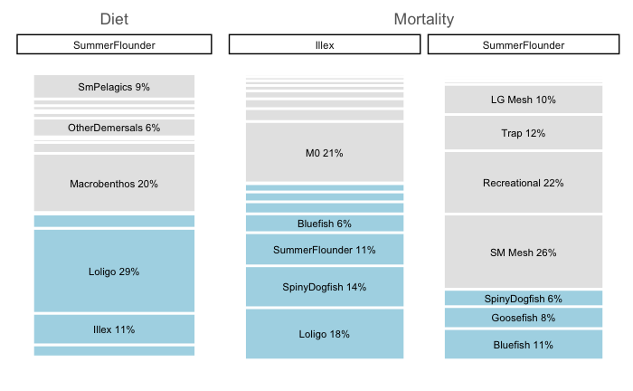
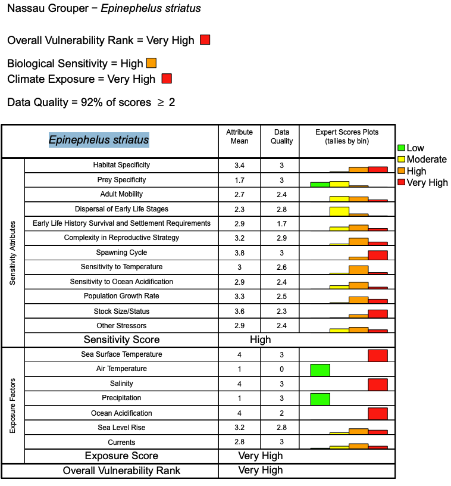

```{r setup, include=FALSE}
knitr::opts_chunk$set(echo = FALSE,
                      message = FALSE,
                      warning = FALSE,
                      fig.align = 'center')

library(tidyverse)
library(flextable) #hopefully makes actual tables in word
set_flextable_defaults(font.size = 10, padding = 5,
                       fonts_ignore=TRUE) #for latex

library(Rpath)
library(viridis)
library(data.table)


```

# Executive Summary

# Introduction

Federal Fishery Management Councils along the U.S. East Coast have been working towards improved management coordination and collaboration for the past several years under the [East Coast Scenario Planning Initiative](https://www.mafmc.org/climate-change-scenario-planning) and subsequent [East Coast Coordination Group](https://www.mafmc.org/east-coast-coordination-group). The purpose of the group is to improve management success in the face of changing ocean conditions and stock distributions that are outside historical bounds; in particular, across traditional management boundaries. A Potential Action Menu was developed for the Coordination Group to improve responsiveness and resilience in fishery management under changing conditions. A key Potential Action Menu item is identifying ecosystem information that can be used by Councils to evaluate changes in ecosystems and fishery resources, and ultimately to develop management that is robust to these changes. The South Atlantic Fishery Management Council (SAFMC) seeks to identify ecosystem data relevant to its region and managed resources, and to develop strategies to make the best use of ecosystem information in management. 

## Project Overview

Ecosystem information and data products are used in different ways across the U.S. Fishery Management Councils, depending on regional needs and information availability. To enhance opportunities for the SAFMC to use ecosystem information to support fishery management, an ecosystem information review was conducted to develop recommendations for ways to incorporate ecosystem information into SAFMC fisheries management processes. First, a comprehensive literature review was conducted and combined with structured interviews of key regional personnel to document ecosystem information sources, data products, and processes where ecosystem information is used for each U.S. Fishery Management Council, including SAFMC. This comprehensive review placed current SAFMC practice and products in the context of the experience of all other U.S. Councils, and set the stage to identify opportunities to use its existing ecosystem information resources, including an ecosystem status report, climate vulnerability analyses for fish and fishing communities, and citizen science program. 

Based on the completed review, opportunities to use ecosystem information in SAFMC processes will now be identified, and practical steps for implementation will be outlined in the current report. 
<!--
All Councils set annual catch advice, and there are multiple other management decisions where ecosystem information may help reduce uncertainty and support improved management outcomes. The next steps in this project will address both annual catch advice and other SAFMC management actions. The project will evaluate whether products such as Ecosystem Socioeconomic Profiles would be useful and practical for SAFMC catch specification processes given data and staff resources, whether Climate Vulnerability Analysis might be useful for assessing uncertainty and risk in adjusting catch levels, and what other approaches to integrating ecosystem information into catch specification would be feasible. The project will also systematically review SAFMC actions for the past 3-5 years to identify current and potential pathways for the use of ecosystem information. This review will include inter-jurisdictional processes such as the East Coast Climate Scenario Planning and subsequent East Coast Coordination Group. Based on this review, management decisions will be classified by data needs and process timelines to develop a prioritized list of processes linked to ecosystem information and recommend practical pathways for implementation. Example management decisions may include spatial allocation of catch, seasonal openings and closures, or bycatch management, each requiring indicators at different scales. The project will evaluate whether risk based frameworks are appropriate for these decisions, and specify indicators necessary to support decisions. The project will also explore whether global and regional ocean physics datasets could provide useful indicators for SAFMC decisions, using methods developed for the Northeast U.S. shelf. Finally, the project will review current SAFMC cooperative research and citizen science programs and suggest where expansion of these programs would fill the highest priority ecosystem data gaps associated with key management decisions or validate information coming from other sources.
-->

## Objectives

This report addresses the second and third Project objectives:

2) Identify opportunities and methods for incorporating identified ecosystem information into
SAFMC management processes, including inter-jurisdictional management decision-making
processes, and identify practical requirements for successful implementation (e.g. data quality,
frequency of information updates, regional council process consistency, implementation
timelines); and

3) Identify opportunities to continue to expand cooperative, constituent-engaged data collection
and research to improve the available ecosystem information in the South Atlantic region (e.g.,
study fleets, cooperative research, citizen science).

## Review Results

Briefly, the [All Council Ecosystem Data Review](https://sgaichas.github.io/SAFMCindicators/AllCouncilDataReview.html) found a diversity of successful Council ecosystem approaches based on regional contexts and information availability, identified common management concerns, and highlighted potential ways forward for SAFMC that are further explored and detailed in this document. Common management concerns include food webs and climate change, with multiple Councils addressing forage fish management and all Councils experiencing rapid ecosystem changes. Even data-rich regions with long-term ecosystem reporting have experienced unexpected stock collapses, highlighting the need for climate-ready management approaches. Common challenges include the inherent complexity of ecosystem information, resource constraints, and stakeholder perceptions. In interviews, Council staff emphasized the need to provide information in "digestible packets," with clear linkages to management processes and decisions. Developing streamlined processes for both producing ecosystem information and for Council review and action were emphasized across regions; even data-rich regions identified capacity limitations for integrating ecosystem information into management. Finally, in some regions, stakeholders view ecosystem considerations as only increasing restrictions, rather than expanding opportunities. 

Successful practices for the use of ecosystem information were identified across Council regions, all of which can be tailored to the South Atlantic context. 

1. **Iterative Co-Development**: Ecosystem reports have been restructured with Council feedback in several regions, enhancing report utility. Most FEPs emphasize collaborative development of problem statements, analyses, conceptual models, model scenarios, and indicators with fishers, managers, and scientists.

2. **Risk-Based Frameworks**: North Pacific, Pacific, New England, Mid-Atlantic, and Caribbean are developing or have implemented indicator-based risk assessments to adjust catch advice and/or to support strategic decisions. Risk policies and ABC frameworks currently in development in the Pacific and New England emphasize a "two way street" of both increased precaution with increased ecosystem risk and higher risk tolerance/catch potential with decreased ecosystem risk.  

3. **Actionable FEPs**: "Action modules" (North Pacific), "Initiatives" (Pacific), and "Fishery Ecosystem Issues" (Gulf) provide structured pathways from fishery ecosystem plans to management action for specific, Council-selected issues.

4. **Multi-scale Ecosystem Information**: Regular reporting at the ecosystem scale provides context for decisions and familiarity with ecosystem data. Stock-specific ecosystem reports link environmental drivers to individual stock productivity for use in stock assessment and catch specification. Streamlined processes can produce this information: a structured dialogue process between ecosystem and stock assessment scientists is producing similar stock-level information in the Pacific.

The South Atlantic Fishery Management Council stood out among Councils with unique strengths for further developing its ecosystem approaches, including habitat and ecosystem integration, an advanced citizen science program, existing ecosystem data products, and long term ecosystem modeling investments. First, SAFMC has always integrated habitat and ecosystem approaches, in contrast to many Councils where habitat and ecosystem efforts were described as "siloed." SAFMC explicitly links EFH policies with ecosystem approaches through comprehensive policy statements. Second, SAFMC has a formal Citizen Science program in place to facilitate both participatory modeling [@mcpherson_participatory_2022] and data collection. Third, existing ecosystem data products are available in the region: a recent ESR [@craig_ecosystem_2021] and both fish [@burton_climate_2023; @craig_climate_2025] and fishing community [@seara_community_2022] CVAs provide ready-to-use information. Fourth, SAFMC has invested in ecosystem modeling over the long term, and its regional food web model has been reviewed and endorsed by the SSC, and is poised to address Council questions. 


## Initial Recommendations for SAFMC

The South Atlantic's combination of habitat focus, existing ecosystem tools, and commitment to stakeholder engagement provides a strong foundation for advancing ecosystem-based fishery management in ways responsive to the region's unique challenges and opportunities.

*  Hybrid Approach: Given mix of data-rich and data-limited stocks across diverse habitats, combining aspects of successful practices from different Councils has more potential than adopting a particular Council’s ecosystem approach

*  Leverage Existing Products: Align indicators from the South Atlantic ESR with objectives in EFH policy documents and CVA results to evaluate whether an integrated risk assessment framework could be developed

*  Formalize Action Process: Consider a process to develop explicit ecosystem initiatives or issues (similar to Pacific, North Pacific, Gulf) to move from planning to tangible management actions on priority topics

*  Update Reporting Frequency: Work toward more regular ecosystem reporting focused on Council-derived objectives and associated indicators produced with streamlined automation processes developed for the Caribbean ESR

*  Expand CVA Use: Consider climate vulnerability information in management processes where characterizing uncertainty is important (SSC ABC decisions)

*  Explore Novel Approaches: Evaluate multispecies management strategies using the existing food web model, considering both commercial yield and recreational fishing opportunity objectives

In this report, multiple approaches are used to outline practical next steps for SAFMC's use of ecosystem information. First, over three years of Council actions were systematically to identify current and potential pathways for the use of ecosystem information. Based on this review, management decisions were classified by data needs and process timelines to develop a prioritized list of processes linked to ecosystem information and recommend practical pathways for implementation, some of which could be supported by current or new citizen science programs. Given the Council emphasis on habitat issues, a second approach reviewed habitat FMPs and other policy documents along with current ecosystem data products to evaluate "quick wins" aligning objectives and current indicators, and identifying where data from citizen science programs might augment existing indicator data products. In the third approach, the current Council catch specification process, including SSC ABC decisions, was evaluated to determine whether products such as Ecosystem Socioeconomic Profiles would be useful and practical for SAFMC catch specification processes given data and staff resources, whether Climate Vulnerability Analysis might be useful for assessing uncertainty and risk SSC ABC determination, and what other approaches to integrating ecosystem information into catch specification would be feasible. A fourth approach evaluated the feasibility of developing ocean indicators from global and regional ocean physics datasets for SAFMC habitat or other decisions, using methods developed for the Northeast U.S. shelf. Potential citizen science programs for validating ocean model based indicators were identified based on existing programs in other regions.  A fifth approach outlined potential use of the Council's food web model for evaluating multispecies management strategies or harvest control rules, with decision points for Council consideration. 

# Methods

## 3+ Year Action Review

Council Actions from March 2023-March 2026 meetings were reviewed based on posted Committee Reports and Motion Summaries for each meeting. In addition, posted annual Council workplans and a current workplan provided by John Hadley were reviewed. Counts of actions by FMP were tallied and action types were classified into routine, tactical, occasional, and /or strategic decision types. In general, motions establishing catch limits and measures for stocks were considered tactical and routine, while motions considering planning or policy were considered strategic and occasional. The latter included setting research priorities, workplans, and terms of reference for assessments. Establishing long term open or closed areas was considered tactical but occasional. Approving Habitat and Ecosystem Advisory Panel agendas was considered strategic and routine. The purpose of this was not to track changes in timelines for particular actions (which clearly happens) but to identify current and potential entry points for ecosystem information.

Each summary motions document (or committee report, if not available) starting in March 2023 and ending in March 2026 was examined and the number of motions by committee tallied, along with comments on the action type and inclusion or potential for inclusion of ecosystem information. Ecosystem information was considered to be included when explictly mentioned in the motion or in the background material in the summary. Ecosystem information was considered to have the potential to be included in decisions regarding stock assessment and MSE terms of reference, assessment prioritization, evaluation of spawning closed areas or seasons, and allocation reviews. Full Council Closed Session motions related to committee or working group nominations were excluded from analysis. This information was entered into a table (see Appendix Table).

## Policy Objectives/Indicators Alignment

EFH policy documents and current ESR indicators [@craig_ecosystem_2021] were reviewed and aligned where possible, with gaps highlighted. Three key policy documents were reviewed in detail and aligned with existing indicators:

* South Atlantic [Food Webs and Connectivity Policy](https://safmc.net/documents/policy-considerations-for-south-atlantic-food-webs-and-connectivity-and-essential-fish-habitats/) – January 2025
    +  Connects EFH and food web considerations, identifies research needs 
    +  Includes fish food habits data identifying top 10 prey by FMP
    +  Includes food web model for the South Atlantic region  
* [Climate Variability and Fisheries](https://safmc.net/wp-content/uploads/document-blocks/2026/01/6bc7f4cd-7c4e-45d3-9c29-fddd42ea8f98-policy-considerations-for-south-atlantic-climate-variability-and-fisheries-and-essential-fish-habitats_march2018.pdf) – March 2018
    +  Connects changing ocean conditions with fish distribution shifts and changing timing, identifies research needs 
    +  Notes these shifts present challenges for management and new fishery opportunities  
    +  Requests annual summaries of climate indicators tracking ecological, social and economic trends 
    +  Requests climate vulnerability analysis and management strategy evaluation focused on climate robustness
* [Marine Submerged Aquatic Vegetation](https://safmc.net/wp-content/uploads/document-blocks/2025/02/6bddb63d-9deb-4fd4-af8c-407d8cd56f17-policy-for-protection-and-enhancement-of-estuarine-and-marine-submerged-aquatic-vegetation-sav-habitat.pdf) (SAV) Habitat Policy – June 2014    
    +  Describes ecosystem services provided by SAV and recent declines in this EFH
    +  Outlines monitoring and research, planning, management, and education and enforcement to protect and restore SAV
    
Additional policies identify species with EFH and HAPC potentially impacted by each activity, and identify specific threats, best management practices and research needs. These may be reviewed for alignment with existing indicators if time permits:   

*  Beach Dredging and Filling, Beach Renourishment and Large-Scale Coastal Engineering – September 2023 
*  Energy Exploration, Development, Transportation and Hydropower Re-Licensing - November 2024   
*  Alteration of Riverine, Estuarine and Nearshore Flows Policy – June 2014    
*  Artificial Reef Habitat Policy Threats to EFH – September 2017    
*  Marine and Estuarine Non-Native and Invasive Species Policy – June 2014    
*  Interactions Between Essential Fish Habitats And Marine Aquaculture Policy – June 2014     

Policy objectives without current indicators were identified. Information gaps that might be filled with Citizen Science programs were then identified, along with what those programs would need to deliver. 

All policy documents were reviewed by the author. Initial matches with ESR indicators were taken from the ESR summary which used Claude Sonnet 4.5 to produce a draft summary and R code to compile indicator descriptions as described [here](https://sgaichas.github.io/SAFMCindicators/ESRcomparisons.html). After initial matches were made, pertinent ESR sections were reviewed by the author to validate matches and provide indicator details. 

## Indicator Opportunities for SSC ABC Setting 

For catch advice, the project will evaluate whether products such as Ecosystem Socioeconomic Profiles (ESPs, [@behan_ecosystem_2022; @shotwell_synthesizing_2022; @shotwell_introducing_2023]) would be useful and practical for SAFMC catch specification processes given data and staff resources, whether Ecosystem Status Report (ESR, [@craig_ecosystem_2021]) indicators or Climate Vulnerability Analysis (CVA, [@burton_climate_2023; @craig_climate_2025]) might be useful for assessing uncertainty and risk in adjusting catch levels, and what other approaches to integrating ecosystem information into catch specification would be feasible. 

The current SAFMC risk policy and ABC approach were updated for three FMPs [in 2023](https://safmc.net/documents/abccram_06052023_submittal-pdf/). This approach classifies risk of overfishing based on multiple attributes, as outlined below. 

Risk tolerance (probability of overfishing, P*) is highest for stocks above B_MSY, intermediate for stocks at or below B_MSY but above the halfway point between B_MSY and MSST, and low for stocks below the midpoint (Fig. \@ref(fig:ABCSAFMC)). 

The magnitude of P* across these stock status categories changes depending on the overall risk of overfishing, which is determined by the Council after reviewing risk rankings from the AP and SSC.

```{r ABCSAFMC, fig.cap="SAFMC Risk Policy, 2023"}

riskpol <- data.frame(Bfrac = c(0, 0.75, 0.7501, 1.0, 1.0001, 2.0),
                      High = c(0.2, 0.2, 0.30, 0.30, 0.40, 0.40),
                      Medium = c(0.30, 0.30, 0.40, 0.40, 0.45, 0.45),
                      Low = c(0.4, 0.4, 0.45, 0.45, 0.45, 0.45)
)

riskpol <- riskpol |>
  tidyr::pivot_longer(-Bfrac, names_to = "pstar")

riskpol$pstar <- factor(riskpol$pstar, levels = c("High", "Medium", "Low"))

p1 <- ggplot2::ggplot(riskpol, ggplot2::aes(x=Bfrac, y=value, color = pstar)) +
  ggplot2::geom_path(show.legend = TRUE) +
  ggplot2::theme_minimal() +
  ggplot2::xlab("Bmsy") +
  theme(axis.text.x = element_blank()) +
  ggplot2::ylab("p*") +
  ggplot2::ylim(c(0,0.5)) +
  ggplot2::labs(color = "Risk")#

print(p1, vp=grid::viewport(gp=grid::gpar(cex=1.5)))

```

The Council can deviate, up or down, from default P* in the figure above by up to 10%.  

Specific attributes that can inform risk of overfishing:

*  Biological:
    * Estimated natural mortality
    * Age at maturity
*  Human Dimension:
    * Ability to regulate fishery
    * Potential for discard losses
    * Annual commercial value
    * Recreational desirability
    * Social concerns
*  Environmental:
    * Ecosystem importance
    * Climate change
    * Other environmental variables


Risk evaluation could include an indicator-based approach. While some Councils use information from annual stock level ESPs or full system ESRs to evaluate risk when specifying catch levels, others are developing a more streamlined process based on structured discussions between stock assessors and ecosystem scientists. A mix of approaches will be explored for the South Atlantic context given existing resource levels. 

Potential approaches were discussed with the SSC at their April 2026 meeting to evaluate feasibility. Questions for the SSC included:

1. Is the characterization of the ABC control rule above correct?
1. How many times has the SSC applied the rule?
1. For which species has the SSC filled out the risk table? (I have [Black Sea Bass from April 2025](https://safmc.net/documents/ssc_apr2025_report_final-pdf/))
1. What is the SSC's experience filling out the risk table? 
    + Which portions have high agreement? 
    + Which portions generate much discussion and disagreement?
    + What information does the SSC have when filling out the risk table?
1. It appears that quantitative indicators are available for the Biological and Human Dimensions Attributes, but not the Environmental Attributes
    + Could the Ecosystem Importance attribute be informed by the SAFMC Food Web Model?
    + Could the Climate Change attribute be informed by the South Atlantic Climate Vulnerability Assessment [@craig_climate_2025]?
    + What information is most often used to evaluate the Other Environmental Variables attribute?

## Prototype Indicator Development

A prototype habitat indicator characterizing bottom temperature in space over time was developed using GLORYS data with a reproducible workflow based on workflows used in the Northeast US by NEFSC. The objective is to produce maps and time series indicating where and when bottom temperature conditions approach or exceed stressful levels input particular species ranging from corals to targeted fish species. Stressful temperature levels would need to be determined from literature or other studies if unknown. 

Validation of this model-based temperature indicator could be achieved with an expanded Citizen Science program; establishment of a formal Study Fleet such as that in the Northeast US [@jones_learning_2022] will be outlined if the indicator shows promise.  

## Multispecies MSE Potential

Outline analysis using FW model (identify level of disaggrgation needed), Rpath MSE capabilities, identify needs and next steps


# Results

## 3+ Year Action Review

```{r motions}

# do once with Oauth and save locally, rerun if google sheet changes
# resultfile <- googledrive::drive_get("https://docs.google.com/spreadsheets/d/1b4n-8rTpLfs6W6exl1_3I2QHDEheHZz69HnpU_T96BA/edit?gid=0#gid=0")
# 
# motions <- googledrive::drive_download(resultfile, type = "csv", overwrite = TRUE) %>%
#      {read.csv(.$local_path)}

# once file has been downloaded use this
motions <- read.csv("MotionsReview.csv",header=T)

byFMP <- motions |>
  dplyr::group_by(Committee) |>
  dplyr::summarise(n = n(),
                   perc = n/nrow(motions)*100) |>
  dplyr::arrange(desc(perc))

byTopic <- motions |>
  dplyr::group_by(Topic) |>
  dplyr::summarise(n = n(),
                   perc = n/nrow(motions)*100) |>
  dplyr::arrange(desc(perc))

byDesc <- motions |>
  dplyr::group_by(MotionDesc) |>
  dplyr::summarise(n = n(),
                   perc = n/nrow(motions)*100) |>
  dplyr::arrange(desc(perc))

byEco <- motions |>
  dplyr::group_by(Ecosystem) |>
  dplyr::summarise(n = n(),
                   perc = n/nrow(motions)*100) |>
  dplyr::arrange(desc(perc))

byCatTiming <- motions |>
  dplyr::group_by(Category, Timing) |>
  dplyr::summarise(n = n(),
                   perc = n/nrow(motions)*100) |>
  dplyr::arrange(desc(perc))

byFMPEco <- motions |>
  dplyr::group_by(Committee, Ecosystem) |>
  dplyr::summarise(n = n(),
                   perc = n/nrow(motions)*100) |>
  dplyr::arrange(desc(perc)) |>
  tidyr::pivot_wider(-perc, names_from = "Ecosystem", values_from = n)

byCategoryEco <- motions |>
  dplyr::group_by(Category, Ecosystem) |>
  dplyr::summarise(n = n(),
                   perc = n/nrow(motions)*100) |>
  dplyr::arrange(desc(perc)) |>
  tidyr::pivot_wider(-perc, names_from = "Ecosystem", values_from = n)

byTimingEco <- motions |>
  dplyr::group_by(Timing, Ecosystem) |>
  dplyr::summarise(n = n(),
                   perc = n/nrow(motions)*100) |>
  dplyr::arrange(desc(perc)) |>
  tidyr::pivot_wider(-perc, names_from = "Ecosystem", values_from = n)

byTimingCatEco <- motions |>
  dplyr::group_by(Category, Timing, Ecosystem) |>
  dplyr::summarise(n = n(),
                   perc = n/nrow(motions)*100) |>
  dplyr::arrange(desc(perc)) |>
  tidyr::pivot_wider(-perc, names_from = "Ecosystem", values_from = n)

```

In the period from March 2023 to March 2026, there were a total of `r dim(motions)[1]` motions that did not involve closed session nominations. The Snapper Grouper Committee was responsible for more than half of Council Motions:

```{r byFMP}
flextable::flextable(byFMP) |>
  flextable::colformat_double(
    j = c("perc"), # Specify the columns to format
    digits = 0                  # Specify the number of decimal places
  ) |>
  flextable::set_header_labels(perc = "%") |>
  flextable::set_caption("Number and percent (%) of motions by committee, March 2023 - March 2026")
```

While categorizing motions as tactical or strategic, routine or occasional required some judgement, the breakdown was as expected. Decisions are roughly evenly split between tactical/routine and strategic/occasional, with most staff tasking motions classified as both, and a small number of other combinations.

```{r}
flextable::flextable(byCatTiming) |>
  flextable::colformat_double(
    j = c("perc"), # Specify the columns to format
    digits = 0                  # Specify the number of decimal places
  ) |>
  flextable::set_header_labels(perc = "%") |>
   flextable::set_caption("Number and percent (%) of motions by category, March 2023 - March 2026")

```

More than half of motions had no obvious ecosystem pathway, but 18% addressed or included ecosystem issues, and 26% more had the potential for ecosystem linkages.

```{r byEco}
 flextable::flextable(byEco) |>
  flextable::colformat_double(
    j = c("perc"), # Specify the columns to format
    digits = 0                  # Specify the number of decimal places
  ) |>
  flextable::set_header_labels(perc = "%") |>
   flextable::set_caption("Number and percent (%) of motions with ecosystem linkages, March 2023 - March 2026")
```

Ecosystem linkages are more commonly associated with strategic and occasional decisions. However there is potential to use ecosystem information to support routine tactical decisions as well. 

```{r}
flextable::flextable(byTimingCatEco) |>
   flextable::set_caption("Number of motions with ecosystem linkages by decision type, March 2023 - March 2026")
```

Motions with direct ecosystem linkages included:

```{r}
motionsEcoLink <- motions |>
  dplyr::filter(Ecosystem == "yes") |>
  dplyr::select(Committee, Topic, Species, How)

flextable::flextable(motionsEcoLink) |>
  flextable::width(width = c(1,1,1,3)) |>
  flextable::set_caption("Motions with direct ecosystem linkages, March 2023 - March 2026")
```

Motions with potential ecosystem linkages included:

```{r}
motionsMaybeEcoLink <- motions |>
  dplyr::filter(Ecosystem == "maybe") |>
  dplyr::select(Committee, Topic, Species, How)

flextable::flextable(motionsMaybeEcoLink) |>
  flextable::width(width = c(1,1,1,3)) |>
  flextable::set_caption("Motions with potential ecosystem linkages, March 2023 - March 2026")
```


[All results plus the full motions table are posted here.](https://sgaichas.github.io/SAFMCindicators/3YrsActions.html)

## Policy Objectives/Indicators Alignment

### South Atlantic Food Webs and Connectivity Policy

This document outlines 9 policies and 9 research and information needs. 

Research needs are broader and so considered separate from policies here. Both are aligned with existing indicators in the following tables.

Overall, while two food web policy related indicators are reported in the 2021 ESR, at least 3 additional policies can be assessed with indicators derived from the existing food web model. Two others could potentially be addressed with more labor intensive updates to the existing food web model by integrating spatial capabilities and existing literature. Some literature information on invasive species diet is available [@peake_feeding_2018; @sancho_invasive_2018]. Contaminant studies are not included in the ESR, perhaps due to limited work in the South Atlantic region [@fair_persistent_2018; @barbieri_contaminants_2025; @thornton_multistressor_2026]. 


```{r FWpolicy}

FWcrosswalk <- data.frame(Policy = c("Forage Fisheries",
                                     "Prey Importance",
                                     "Food Web Indicators",
                                     "Food Web Connectivity",
                                     "Trophic Pathways",
                                     "Food Web Models",
                                     "Ecosystem Component Species",
                                     "Invasive Species",
                                     "Contaminants"),
                          Brief = c("Consider forage impacts on predator productivity when setting catch limits",
                                    "Classify important prey as ecosystem component species",
                                    "Consider food web targets and thresholds for management action",
                                    "Account for migratory species interactions across otherwise separate food webs",
                                    "Maintain diverse (bottom up and top down) energy pathways",
                                    "Use food web models in multiple decision contexts where appropriate",
                                    "Definition: otherwise unmanaged species important to achieving ecosystem management objectives",
                                    "Account for invasive species impacts in management actions",
                                    "Consider human health and food web impacts"
                                    ),
                          ProposedInd = c("Forage stock abundance and dynamics for important forage by FMP (Appendix A)",
                                    "Mass, occurrence, and degree of overlap among multiple predators",
                                    "Not listed",
                                    "Not listed",
                                    "Diversity of energy pathways",
                                    "Not listed",
                                    "Not listed",
                                    "Lionfish predation on and competition with other reef species",
                                    "Not listed"
                                    ),
                          CurrentInd = c("Forage fish (menhaden) abundance and estuarine crab and shrimp landings",
                                    "Average percent prey in diet by FMP (Appendix A)",
                                    "Mean Trophic Level",
                                    "None",
                                    "None",
                                    "None",
                                    "None",
                                    "None",
                                    "None"
                                    ),
                          PotentialInd = c("Add food web estimated trends for aggregate forage",
                                    "Diet analysis to estimate prey mass, occurrence, and degree of overlap among multiple predators",
                                    "Estimate from food web model",
                                    "Potentially from spatial food web model",
                                    "Estimate from food web model",
                                    "Identify desirable food web states and estimate from food web model",
                                    "Use indicators for Prey Importance",
                                    "Analysis of lionfish diet, distribution and abundance, potentially add to food web model",
                                    "Potentially from seafood safety monitoring"
                                    ),
                          Feasibility = c("High: use current food web model",
                                          "Unknown, dependent on quality of existing food habits data",
                                          "High: use current food web model",
                                          "Moderate: requires spatial update to food web model",
                                          "High: use current food web model",
                                          "High: use current food web model, pending Council ecosystem objectives",
                                          "High: aggregate indicators available",
                                          "Moderate: published lionfish diet studies exist, requires abundance data and model update",
                                          "Low: published contaminant studies have limited spatial scope")

                          )


flextable::flextable(FWcrosswalk) |>
  flextable::width(width = c(1,2,2,1,2,2)) |>
  flextable::set_header_labels(Brief = "Brief Policy Description",
                               ProposedInd = "Indicators Outlined in the Policy",
                               CurrentInd = "Available Indicators",
                               PotentialInd = "Potential Indicators",
                               Feasibility = "Potential Indicator Feasibility") |>
  flextable::set_caption("SAFMC Food Web and Connectivity Policy Objectives and Current Indicators")

```

Research and information needs are already partially addressed by existing CVA [@burton_climate_2023; @craig_climate_2025] and ESR indicators, and by current MSE efforts [@peterson_climate-readiness_2025]. Collaboration between the Council and NOAA/other partners to identify clear priorities and objectives for research is a practical next step. Many current ESR indicators have the potential to address specific Council needs; collaboration to tailor the indicators for specific uses is recommended. A structured decision process to identify and analyze ecosystem issues (similar to Pacific FEP Initiatives, North Pacific Action Modules, or Gulf Fishery Ecosystem Issues) could help achieve these goals. 

```{r FWresearch}

FWResearchCrosswalk <- data.frame(Research = c("Climate Impacts on Productivity",
                                               "Offshore Habitats for Estuarine Species",
                                               "Role of Forage Species",
                                               "Fix Data Gaps",
                                               "Overarching Risks",
                                               "Species Risk Assessments",
                                               "MSEs",
                                               "Ecosystem Reference Points",
                                               "Essential Fish Habitat"),
                                  CurrentInd = c("CVA, Recruitment of Economically Important Species, Coral Bleaching",
                                                 "Surface and Bottom Temperature, FL Current Transport, Gulf Stream Position, Upwelling, Primary Productivity, Ocean Acidification",
                                                 "Forage fish (menhaden) abundance and estuarine crab and shrimp landings",
                                                 "None",
                                                 "CVA, Community CVA, Sea Level Rise, FL Current Transport, Gulf Stream Position, Upwelling",
                                                 "CVA",
                                                 "Peterson et al 2025",
                                                 "None",
                                                 "Wetlands and Forests, SAV, Oyster Reefs, Coral Demographics and Bleaching, Nearshore, Offshore Hard Bottom, and Coral Reef Fish Diversity and Abundance"),
                                  PotentialAction = c("Prioritize and tailor to species based on CVA",
                                                   "Prioritize and tailor existing indicators to species based on CVA",
                                                   "Habitat specific managed species diet",
                                                   "Ensure full use of ESR and CVA data, prioritize data for Citizen Science collection",
                                                   "Consider FMP level risks to refine and align existing indicators with management",
                                                   "Clarify additional factors to build on CVA",
                                                   "List/provide model code, inputs, and outputs across analyses",
                                                   "Develop objectives before reference points",
                                                   "Prioritize and tailor existing indicators to EFH and HAPC"),
                                  Feasibility = c("Moderate: resource intensive depending on priority species",
                                                  "Moderate: resource intensive depending on priority species",
                                                  "Unknown, dependent on quality of existing food habits data",
                                                  "Mixed: will vary by application",
                                                  "High: existing CVA and ESR applied by FMP",
                                                  "Moderate: depends on additional factors needed",
                                                  "High: central repository for existing models",
                                                  "Moderate: requires Council objectives to test literature ELRPs",
                                                  "High: many ESR indicators align with habitats")
  
)

flextable::flextable(FWResearchCrosswalk) |>
  flextable::width(width = c(2,2,2,2)) |>
  flextable::set_header_labels(CurrentInd = "Available Indicators",
                               PotentialAction = "Potential Council Actions",
                               Feasibility = "Potential Action Feasibility") |>
  flextable::set_caption("SAFMC Food Web and Connectivity Research Needs and Current Indicators")


```


Reference material:

*  [Published lionfish studies](https://coastalscience.noaa.gov/news/lionfish-prefer-to-eat-local/)

### Climate Variability and Fisheries

This document describes historical and projected ocean conditions in the South Atlantic, climate effects on fish, habitats, and fisheries, information gaps and research priorities, and relationships with SAFMC management. Here, stated management policies and research priorities are aligned with existing indicators. This policy was last updated in 2018, before the 2021 ESR and 2023 CVA were released.

Many current ESR indicators directly address Climate Variability and Fisheries policy statements. Current gaps related to species distribution shifts and forecast conditions could be filled with existing information. [DisMAP indicators](https://apps-st.fisheries.noaa.gov/dismap/DisMAP.html#) summarizing species distribution from the SEAMAP survey are available. [Regional ocean model forecasts](https://psl.noaa.gov/cefi_portal/) are available for the South Atlantic region, but resources are required to process, evaluate, and translate these outputs into indicators for management review. Some Councils already receive reports of [unmanaged species landings](https://safmc.net/documents/mafmcunmanagedcomlandings-pdf/) compiled by NOAA Regional Offices. However, these reports focus on commercial landings because there are few information sources for recreational landings of unmanaged species.


```{r ClimPolicy}

Climcrosswalk <- data.frame(Policy = c("Collaboration",
                                     "Climate Indicators",
                                     "Tradeoffs",
                                     "Precautionary",
                                     "New Fisheries"),
                          Brief = c("Work across jurisdictions with multiple organizations and stakeholders",
                                    "Develop and present climate indicators annually",
                                    "Consider increased uncertainty and changing productivity in management",
                                    "Apply precautionary principle under uncertain future climate conditions",
                                    "Manage new fishery development to avoid negative EFH impacts"
                                    ),
                          ProposedInd = c("Species distribution shifts",
                                    "Climate, ecological, social, and economic trends and status, environmentally driven fishery trends",
                                    "Uncertainty and stock productivity",
                                    "Not listed",
                                    "Not listed"
                                    ),
                          CurrentInd = c("None",
                                    "5 Climate, 13 Physical, 5 Habitat, 4 Low and 6 Upper Trophic Level, 8 Fishery, Social, and Economic indicator categories",
                                    "Biomass and Recruitment of Commercially Important Species, Shrimp, Crab, and Oyster landings",
                                    "None",
                                    "None"
                                    ),
                          PotentialInd = c("Latitudinal and depth shifts for all or individual species",
                                    "Review and refine existing before considering additional indicators",
                                    "Short term ocean forecasts including uncertainty, MSE with changing productivity",
                                    "Short term ocean forecasts including uncertainty",
                                    "Landings of currently unmanaged species"
                                    ),
                          Feasibility = c("High: available on DisMAP website",
                                          "High: prioritize available indicators for refinement",
                                          "Moderate: resources required to integrate regional ocean forecasts and uncertainty in MSE",
                                          "Moderate: resources required to process regional ocean forecasts",
                                          "Moderate: resources required to compile information from multiple sources"
                                          )

                          )


flextable::flextable(Climcrosswalk) |>
  flextable::width(width = c(1,2,2,1,2,2)) |>
  flextable::set_header_labels(Brief = "Brief Policy Description",
                               ProposedInd = "Indicators Outlined in the Policy",
                               CurrentInd = "Available Indicators",
                               PotentialInd = "Potential Indicators",
                               Feasibility = "Potential Indicator Feasibility") |>
  flextable::set_caption("SAFMC Climate Variability and Fisheries Policy Objectives and Current Indicators")


```

There are multiple ways to move forward with Climate Variability and Fisheries policies and research priorities given existing indicators and analyses. An initial step is collaborative Council and NOAA review of current indicators to prioritize a subset for refinement and annual updates. The CVA results could help identify a subset of species or a representative species for each FMP for initial focus. Considerable effort towards understanding the social and economic context and community climate vulnerability already exists [@jepson_development_2013; @seara_community_2022] and can contribute to these efforts. Note that the last research priority here is identical to the second research priority identified in the Food Webs and Connectivity Policy.


```{r ClimResearch}

ClimateResearchCrosswalk <- data.frame(Research = c("Climate Impacts on Productivity",
                                               "Climate Impacts in Assessments",
                                               "3D Estuarine-Coastal-Ocean Observations",
                                               "Climate Robust MSE",
                                               "Socioeconomic Impacts and Fishery Responses",
                                               "Offshore Habitats for Estuarine Species"),
                                  CurrentInd = c("CVA combined with many ESR indicators",
                                                 "ESR indicators need refinement for assessment application",
                                                 "Surface and Bottom Temperature, FL Current Transport, Gulf Stream Position, Upwelling",
                                                 "Peterson et al 2025",
                                                 "CVA, Community CVA, Sea Level Rise, FL Current Transport, Gulf Stream Position, Upwelling",
                                                 "Surface and Bottom Temperature, FL Current Transport, Gulf Stream Position, Upwelling, Primary Productivity, Ocean Acidification"),
                                  PotentialAction = c("Prioritize and tailor existing indicators to species based on CVA",
                                                   "Prioritize and tailor existing ESR indicators to assessments based on CVA",
                                                   "Add ocean model reanalysis products (GLORYS) to existing indicators",
                                                   "Consider standard climate scenarios in all MSEs",
                                                   "Prioritize and tailor existing indicators",
                                                   "Prioritize and tailor existing indicators to species based on CVA"),
                                  Feasibility = c("Moderate: resource intensive depending on priority species",
                                                  "Moderate: resource intensive depending on priority species",
                                                  "High: apply methods and code developed in other regions",
                                                  "High: develop simple climate scenarios as robustness tests",
                                                  "High: existing CVA, Community CVA, and ESR indicators",
                                                  "Moderate: resource intensive depending on priority species")
  
)

flextable::flextable(ClimateResearchCrosswalk) |>
  flextable::width(width = c(2,2,2,2)) |>
  flextable::set_header_labels(CurrentInd = "Available Indicators",
                               PotentialAction = "Potential Council Actions",
                               Feasibility = "Potential Action Feasibility") |>
  flextable::set_caption("SAFMC Climate Variability and Fisheries Research Needs and Current Indicators")


```


### Marine Submerged Aquatic Vegetation

Submerged Aquatic Vegetation (SAV) or seagrass is an important habitat in the South Atlantic, found primarily in North Carolina and Florida coastal waters. SAFMC has designated SAV to be Essential Fish Habitat (EFH) for managed fish (snapper-grouper species and cobia) and invertebrates (Penaeid shrimp and spiny lobster), as well as a Habitat Area of Particular Concern (HAPC) for snapper-grouper species. 

The Council does not directly manage many of the activities and conditions that affect SAV. The overall policy goal in this document is to support actions that protect and restore SAV throughout the South Atlantic. These actions require collaboration with the four South Atlantic states: North Carolina, South Carolina, Georgia, and Florida, as well as local authorities. 

Existing ESR indicators for SAV, coastal habitat attributes, land use and ocean economy align with SAV policy.  Additional indicators of SAV benefits to dependent managed species could be derived from current indicators for commercial and recreational landings and value. However, comprehensive SAV indicators and research would require dedicated effort from multiple partners. 


```{r SAVPolicy}

SAVcrosswalk <- data.frame(Policy = c("Monitoring",
                                     "Planning",
                                     "Management",
                                     "Education and Enforcement"),
                          Brief = c("Monitoring is needed for assessment and management",
                                    "Establish goals, objectives, measures of success",
                                    "Review existing human activity rules, water quality standards, and restoration guidelines",
                                    "Analyze and communicate benefits of SAV protection, evaluate current enforcement"
                                    ),
                          ProposedInd = c("SAV distribution and shifts, water quality",
                                    "Not listed",
                                    "Not listed",
                                    "Not listed"
                                    ),
                          CurrentInd = c("SAV extent and % change",
                                    "SAV extent and % change, Coastal salinity",
                                    "Coastal salinity, Stream flow, Nutrient loading, Coastal and Urban land use",
                                    "Total ocean economy"
                                    ),
                          PotentialInd = c("Same indicator with more comprehensive data in space and time",
                                    "Change in SAV distribution; habitat depth, sediment, light penetration, salinity, and wave energy",
                                    "Habitat disturbance indicators (dredging, construction, bottom contact from boating and fishing)",
                                    "Commercial and Recreational landings and value for SAV dependent species"
                                    ),
                          Feasibility = c("Low-Moderate: depends on multiple states resources and coordination",
                                          "Mixed: depends on water quality information availability",
                                          "Low-Moderate: resource intensive to collate information from many local sources",
                                          "High: subset of information from current indicators"
                                          )

                          )


flextable::flextable(SAVcrosswalk) |>
  flextable::width(width = c(1,2,2,1,2,2)) |>
  flextable::set_header_labels(Brief = "Brief Policy Description",
                               ProposedInd = "Indicators Outlined in the Policy",
                               CurrentInd = "Available Indicators",
                               PotentialInd = "Potential Indicators",
                               Feasibility = "Potential Indicator Feasibility") |>
  flextable::set_caption("SAFMC Submerged Aquatic Vegetation Policy Objectives and Current Indicators")


```

In general, research priorities for SAV require more coordination and collaboration with state and local partners relative to the priorities above for food web connectivity and climate fisheries interactions. However, the research objectives are clearly stated and well focused. Initial steps could include evaluation and prioritization of ESR indicators for relevance to SAV extent and % change. A longer term project could consider habitat-climate vulnerability analysis as was done for Northeast US Atlantic habitats [@farr_assessment_2021], which would apply not just to SAV but to all Council designated EFH and HAPC.

```{r SAVResearch}

SAVResearchCrosswalk <- data.frame(Research = c("Standardize Mapping Protocols",
                                               "EFH GIS Database",
                                               "Evaluate Water Quality",
                                               "Drivers of SAV Loss",
                                               "Restoration Efficacy",
                                               "Climate Impacts on SAV"),
                                  CurrentInd = c("None",
                                                 "SAV areal coverage and % change based on existing data",
                                                 "Stream Flow, Nutrient Loading, Precipitation and Drought",
                                                 "SAV, Stream Flow, Nutrient Loading, Precipitation and Drought, Sea Level Rise, Storms and Hurricanes, Primary Productivity, Human Population, Coastal Land Use",
                                                 "None",
                                                 "SAV, Surface and Bottom Temperature, Primary Productivity, Ocean Acidification"),
                                  PotentialAction = c("Collaborate with partners to design and implement regional surveys",
                                                   "Expand Council EFH and HAPC maps",
                                                   "Prioritize existing indicators for further refinement",
                                                   "Prioritize existing indicators for further refinement",
                                                   "Collaborate with partners",
                                                   "Consider habitat climate vulnerability assessment"),
                                  Feasibility = c("Moderate: resource intensive proces",
                                                  "Moderate: resource intensive process",
                                                  "Moderate-High: may need additional indicators for water clarity",
                                                  "High: many potential indicators for SAV drivers exist",
                                                  "Moderate: resource intensive process",
                                                  "Moderate: resource intensive process")
  
)

flextable::flextable(SAVResearchCrosswalk) |>
  flextable::width(width = c(2,2,2,2)) |>
  flextable::set_header_labels(CurrentInd = "Available Indicators",
                               PotentialAction = "Potential Council Actions",
                               Feasibility = "Potential Action Feasibility") |>
  flextable::set_caption("SAFMC Submerged Aquatic Vegetation Research Needs and Current Indicators")


```

<!--
[Preliminary results](https://sgaichas.github.io/SAFMCindicators/ObjectivesIndicators.html)
-->

## Indicator Opportunities for SSC ABC Setting 

The SSC verified that the characterization of the ABC control rule described above is correct. The rule and risk scoring procedure have been used for six species in the Snapper Grouper FMP to date.

This approach has been applied in 2024 (from Snapper Grouper Committee December 2024 Council Report):
>**Stock Risk Ratings for Golden Tilefish, Blueline Tilefish, Red Snapper, Mutton Snapper, and Yellowtail Snapper**
Under the ABC Control Rule, the Council incorporates an evaluation of how much risk of
overfishing it would be willing to accept based on biological, fishery (human interaction), and
environmental factors affecting each stock. The Committee reviewed recommended scores from
the AP and SSC and related information for golden tilefish, blueline tilefish, red snapper, mutton
snapper, and yellowtail snapper. The Committee developed stock risk ratings for use in
application of the ABC Control Rule to each of these species and rated each of these stocks as
High Risk.

The approach was also applied in 2025 (from Snapper Grouper Committee June 2025 Council Report):
>**Black Sea Bass (Amendment 56)**
Council staff presented the stock risk rating matrix from the ABC Control Rule for Black Sea
Bass and the preliminary scores and comments made by the Advisory Panel and SSC. The
Council determined the stock risk rating of black sea bass to be “high.”

[*This section will be updated when the final SSC report is available, currently based on my notes from discussion*]

The SSC discussed how the risk table is operationally applied. When a new assessment is coming forward, the SSC, AP, and Council scores risk for all of the categories. In general there have been only minor differences between SSC AP and Council scores, so there is not a lot of disagreement between the groups to date. The ABC Control Rule and Risk Table approach was established by FMP amendment, so changes to the table also require FMP amendments. 

When first applying the framework, the SSC had difficulties with some of the risk categories, mostly related to economic scoring and ecosystem scoring, because it wasn't always clear how to interpret the text. There was a general consensus that indicators for biological and human dimensions sections were well specified, but the ecosystem factors lacked consistent data. Biological risk was sometimes adjusted from previous Productivity Susceptibility Analysis scores if that information was considered too old. The table itself specifies human dimensions indicators.  

The SSC briefly discussed the SAFMC food web model and its capabilities to inform ecosystem importance. This is expanded with an example of potential use below. The SSC also discussed how information in the South Atlantic Climate Vulnerability Assessment [@craig_climate_2025] might be applied to the climate change attribute. This is also discussed below. Finally, The SSC noted that it has been particularly difficult to score the environmental factors risk. This was originally intended to capture relevant factors that may not be the same across stocks; lacking specific environmental drivers, trends in recruitment or regime shifts would be appropriate indicators for this risk. Some potential pathways for approaching this risk are also outlined below. 

### Using food web model results to inform ecosystem importance

The Risk Table criterion for ecosystem importance High risk is "Does this species significantly affect other species, e.g. as a keystone predator, primary prey, habitat builder etc.?" Food web models can be used to characterize important prey and predators of species by summing biomass flows into and out of each species. Influential prey and predators can be identified for the entire system without the need for dynamic simulation. This information can be useful to provide context for stock assessments in multispecies systems [@gaichas_using_2010], as well as directly inform ecosystem importance for risk assessment. 

The SAFMC food web model is an Ecopath with Ecosim model with over 20 years of development. The original model [@okey_preliminary_2001] included over 200 functional groups, as shown in Figure \@ref(fig:SAfoodweb), but has since been modified into simpler more aggregated versions to address particular issues, including spatial issues. Contractors from the Florida Fish and Wildlife Research Institute and the University of Florida are leading current model development, in close collaboration with SAFMC. This model has been has been [endorsed by the SSC in 2020](https://safmc.net/documents/a08_ewe_ssc_-model_review_wg_-report-pdf/), and developed recently to evaluate questions such as predation on juvenile black sea bass by red snapper and development for MSE applications. 

In this simple example, results from a draft Mid-Atlantic food web model are used to identify key prey and mortality sources for summer flounder. A similar analysis can be performed with the SAFMC food web model. Blue shaded prey and predators are Mid-Atlantic managed species, while other prey and mortality from fisheries or non-MAFMC managed species are shaded in gray. Managed squids are an important diet item for Summer Flounder. Summer flounder is also an important predator of squids, causing more than 10% of mortality on Illex squids. Primarily fisheries cause mortality on Summer Flounder. 



Thresholds of diet or mortality proportion can be used to determine risk. 


### Using climate vulnerability assessment (CVA) results to inform climate change

The SSC pointed out that while the CVA could inform the climate change risk attribute, they would also need indicators of the conditions that species are sensitive to in order to best characterize risk. The Risk Table criterion for High Risk is "Is this species likely to experience/be experiencing negative stock impacts due to climate change?" The CVA can provide a starting point to both prioritize species likely to see negative impacts of climate and to identify key sensitivities for those species.

A CVA for 71 fish and invertebrate species [@burton_climate_2023; @craig_climate_2025] is complete, as well as analysis for South Atlantic and Gulf fishing communities [@seara_community_2022]. Marine mammal (108 stocks) and highly migratory fish (58 stocks) climate vulnerability has also been assessed for the entire Atlantic Coast [@lettrich_vulnerability_2023; @loughran_climate_2025]. These documents contain indicators that represent a starting point towards meeting the needs identified in the EFH policy documents above. In addition, the fish CVA might inform the climate portion of the P* process used to set ABC for stocks in the Dolphin-Wahoo, Golden Crab, and Snapper-Grouper FMPs.


Source: [Craig et al. 2025](https://journals.plos.org/climate/article?id=10.1371/journal.pclm.0000543) 


One way to inform the SSC ABC process might be to use the directionality scores below. When considering the climate change risk criterion for a particular species, the SSC could first look up whether the direction of climate impact was positive, neutral, or negative for that species using CVA results. Species with positive impacts could be assigned lowest risk, those with neutral impacts could be assigned the default risk, and those with negative impacts could be assigned a higher risk overall in the absence of other information. 

Many snapper species are in the positive impacts bin, suggesting that a way to account for "climate winners" in the risk table might be useful.


Source: [Craig et al. 2025](https://journals.plos.org/climate/article?id=10.1371/journal.pclm.0000543) 

For species predicted to have negative impacts from climate change, the sensitivity and exposure for that species could be considered to develop additional indicators of risk. For example, some species are more sensitive to ocean acidification, while others are more sensitive to temperature. Appropriate indicators can then be evaluated to determine whether risk may remain the same for the species or may be increasing or decreasing given current indicator trends.

For example, Nassau grouper (*Epinephelus striatus*) were identified as a species with a very high vulnerability ranking and a negative impact directionality in the CVA. Individual species sensitivity data shows high vulnerability to both temperature and ocean acidification. The spawning cycle is the sensitivity attribute with the highest sensitivity score, followed by habitat specificity. 



If this species were assessed and required scoring, it could get a high risk score simply from the negative directional impact from the CVA. However, indicators of temperature and ocean acidificaton could also be evaluated during spawning seasons and in key habitats to further determine whether the high climate vulnerability and negative direction is likely to be realized in the near future. Spatial bottom temperature indicators, such as the one developed in the next section, can contribute information on conditions in specific areas of the South Atlantic inhabited by species of interest. If multiple indicators are used, correlations among the indicators could be evaluated to ensure that each indicator is giving distinct information. Regional ocean model projections could also be used to develop projected indicators appropriate to a species based on CVA results if adequate resources are available. 

### Appropaches for identifying and evaluating other environmental variables 

Other environmental variables difficult to evaluate–this is where an ESP could help? Salinity and temperature, that info could help, projections 
NC State modeling of the ocean could help–recuitment study?

Most often used other env var is the trend of low recruitment and regime shifts
SERVS data
Environmental indicators above the surface of the ocean–wind and waves, bad weather days that prevent fishing, is this a climate driven thing, what is the variance, runs of bad weather days, does that affect the number of fishing days, affect fishing regs or p* and then likelihood of catch reaching ABC

### Considering positive ecosystem effects?

Pacific risk table allows for positive, neutral, and negative ecosystem effects to be used in ABC setting. Although this type of approach would require an FMP amendment in the South Atlantic to make categories of ecosystem risk in addition to the current "High" category, it may be worth considering to get a full picture of ecosystem effects, positive and negative, on the risk of overfishing.

The Pacific Council SSC is evaluating risk tables in progress for stock assessments and ABC decisions, where risk tables are reframed as uncertainty tables using IPCC "confidence" language on degree of agreement of indicators and robustness of evidence. This approach is patterned on the use of risk tables in NPFMC harvest specification, but is tailored to the p* process used in PFMC. The ecosystem team tested options and recommended one where ecosystem and climate risks would alter the sigma applied to characterize scientific uncertainty in the OFL  (sigma is equivalent to the MAFMC SSC OFL CV). PFMC sigmas are 0.5 for high certainty assessments, 1.0 for data moderate assessments, and 2.0 for data limited assessments, with additional increases from a baseline sigma as time passes since the most recent assessment. Ecosystem and climate risks could further inform sigma, increasing or decreasing it as these factors increase or decrease uncertainty. 

Operationally, a prototype process has ecosystem and stock scientists participate in a structured conversation to identify key uncertainties in the assessment and evaluate ecosystem drivers of the stock (that are not already included in the assessment) to fill out a table indicating whether ecosystem conditions are favorable, neutral, or unfavorable for the stock. This draws on previous literature and the indicators reported in the ESR. Information from the CVA for each stock is also included in this discussion. The structured discussion template is included in the CCIEA team's [2024 report](https://www.pcouncil.org/documents/2024/08/h-1-a-cciea-team-report-1-cciea-risk-table-report-on-fep-initiative-4.pdf/). For groundfish stock assessments conducted in 2025, pilot risk tables were developed for five full/benchmark assessments: yellowtail rockfish [@oken_status_2025], California quillback rockfish [@langseth_status_2025], chilipepper rockfish [@dick_status_2025], rougheye and blackspotted rockfishes [@cope_status_2025], and sablefish [@wetzel_status_2025]. 

```{r}

Tab4 <- readr::read_csv("https://github.com/sgaichas/HSpresentations/raw/main/Conferences/BevanUW_2026-02-19/data/WestCoastRiskFramework.csv")

flextable::flextable(Tab4)|>
  flextable::set_caption("Pacific Pilot Risk Levels and Indicator Criteria.") |>
  flextable::width(width = c(4,4,4,4)) |>
  flextable::bg(i = c(1:3), bg=c("#00FF0050", "white", "#FF000050"))
```

Potential Action:  
Favorable Conditions &rarr; <span style="background-color:#00FF0050;">Decrease Risk Buffer (Higher Catch Recommendation)</span>  
Neutral Conditions &rarr; Keep Standard Risk Buffer (Standard Catch Recommendation)  
Unfavorable Conditions &rarr; <span style="background-color:#FF000050;">Increase Risk Buffer (Lower Catch Recommendation)</span>

Source: [CCIEA Risk Table Report](https://www.pcouncil.org/documents/2024/08/h-1-a-cciea-team-report-1-cciea-risk-table-report-on-fep-initiative-4.pdf/)

<!--
[SSC review document](https://sgaichas.github.io/SAFMCindicators/SSCABCs.html)
-->

## Prototype Indicator Development

[Indicator workflow in progress](https://sgaichas.github.io/SAFMCindicators/PrototypeOceanIndicator.html)


## Multispecies MSE Potential


# Discussion

## Synthesis of results


## Balancing resources


## Potential next steps (short term)


## Potential next steps (long term)


# References


