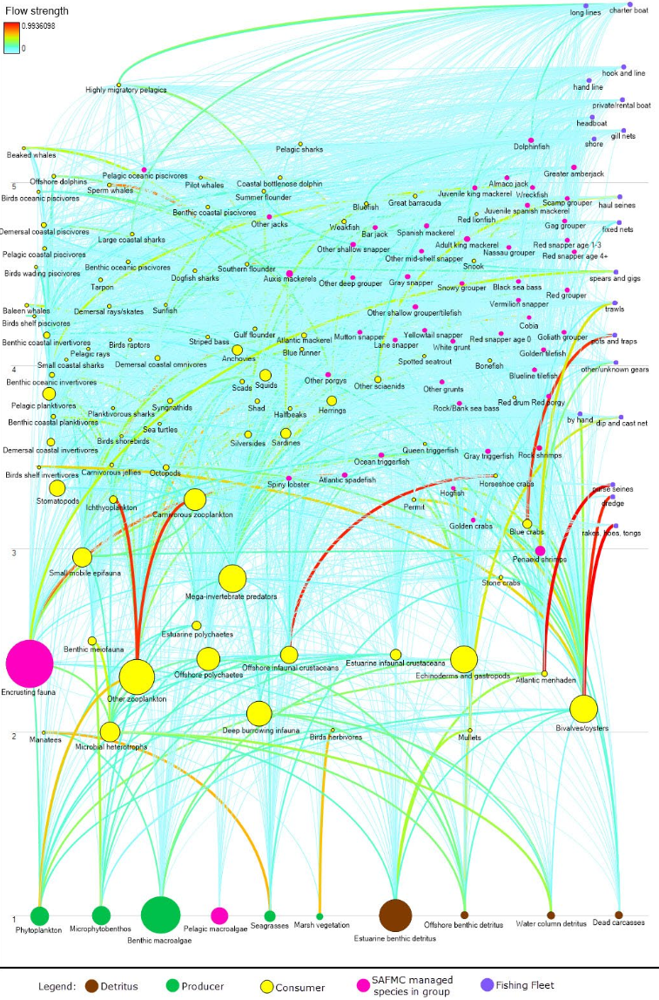

```{r setup, include=FALSE}
knitr::opts_chunk$set(echo = FALSE,
                      message = FALSE,
                      warning = FALSE)

library(tidyverse)
```

# Introduction

All Councils set annual catch advice, and there are multiple other management decisions where ecosystem information may help reduce uncertainty and support improved management outcomes. The next steps in this project will address both annual catch advice and other SAFMC management actions. For catch advice, the project will evaluate whether products such as Ecosystem Socioeconomic Profiles (ESPs, [@behan_ecosystem_2022; @shotwell_synthesizing_2022; @shotwell_introducing_2023]) would be useful and practical for SAFMC catch specification processes given data and staff resources, whether Ecosystem Status Report (ESR, [@craig_ecosystem_2021]) indicators or Climate Vulnerability Analysis (CVA, [@burton_climate_2023; @craig_climate_2025]) might be useful for assessing uncertainty and risk in adjusting catch levels, and what other approaches to integrating ecosystem information into catch specification would be feasible. 

The current SAFMC risk policy and ABC approach were updated for three FMPs [in 2023](https://safmc.net/documents/abccram_06052023_submittal-pdf/). This approach classifies risk of overfishing based on multiple attributes, as outlined below. Risk evaluation could include an indicator-based approach. While some Councils use information from annual stock level ESPs or full system ESRs to evaluate risk when specifying catch levels, others are developing a more streamlined process based on structured discussions between stock assessors and ecosystem scientists. A mix of approaches will be explored for the South Atlantic context given existing resource levels. 

Potential approaches were discussed with the SSC in April 2026 to evaluate feasibility. 

## My questions for the SSC include:

1. Is the characterization of the ABC control rule below correct?
1. How many times has the SSC applied the rule?
1. For which species has the SSC filled out the risk table? (I have [Black Sea Bass from April 2025](https://safmc.net/documents/ssc_apr2025_report_final-pdf/))
1. What is the SSC's experience filling out the risk table? 
    + Which portions have high agreement? 
    + Which portions generate much discussion and disagreement?
    + What information does the SSC have when filling out the risk table?
1. It appears that quantitative indicators are available for the Biological and Human Dimensions Attributes, but not the Environmental Attributes
    + Could the Ecosystem Importance attribute be informed by the SAFMC Food Web Model?
    + Could the Climate Change attribute be informed by the South Atlantic Climate Vulnerability Assessment [@craig_climate_2025]?
    + What information is most often used to evaluate the Other Environmental Variables attribute?

# Using Ecosystem Information in Catch Advice

## Opportunities within the [recently approved Comprehensive ABC Control Rule](https://safmc.net/documents/abccram_06052023_submittal-pdf/)

This policy applies to assessed species in the Dolphin-Wahoo, Golden Crab, and Snapper Grouper FMPs.

Risk tolerance (probability of overfishing, P*) is highest for stocks above B_MSY, intermediate for stocks at or below B_MSY but above the halfway point between B_MSY and MSST, and low for stocks below the midpoint (Fig. \@ref(fig:ABCSAFMC)). 

The magnitude of P* across these stock status categories changes depending on the overall risk of overfishing, which is determined by the Council after reviewing risk rankings from the AP and SSC.

```{r ABCSAFMC, fig.cap="SAFMC Risk Policy, 2023"}

riskpol <- data.frame(Bfrac = c(0, 0.75, 0.7501, 1.0, 1.0001, 2.0),
                      High = c(0.2, 0.2, 0.30, 0.30, 0.40, 0.40),
                      Medium = c(0.30, 0.30, 0.40, 0.40, 0.45, 0.45),
                      Low = c(0.4, 0.4, 0.45, 0.45, 0.45, 0.45)
)

riskpol <- riskpol |>
  tidyr::pivot_longer(-Bfrac, names_to = "pstar")

riskpol$pstar <- factor(riskpol$pstar, levels = c("High", "Medium", "Low"))

p1 <- ggplot2::ggplot(riskpol, ggplot2::aes(x=Bfrac, y=value, color = pstar)) +
  ggplot2::geom_path(show.legend = TRUE) +
  ggplot2::theme_minimal() +
  ggplot2::xlab("Bmsy") +
  theme(axis.text.x = element_blank()) +
  ggplot2::ylab("p*") +
  ggplot2::ylim(c(0,0.5)) +
  ggplot2::labs(color = "Risk")#

print(p1, vp=grid::viewport(gp=grid::gpar(cex=1.5)))

```

The Council can deviate, up or down, from default P* in the figure above by up to 10%.  

Specific attributes that can inform risk of overfishing:

*  Biological:
    * Estimated natural mortality
    * Age at maturity
*  Human Dimension:
    * Ability to regulate fishery
    * Potential for discard losses
    * Annual commercial value
    * Recreational desirability
    * Social concerns
*  Environmental:
    * Ecosystem importance
    * Climate change
    * Other environmental variables

<!--
Risk Tolerance: Council specifies using Table 2.1.3
Overfished Stocks: ABC from Council’s specified rebuilding plan
Council can deviate, up or down. from default P* by up to 10%
Constant and annual ABC recommendations
adjusting P* above the value set by the SSC should be infrequent and well-justified based on
new scientific understanding and the Council’s risk tolerance.
-->

## Current South Atlantic Indicators

### Climate Vulnerability Assessment

A CVA for 71 fish and invertebrate species [@burton_climate_2023; @craig_climate_2025] is complete, as well as analysis for South Atlantic and Gulf fishing communities [@seara_community_2022]. Marine mammal (108 stocks) and highly migratory fish (58 stocks) climate vulnerability has also been assessed for the entire Atlantic Coast [@lettrich_vulnerability_2023; @loughran_climate_2025]. These documents contain indicators that represent a starting point towards meeting the needs identified in the EFH policy documents above. In addition, the fish CVA might inform the climate portion of the P* process used to set ABC for stocks in the Dolphin-Wahoo, Golden Crab, and Snapper-Grouper FMPs.


One way to inform the SSC ABC process might be to use the directionality scores below. When considering the climate change risk criterion for a particular species, the SSC could first look up whether the direction of climate impact was positive, neutral, or negative for that species using CVA results. Species with positive impacts could be assigned lowest risk, those with neutral impacts could be assigned the default risk, and those with negative impacts could be assigned a higher risk overall in the absence of other information. 

Many snapper species are in the positive impacts bin.


For species predicted to have negative impacts from climate change, the sensitivity and exposure for that species could be considered to develop additional indicators of risk. For example, some species are more sensitive to ocean acidification, while others are more sensitive to temperature. Appropriate indicators can then be evaluated to determine whether risk may remain the same for the species or may be increasing or decreasing given current indicator trends.

For example, Nassau grouper (*Epinephelus striatus*) were identified as a species with a very high vulnerability ranking and a negative impact directionality in the CVA. Individual species sensitivity data shows high vulnerability to both temperature and ocean acidification. The spawning cycle is the sensitivity attribute with the highest sensitivity score, followed by habitat specificity. 

Source: [Craig et al. 2025](https://journals.plos.org/climate/article?id=10.1371/journal.pclm.0000543) 


### Ecosystem Status Report

Considerable work has been completed in the Southeast US region that forms an excellent starting point to evaluate South Atlantic resources relative to those available nationwide. The South Atlantic has an ESR [@craig_ecosystem_2021] including indicators spanning climate drivers, physical and chemical pressures, habitat states, lower and upper trophic level status, ecosystem services, and human dimensions (Table \@ref(tab:SAInds)). 

```{r SAInds, ft.arraystretch = 1}
compesrdat <- readr::read_csv(here::here("compesrdat.csv"))

summtab <- readr::read_csv(here::here("summtab.csv"))

summtab$Frequency <- dplyr::case_when(summtab$Council == "CFMC" ~ "First",
                                      summtab$Council %in% c("GFMC", "SAFMC", "WPFMC") ~ "Intermittent",
                                      TRUE ~ "Annual")

summtab <- summtab |> dplyr::relocate(Frequency, .after = Year)

sectionindcounts <- compesrdat |>
  dplyr::group_by(Region, Year, Section) |>
  dplyr::summarise(Nind = n())

indcounts <- compesrdat |>
  dplyr::group_by(Region) |>
  dplyr::summarise(Nind = n())

sectioncounts <- compesrdat |>
  dplyr::select(Region, Year, Section) |>
  dplyr::distinct() |>
  dplyr::group_by(Region, Year) |>
  dplyr::summarise(Nsect = n())

order <- compesrdat |>
  dplyr::group_by(Region) |>
  dplyr::select(Section) |>
  dplyr::distinct() |>
  dplyr::mutate(order = 1:length(Section))

esrs <- merge(sectionindcounts, order) |>
  dplyr::select(Region, Year, Section, Order= order, Nind) |>
  dplyr::arrange(Region, Order)
  
esrsls <- split(esrs, f = esrs$Region)

esrsdetls <- split(compesrdat, f = compesrdat$Region)

ESRname <- "South Atlantic"

flextable::flextable((esrsdetls[[ESRname]]))|>
  flextable::colformat_num(
    j = c("Year"), # Specify the columns to format
    big.mark = "",             # Set big.mark to an empty string to remove commas
    digits = 0                  # Specify the number of decimal places
  ) |>
  flextable::set_caption(paste0("Indicators presented in the ", ESRname, " ESR, in order of appearance.")) |>
  flextable::width(width = c(1.5,0.5,2,3))

```


### Food Web Model

Food web models can be used to characterize important prey and predators of species by summing biomass flows into and out of each species. Influential prey and predators can be identified for the entire system without the need for dynamic simulation.

The SAFMC food web model is an Ecopath with Ecosim model with over 20 years of development. The original model [@okey_preliminary_2001] included over 200 functional groups, as shown in Figure \@ref(fig:SAfoodweb), but has since been modified into simpler more aggregated versions to address particular issues, including spatial issues. Contractors from the Florida Fish and Wildlife Research Institute and the University of Florida are leading current model development, in close collaboration with SAFMC. This model has been has been [endorsed by the SSC in 2020](https://safmc.net/documents/a08_ewe_ssc_-model_review_wg_-report-pdf/), and developed recently to evaluate questions such as predation on juvenile black sea bass by red snapper and development for MSE applications. 
    
<!---->

```{r SAfoodweb, fig.cap="SAFMC food web model highlighting managed species and their trophic links", out.width="75%"}
knitr::include_graphics(here::here("docs/images/SAFMC_FWmodel.png"))
```


## Reference: Methods used by other Councils

### New England (in development)

The New England Council is developing a [risk policy](https://d23h0vhsm26o6d.cloudfront.net/Risk-Policy-Statement-and-Concept-Overview-for-posting-v1-final.pdf) that will use some indicators from the SOE, the fish CVA, and possibly ESPs. The policy evaluates risk due to stock status and assessment uncertainty, climate and ecosystem drivers, and economic and community considerations (Fig. \@ref(fig:NEriskpolicy)). Indicators are being selected for each category will be scored according to criteria established for the category, then scores across categories are to be weighted by the Council to achieve an overall risk score for each stock given the set of indicators. The risk score would then be used to adjust the buffer between OFL and ABC using the established control rule for the stock in question (NEFMC harvest control rules vary by FMP). 

```{r NEriskpolicy, fig.cap="NEFMC Risk Policy indicator scoring example.", out.width="80%"}
knitr::include_graphics(here::here("docs/images/NEFMC_RiskPolicy2026.png"))
```

The Council plans to start with its groundfish FMP to refine this indicator based risk approach. As of January 2026, risk policy matrices have been developed for [monkfish](https://d23h0vhsm26o6d.cloudfront.net/biii_2025-Monkfish-Risk-Policy-Matrix.pdf), [skates](https://d23h0vhsm26o6d.cloudfront.net/biii_2025-Skate-Risk-Matrix.pdf), [scallops](https://d23h0vhsm26o6d.cloudfront.net/1d.-Scallop-Risk-Policy-Matrix.pdf), and [groundfish](https://d23h0vhsm26o6d.cloudfront.net/5_251014_Risk-Policy-Matrix_Groundfish-Stocks-Combined.pdf), including Acadian redfish, white hake, Georges Bank winter flounder, Gulf of Maine winter flounder, Southern New England winter flounder, Cape Cod/Gulf of Maine yellowtail flounder, and Southern New England Mid Atlantic yellowtail flounder. In addition, an automated Fishery Performance Report has been proposed for the [small-mesh multispecies fishery](https://d23h0vhsm26o6d.cloudfront.net/2_Final-annual-monitoring-and-fishery-performance-report.pdf) to integrate information needed for implementing the risk policy. The Council plans to review an updated risk policy concept document in summer 2026 that incorporates feedback from various Council groups as well as simulation testing of the decision framework.


### North Pacific (in use)

In the North Pacific, ESRs are produced annually, and many ESPs are updated annually, with both presented alongside updated stock assessments in the Council's annual specifications process. Both ESRs and ESPs feed into annual catch specification through risk tables presented in stock assessments [@dorn_risk_2020]. The North Pacific approach starts with a maximum permissible ABC. Increasing levels of concern apply increased precaution to reduce ABC from the maxiumum permissible.

To date, risk tables incorporating ecosystem indicators have been presented in up to 18 stock assessments annually. Since risk tables were introduced in 2018, 14 stocks have had reductions in ABC from the maximum permissible due to risk information (including stock assessment, population dynamics, and fishery concerns as well as ecosystem concerns). In 2024, reductions to three stock ABCs were based on stock assessment, population dynamics, and fishery considerations. No reductions were taken in response to ecosystem considerations. 

```{r}
Tab5 <- readr::read_csv("https://github.com/sgaichas/HSpresentations/raw/main/Conferences/BevanUW_2026-02-19/data/NPacRiskFramework.csv")

flextable::flextable(Tab5)|>
  flextable::set_caption("North Pacific Risk Levels and Indicator Criteria") |>
  flextable::width(width = c(2,2,2,2,2)) |>
  flextable::bg(i = c(1:3), bg=c("white", "#FFFF0050", "#FF000050"))
```

Potential Action:  
Minimal Concern &rarr; No Catch Reduction from Maximum Allowed  
Increased Concern &rarr; <span style="background-color:#FFFF0050;">Some Catch Reduction</span>   
Extreme Concern &rarr; <span style="background-color:#FF000050;">More Catch Reduction</span> 

Source: [Draft 2025 Blue King Crab Risk Table](https://meetings.npfmc.org/CommentReview/DownloadFile?p=db212742-5381-4c72-b8cf-f95a7913d11e.pdf&fileName=PIBKC%20SAFE%202025%20Appendix%20B.pdf)

### Pacific Risk Tables (in testing)

The Pacific Council SSC is evaluating risk tables in progress for stock assessments and ABC decisions, where risk tables are reframed as uncertainty tables using IPCC "confidence" language on degree of agreement of indicators and robustness of evidence. This approach is patterned on the use of risk tables in NPFMC harvest specification, but is tailored to the p* process used in PFMC. The ecosystem team tested options and recommended one where ecosystem and climate risks would alter the sigma applied to characterize scientific uncertainty in the OFL  (sigma is equivalent to the MAFMC SSC OFL CV). PFMC sigmas are 0.5 for high certainty assessments, 1.0 for data moderate assessments, and 2.0 for data limited assessments, with additional increases from a baseline sigma as time passes since the most recent assessment. Ecosystem and climate risks could further inform sigma, increasing or decreasing it as these factors increase or decrease uncertainty. 

Operationally, a prototype process has ecosystem and stock scientists participate in a structured conversation to identify key uncertainties in the assessment and evaluate ecosystem drivers of the stock (that are not already included in the assessment) to fill out a table indicating whether ecosystem conditions are favorable, neutral, or unfavorable for the stock. This draws on previous literature and the indicators reported in the ESR. Information from the CVA for each stock is also included in this discussion. The structured discussion template is included in the CCIEA team's [2024 report](https://www.pcouncil.org/documents/2024/08/h-1-a-cciea-team-report-1-cciea-risk-table-report-on-fep-initiative-4.pdf/). For groundfish stock assessments conducted in 2025, pilot risk tables were developed for five full/benchmark assessments: yellowtail rockfish [@oken_status_2025], California quillback rockfish [@langseth_status_2025], chilipepper rockfish [@dick_status_2025], rougheye and blackspotted rockfishes [@cope_status_2025], and sablefish [@wetzel_status_2025]. 

```{r}

Tab4 <- readr::read_csv("https://github.com/sgaichas/HSpresentations/raw/main/Conferences/BevanUW_2026-02-19/data/WestCoastRiskFramework.csv")

flextable::flextable(Tab4)|>
  flextable::set_caption("Pacific Pilot Risk Levels and Indicator Criteria.") |>
  flextable::width(width = c(4,4,4,4)) |>
  flextable::bg(i = c(1:3), bg=c("#00FF0050", "white", "#FF000050"))
```

Potential Action:  
Favorable Conditions &rarr; <span style="background-color:#00FF0050;">Decrease Risk Buffer (Higher Catch Recommendation)</span>  
Neutral Conditions &rarr; Keep Standard Risk Buffer (Standard Catch Recommendation)  
Unfavorable Conditions &rarr; <span style="background-color:#FF000050;">Increase Risk Buffer (Lower Catch Recommendation)</span>

Source: [CCIEA Risk Table Report](https://www.pcouncil.org/documents/2024/08/h-1-a-cciea-team-report-1-cciea-risk-table-report-on-fep-initiative-4.pdf/)


# References

